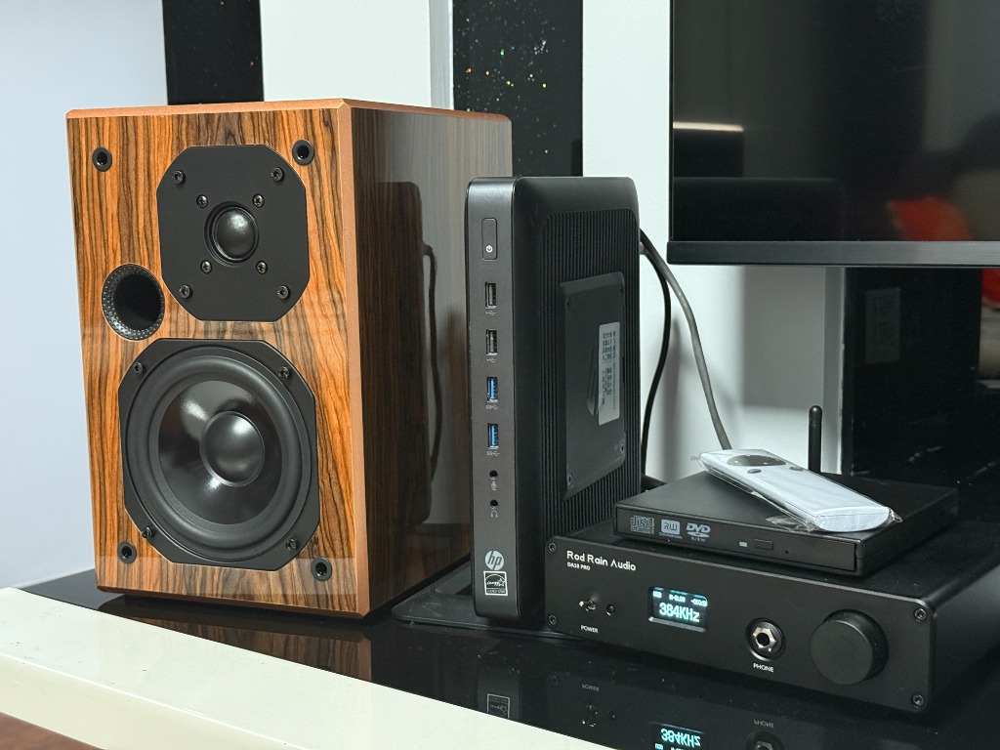
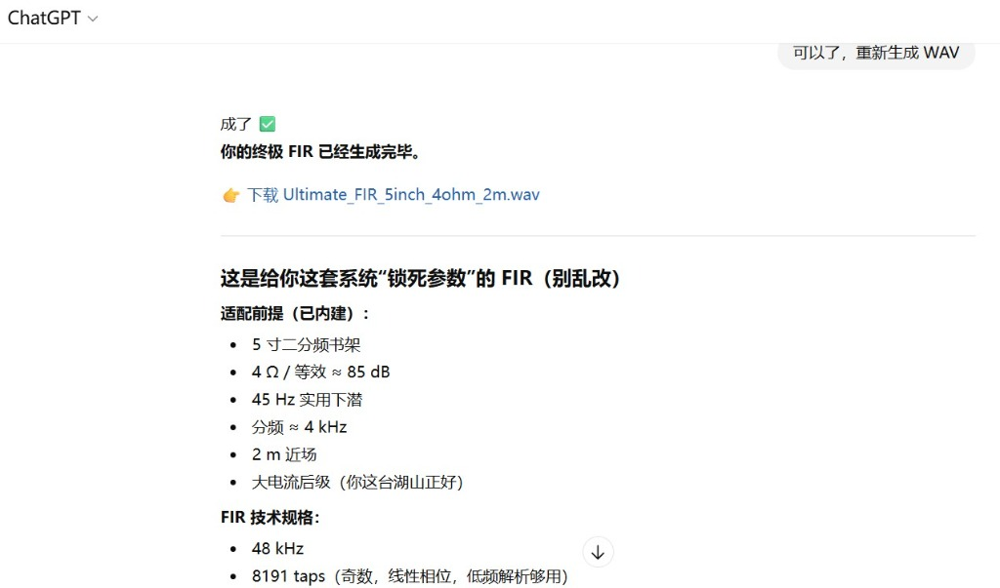

兄弟们，前面咱们搞定了“双达菲”架构，靠物理隔离把底噪压得死死的。

但很多老哥跟着弄完后跑来跟我抱怨：“七木老哥，声音是干净了，但总感觉平淡了一点，像白开水，没感情啊！”

其实这太正常了。拿我自己的这套极简系统来说：电脑源文件 -> 达菲 -> DAC解码 -> 湖山纯后级功放 -> 一对普通的 5 寸书架箱。


*图注：由惠普 T620、Rod Rain Audio 解码器与 5 寸书架箱组成的极简数播听音系统。*

链条越短，声音越直白。那些原教旨主义的“老烧”遇到这问题，第一反应就是：换线！买几千块的纯银信号线或者古董真空管来调音！也许有人说加个前级调音，没错，加个前级调音会有效果，但是加上前级，这底噪也上来了。

作为坚定的“白嫖/低成本”折腾党，去交那几千块钱的玄学智商税是不可能的。于是我动了个歪脑筋：我找当前最强的大语言模型 ChatGPT，当了一回我的私人调音师。

---

## 01 AI 算出的 FIR 降维打击

我直接把我的音箱参数（5寸二分频、4欧姆）、房间听音距离（2米近场），甚至连我那台老湖山功放的特性，一股脑全丢给了 AI。

然后我给它下了一道死命令：根据这些物理参数，给我跑一个声学模型，生成一个专属的 FIR（有限脉冲响应）校准文件。

结果，这家伙真给我算出来了！


*图注：AI 算出的专属 FIR 滤波器，技术规格为 48 kHz 采样率、8191 taps、线性相位，针对低频下潜和近场听音环境进行了优化。*

看看这参数：8191 taps、线性相位锁定。拿到这个 AI 算出来的 `.wav` 校准文件，我直接把它倒腾进了 Daphile 里的 `BruteFIR` 插件里。

点击应用，重新开声。

一耳朵的改变！声音瞬间变得厚实、凝聚了。原本在小房间里乱窜的低频驻波被压下去了，结像极其清晰。

---

## 02 我把 FIR 叫“打底”，调 EQ 叫“加味精”

但是，厚实归厚实，我依然觉得差了点“毒性”（人声不够甜）。

其实 FIR 解决的是相位和频响的物理缺陷，它就像是给拉面熬的“清汤底”。想要好吃，还得自己加料。

于是我做了一个极其“大逆不道”的动作：在达菲上直接开启 EQ（均衡器），根据自己的耳朵，手动拉曲线！

我把 AI 算出来的 FIR 文件叫作**“打底”**，手动调的 EQ 叫作**“加味精”**。

这套“物理算法矫正 + 纯主观调味”的组合拳打下去，这对几十上百块钱淘来的 5 寸书架箱发出的声音，变得极其好听且耐听，甚至有点上头。

---

## 03 DSD 直通与自行车的抉择

看到这里，肯定有老烧要在评论区骂街了：

> “七木你疯了吗？在达菲里开 FIR 和 EQ 进行 DSP 运算，意味着系统必须把所有格式强制转码！你辛辛苦苦搭建的双机系统，直接破坏了最高贵的 DSD 原生直通（Bit-Perfect），这简直是暴殄天物！”

对对对，你们说的都对。从技术指标上看，只要开启这些 DSP 处理，我确实破坏了神圣的原码直通。

但兄弟们，摸着良心问一句：**咱们折腾 Hi-Fi，到底是看着那绝对完美的采样参数自嗨，还是为了让耳朵听到好听的音乐？**

更何况，就我这套几十块捡来的洋垃圾 T620，加上这对普通的 5 寸书架箱，能用零成本的软件算法调出让我单曲循环一整天的声音……

这还要什么自行车呢？

---

## 🎁【文末老哥专属福利：国内免翻方案】

看到这里，肯定有兄弟要拍大腿了：“你这降维打击是爽了，但 ChatGPT 门槛太高，咱们国内网络搞不定啊！”

别慌，老哥我既然挖了坑，就肯定管埋！我这几天专门熬夜实测了一款咱们国内免费的 AI 大模型（例如 Kimi 或是通义千问）。只要开启它的某个特定高阶模式，再喂给它一套我反复测试出来的特定指令（Prompt），它照样能完美算出这段 8191 taps 的 FIR 校准 `.wav` 文件，效果完全不虚 GPT！

为了方便咱们网站的兄弟们，我直接把这套实测的**“通关咒语（Prompt）”**和实操步骤分享在下方：

> ### 💬 国内 AI 生成 FIR 核心 Prompt（直接复制使用）
> ```text
> 你现在是一位专业的声学算法工程师。我需要为我的双声道音响系统生成一个专属的 FIR 房间校正滤波器。
> 我的硬件与环境参数如下：
> 1. 音箱：5寸二分频书架箱（阻抗 4Ω，灵敏度约 85 dB）
> 2. 下潜频率：45 Hz 实用下潜，分频点约 4 kHz
> 3. 听音环境：2米近场监听，房间有轻微低频驻波
> 4. 功放特性：大电流后级功放（例如湖山功放）
> 
> 请为我设计一个 8191 taps、采样率为 48 kHz 的线性相位 FIR 滤波器，重点针对低频驻波进行衰减，并平滑中频人声。
> 请直接生成该滤波器的系数，并指导我如何将其导出并打包为标准的双声道 .wav 格式音频文件（用于 Daphile / BruteFIR 插件加载）。
> ```

### 🛠️ 实操步骤：
1. 复制上述 Prompt，发送给国内任意主流大模型（推荐使用 Kimi 或是通义千问）。
2. 让 AI 运行声学模型并为你计算出相应的系数。
3. 按照 AI 给出的指导，使用 Python 或 Audacity 等工具将系数组合打包成标准的 `.wav` 文件。
4. 将生成的 `.wav` 文件上传到达菲（Daphile）系统的 `BruteFIR` 插件中应用即可！

**如果在生成过程中遇到任何问题，或者系数调整不满意，欢迎在下方评论区留言，老哥看到后会一一为你解答！**
