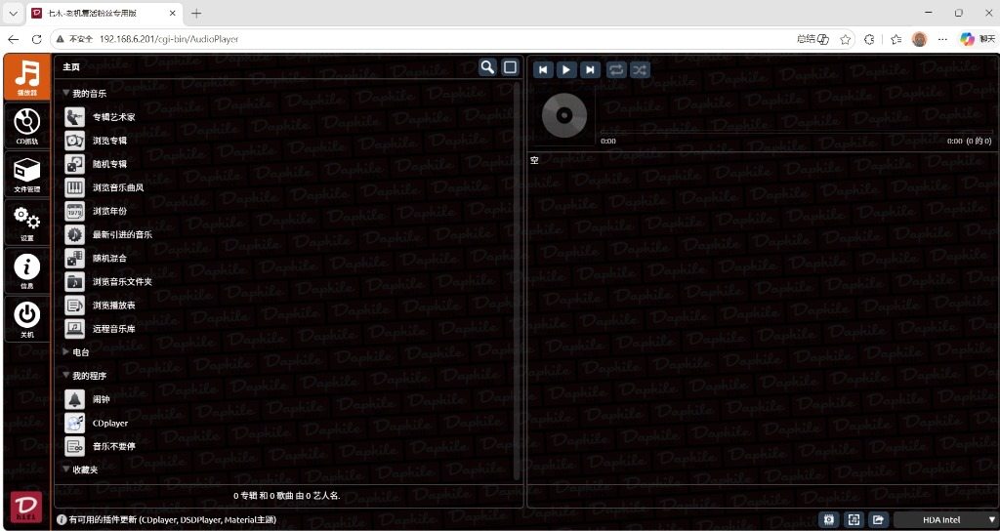
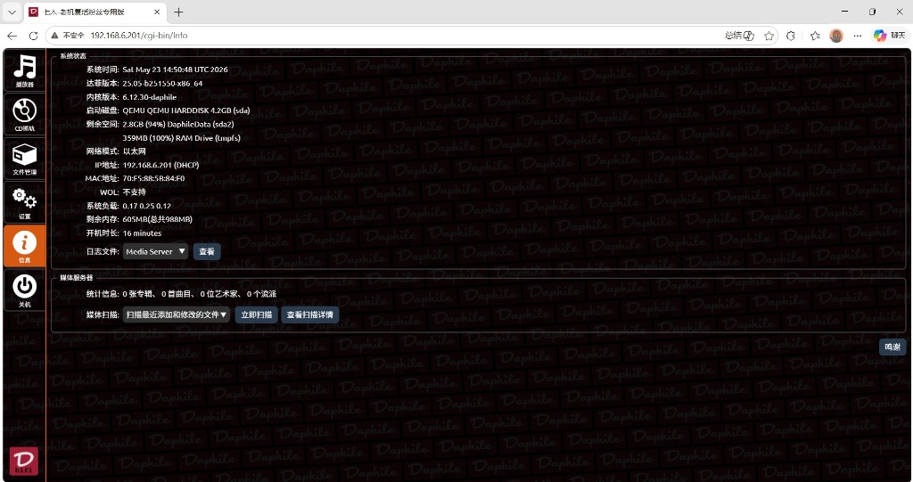
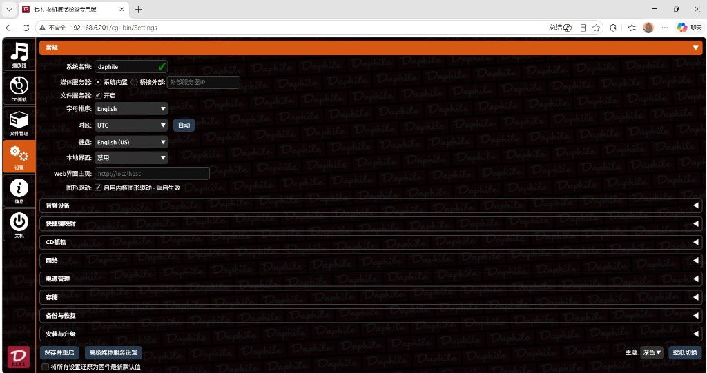
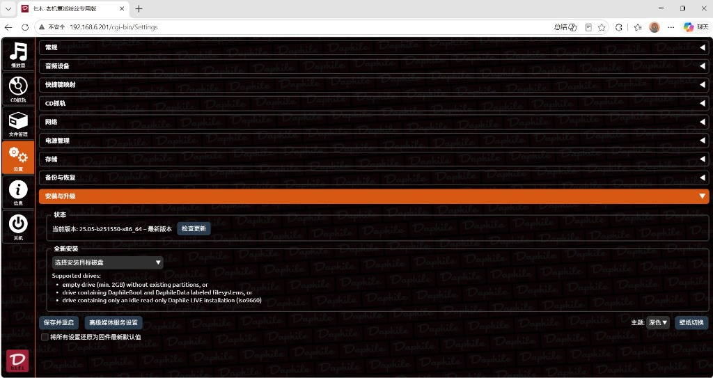
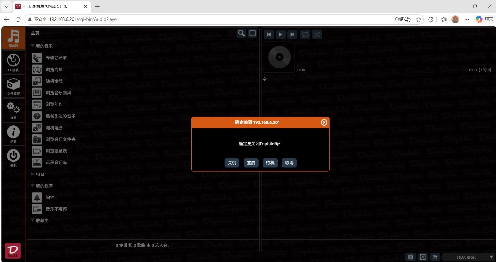

等了大半年，这一次总算彻底做完了。

**Daphile 25.05 中文版 v2.0** 今天正式对外发布。

这次基于官方最新的 `25.05`（内核版本号 `b251550`），在之前 24.06 中文版 v1.8 的基础上全面重构，不仅把整个翻译体系从头梳理了一遍，还预装进去了三个我自己日常在用的核心插件，让你刻上 U 盘开机就能直接用。

*图注：已成功汉化的 Daphile 25.05 中文版主界面，预装的 CDplayer 等插件已开箱即用。*

---

## 这次更新了什么？

### 1. 升级至最新官方 25.05

官方 Daphile 在 25.05 这个大版本里对底层依赖、Squeezelite 播放引擎、以及若干 USB DAC 兼容性做了更新，相比 24.06 整体更稳定。

本次中文版完全基于官方 `daphile-25.05-b251550-x86_64.iso`，不做任何底层修改，仅替换界面翻译字符串和 Web 前端文件，保证升级带来的稳定性改进完整保留。

*图注：系统状态页面，显示达菲版本为最新 25.05-b251550-x86_64，内核为 6.12.30-daphile，完美识别虚拟和物理盘。*

### 2. 全面重构翻译体系

之前 24.06 中文版的翻译是逐步累积的，有一些词条存在遗漏或表述不统一。这次借助全新的自动化合并脚本，系统性地把 25.05 官方英文字符串包与旧版中文翻译做了精准对齐：

| 翻译覆盖模块 | 说明 |
| :--- | :--- |
| **LMS 主字符串** | `opt/mediaserver/strings.txt` —— 包含数百条核心 UI 文本，从扫描状态到设置页面全覆盖 |
| **Daphile 专属字符串** | `opt/mediaserver/Plugins/Daphile/strings.txt` —— 达菲特有的网络、音频设置相关文本 |
| **14 个内置插件** | CLI、DateTime、DnDPlay、DontStopTheMusic 等插件的提示文字全部汉化 |
| **Jive 控制界面** | `usr/share/jive/` 下的所有 `strings.txt` 和 `global_strings.txt` ——  包括菜单、屏保、皮肤选择等 Jive 应用文本 |
| **Web 前端界面** | `nowplaying.html`、`Settings`（CGI 设置页）等网页界面文本 |

翻译风格上，这次统一以"信达"为标准，专有名词（如 Bit-Perfect、DSD、FLAC）保持英文原文，操作性词汇（如"扫描"、"收藏夹"、"随机混播"）使用日常中文，避免直译生硬。

*图注：常规设置（Settings）页面中的所有选项、描述以及下方保存/重置按钮均已完全汉化。*

### 3. 三大核心插件，开箱即用

这是这次改动最大的地方。在默认的原版 Daphile 里，MaterialSkin 等插件需要你联网去 LMS 插件库手动安装，对很多网络不稳定的用户来说极为繁琐。

这次我把三个精选插件直接打包进了 ISO，并在初始化逻辑里注册好了启用状态，开机之后无需联网、无需手动安装，直接就能用：

#### 🎨 MaterialSkin（美观现代皮肤）
这是整个 LMS/Daphile 生态里颜值最高的界面皮肤，响应式设计，手机、平板、桌面浏览器全都完美适配。装上之后，你那台旧 T620 的网页控制台瞬间从 2006 年的设计风格跳到了现代。

版本：**MaterialSkin 6.4.0**（来源：CDrummond/lms-material）

#### 🎵 DSDPlayer（DSD 格式播放器）
如果你的 DAC 支持 DSD（比如 ES9038、AK4493 系列的解码器），原版 Daphile 虽然可以播放 DSD 格式，但需要手动安装 DSDPlayer 插件才能进一步优化 DSD 原生输出策略。

版本：**DSDPlayer 1.12**（来源：LMS-Community 官方仓库）

#### 💿 CDplayer（CD 光驱播放）
如果你有外接 USB 光驱，装上 CDplayer 插件后可以直接在 Daphile 里播放实体 CD，对于藏有大量 CD 唱片的老烧友非常实用。

版本：**CDplayer v1.11**（来源：bpa-code/bpaplugins）

---

## 和之前 24.06 版有什么区别？

| 对比项 | 24.06 中文版 v1.8 | **25.05 中文版 v2.0** |
| :---: | :---: | :---: |
| 基础版本 | 官方 24.06 | **官方 25.05（最新）** |
| 翻译体系 | 人工逐版迭代 | **自动化合并脚本精确对齐** |
| 插件预装 | 无 | **MaterialSkin + DSDPlayer + CDplayer** |
| 插件激活 | — | **开机自动启用，无需联网** |
| 文件管理器 | 有 | **有（elfinder，中文菜单）** |
| ISO 体积 | ~322 MB | **~385 MB（含预装插件）** |

---

## 怎么安装？

如果你已经看过本站的《第二章：系统安装》，操作步骤完全一样，只是换一个 ISO 文件：

1. **下载** Daphile-25.05-x86_64-中文版_v2.0.iso（文末链接）
2. 用 **Rufus** 或 **Ventoy** 将 ISO 写入 U 盘（Ventoy 推荐，支持多镜像共存）
3. 将 U 盘插入你的旧电脑，BIOS 设置从 U 盘启动
4. 系统约 30 秒内引导完成，打开浏览器访问屏幕上显示的 IP 地址

*图注：如果想写入本地硬盘，打开设置中的“安装与升级”菜单即可，这里的磁盘选择和提示也全部完成了汉化。*

> **如果你是从 24.06 旧版升级**：Daphile 的用户数据（音乐库路径、播放列表、DAC 设置）存储在你的数据分区里，不受版本更新影响。直接用新 U 盘替换旧 U 盘启动即可，无需重新配置。

---

## 首次进入后的几个推荐操作

### 1. 切换 MaterialSkin 皮肤
进入 LMS 设置 → 插件 → MaterialSkin，点"主页"图标即可切换到美观的现代皮肤。

### 2. 设置中文语言
如果界面还是英文，进入**设置 → 服务器设置 → 语言**，选择"简体中文"，保存重载。

### 3. 设定音乐库路径
进入**设置 → 媒体库**，添加你的 NAS 共享路径或本地硬盘路径，触发首次扫描。DSD 文件（`.dsf`、`.dff`）可以直接加进来，DSDPlayer 插件会自动识别。

### 4. 关掉不需要的功能
如果你只想安静听歌，可以在插件页面把 InternetRadio（网络电台）、MyApps 等不常用功能关掉，减少界面噪音。

*图注：人性化的关机/重启/待机中文确认提示。*

---

## 技术细节（给想折腾的人）

这次整个 ISO 的构建流程是完全可复现的。核心思路如下：

1. **提取 rootfs**：用 `xorriso` 从官方 ISO 中提取 SquashFS 格式的 rootfs 文件
2. **解包 SquashFS**：用 `unsquashfs` 把 rootfs 解压到临时目录
3. **替换翻译文件**：按目录结构批量替换所有 `strings.txt` 和 Web 前端文件
4. **注入插件**：把三个插件的 `.zip` 文件放入 `/usr/local/share/mediaserver-init/plugins/`，同时在 `extensions.prefs` 和 `state.prefs` 里预注册启用状态，并修补 `mediaserver-init.sh`，让升级用户首次启动时也自动完成插件安装
5. **重新打包**：用 `mksquashfs`（zstd 压缩，256K 块大小）重建 SquashFS，再用 `xorriso` 把新 rootfs 替换回 ISO

整个过程通过 shell 脚本和 Python 自动化，可以在有 WSL2 或 Linux 环境的机器上一键完成。

---

## 已知问题

- MaterialSkin 皮肤在老版 Safari 上显示可能有轻微偏差，建议用 Chrome 或 Firefox 访问。
- DSDPlayer 的 DSD 原生输出依赖 DAC 支持，如果你的解码器不支持 DSD，播放 DSD 文件时会自动转码为 PCM，这是正常行为。
- CDplayer 插件需要系统能识别到 USB 光驱，部分老旧光驱在 Linux 内核下识别率较低。

有问题欢迎在页面下方留言，我会尽量回复。

## 下载地址

由于文件较大，本次提供百度网盘下载通道：

* **下载链接**：[百度网盘下载](https://pan.baidu.com/s/1GA-RI86dwR7H0GOcS0IeCQ?pwd=ljfh) 
* **提取码**：`ljfh`

*(提示：若下载链接失效，请在下方留言区或通过「关于本站」页面联系站长更新。)*
