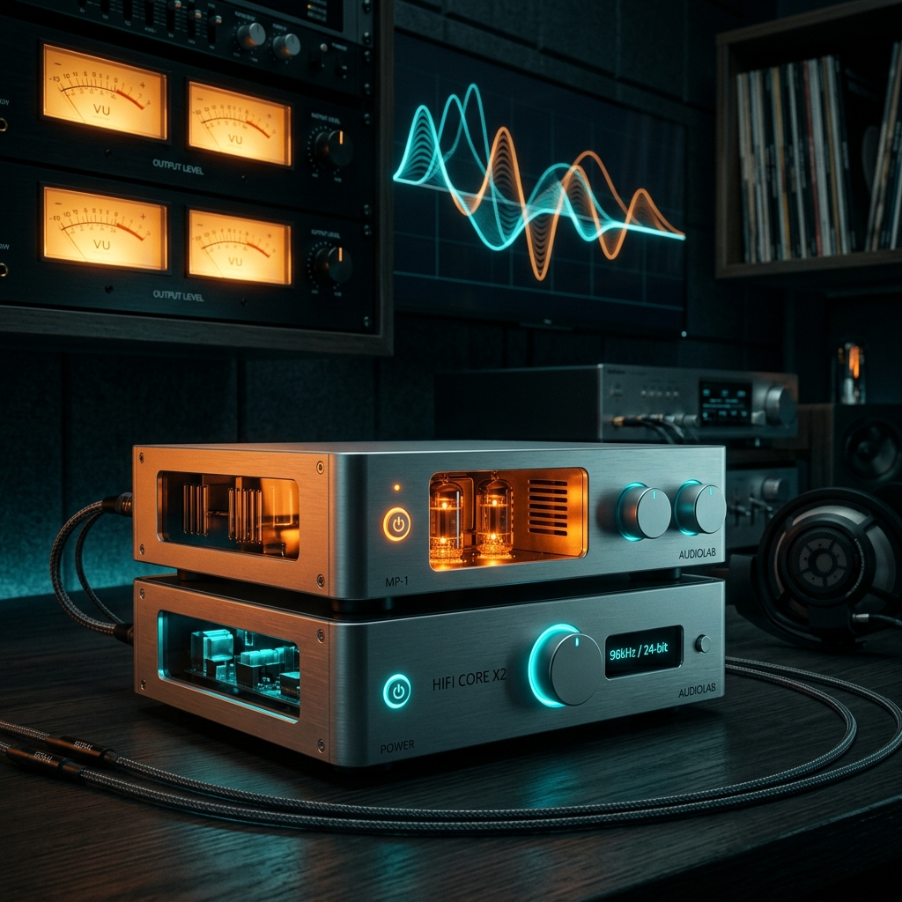

# 【发烧实测】双达菲 3.1.1 完美合体：桥核模式的终极真香体验！

各位达菲（Daphile）的同好、发烧友们，大家晚上好。

熟悉我的老粉丝都知道，在数播的世界里，**“桥核分离（Bridge & Core）”**一直被推崇为音质的天花板玩法。一台机器当核心服务器（Core）跑 LMS、挂载 NAS 扫歌；另一台纯净的小主机当桥（Bridge/Player）运行 Squeezelite，直连解码器出声。

但长久以来，双机党们心中一直有个挥之不去的痛：**SACD ISO 的直接读取和点歌体验太撕裂了**。要么在实体目录里根本找不到歌，要么点歌体验极为繁琐，更别提中文字符乱码、VU 表卡死等一系列小毛病了。

就在今天，随着**达菲中文 v3.1.1 稳定版**的正式发布，我第一时间将我手头的设备升级到了**“双 3.1.1 RT 版”**（核心跑在强大的虚拟机 QEMU 上，桥则是一台物理小主机直连 DAC）。

经过几个小时的深度折腾与实操开声，我只想用两个字来形容这次的体验：**震撼**。

下面，就和大家聊聊用双 3.1.1 构成双达菲的真实感受。

---

### 一、 终结痛点：SACD ISO 实体目录，终于“盲点直播”了！

在老版本里，想用桥核模式播 NAS 里的 ISO，媒体库扫出来经常是空空如也，体验极其闹心。

而在**双 3.1.1 模式**下，当我在核心（Core）挂载好 NAS 里的 SACD 音乐文件夹后，3.1.1 独有的“实体目录投射补丁”瞬间开始工作。它在底层完美地把 ISO 虚拟解压成了清清爽爽的 DSF 歌曲，并顺畅地投射进了 LMS 数据库。

核心在疯狂扫描两万多首歌曲的同时，我拿起手机控制端，点进“网络驱动器 -> ISO 实体文件夹”——**曾经空的文件夹，现在整整齐齐地躺着所有的 DSF 轨迹！**

随手点下播放，核心瞬间解码并转换成纯净的数字音频流，通过网络秒速推送到桥端。**零延迟、零卡顿、盲点直播，畅快淋漓！**

---

### 二、 资源彻底隔离：FIR+EQ 空间校正与“极致背景黑度”

双机模式最大的魅力，就在于**“各司其职，物理隔离”**。

在 3.1.1 双机下，核心（Core）在后台扫描 17000+ 首歌，这在以前的单机上绝对是 CPU 飙升、温度破表的“重体力活”。但在双机模式下，这股扫描的滚滚热浪完全被挡在了核心虚拟机里。

而我的物理桥（Player）上，正开启着极其消耗算力的 **FIR + EQ（Brutefir）空间空间卷积滤波算法**。

得益于 3.1.1 最新的 RT（实时内核）优化，再加上扫歌重担被完全剥离，**桥的 CPU 负载只有轻微的 2.4 左右，运行温度稳稳压在 58℃！**

当音乐响起的刹那，你能明显感受到背景极其深邃、漆黑。乐器的结像在声场中稳定得纹丝不动，高频的毛刺感被 Brutefir 滤得干干净净，而 RT 内核特有的绵密感和微动态，让声音的充实感和活生感直接上了一个台阶。

这种“心无旁骛”的重放，才是发烧级数播该有的纯净。

---

### 三、 无法抗拒的颜值：丝滑跳动的 VU 指针表

很多朋友可能会问：*“如果我只把核心升级到 3.1.1 搞定 ISO，桥还用老版本或者英文原厂版行不行？”*

行，当然能出声。**但是，你将失去达菲系统的“灵魂加成”——极其精美的 VU 电平指针表。**

因为 VU 指针和汉化 UI 是直接跑在播放端（桥）的屏幕上的。在双 3.1.1 完美合体后，摆在客厅的桥端屏幕上，那两个精致的 VU 指针随着萨克斯的声线、鼓点的起伏，开始**极其丝滑、灵动地跳动起来**。

中文歌名显示得端端正正，再无半点乱码。看着指针优雅地摆动，听着温暖厚实的乐器重放，那种“视觉与听觉双重发烧”的仪式感，是冷冰冰的英文原版永远给不了你的。

---

### 写在最后：

用 3.1.1 升级核心，解决了**“能听歌（ISO直读）”**的痛点；
用 3.1.1 升级播放桥，解决了**“音质（RT内核）+ 颜值（完美VU表）”**的痛点。

“双 3.1.1 桥核模式”的合体，不仅让达菲中文版在底层技术上完全玩转、走通，更是在使用体验上，为发烧友提供了一套兼具极致声音、极致便利与爆表颜值的终极方案。

这米，付得值；这歌，听得爽！

---

## 📥 获取与升级通道

如果您也想让您的达菲设备体验双机“桥核分离”的魅力，欢迎点击下方链接了解并下载最新的写盘工具与系统镜像：

👉 **[点击这里访问 3.1.1 稳定版发布及写盘工具下载页面](/blog/daphile-v311-release)**

若在安装配置、虚拟机直通或 Brutefir 滤波器生成上有任何技术疑问，可点击页面右下角的微信客服按钮进行一对一咨询。
