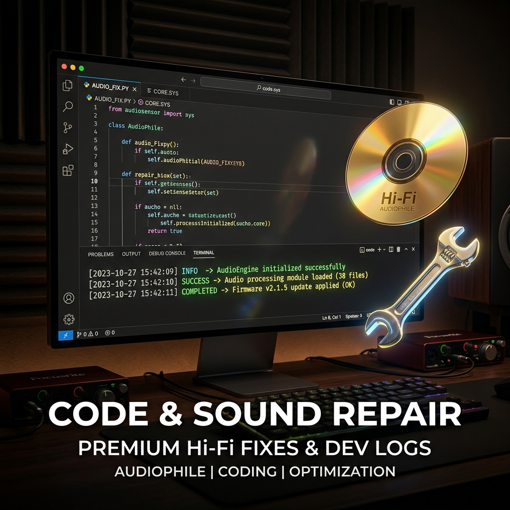

# 🚀 粉丝福利：双击一键全自动修复数播/达菲 CUE 乱码与分轨失败神器！

经常玩数码音频、玩达菲（Daphile）或者各种 Linux 数播机的朋友，一定遇到过这个极其抓狂的痛点：

从网上好不容易下载了几百 G 的整轨无损音乐（WAV/FLAC），导入播放器一看：**歌名全部显示成一堆看不懂的乱码火星文！更郁闷的是，根本无法切歌，分轨播放直接失败！**

这对于强迫症发烧友来说，简直是毁灭性的折磨。

---

## 🔍 为什么会这样？

我们不谈复杂的代码，只告诉大家一个最简单的事实：

*   **根源**：国内网络上流传的大多数整轨音乐，其配对的 `.cue` 索引文件都是在 Windows 电脑上制作的，默认保存为 **GBK（中文编码）**。
*   **冲突**：而达菲（Daphile）、LMS 系统以及绝大多数数播系统，底层都是 Linux，它们**只认识 UTF-8 编码**。
*   **结果**：当播放器强行去读 GBK 编码的 CUE 时，解析出来的文件名和歌名就会变成一堆乱码。系统找不到对应的音频文件，分轨功能自然就瘫痪了。

过去，大家唯一的办法就是用记事本一个一个文件打开，点击“另存为”，再手动把编码改成 UTF-8。如果是几十上百个文件夹，这简直是体力地狱。

---

## 🛠️ 七木团队粉丝独家福利：双击一键全自动转换！

为了彻底终结大家的这个痛点，七木达菲技术团队专门开发了一款 **【Windows 原生 CUE 乱码一键转换修复工具】**。

这款小工具完全是出于“利他精神”送给大家，特点就是极致的简单与安全：

1.  **零门槛，双击即用**：它不需要你安装 Python，也不需要配置任何复杂的电脑环境变量。就是一个简单的绿色免安装批处理工具。
2.  **傻瓜式操作**：把它复制到你的音乐文件夹根目录下，双击运行，几秒钟内，它会自动把下面所有子目录里、成百上千个 CUE 文件全部无损转换为达菲最喜欢的标准 UTF-8 编码。
3.  **安全无忧**：在修改任何文件之前，它都会默默在旁边复制生成一个 `.cue.bak` 的原始备份文件，绝对不会损坏你的任何音乐数据。
4.  **高亮进度**：运行过程中，哪些成功转换、哪些已经是标准编码会被跳过，都会在屏幕上用绿色和黄色清晰标出，一目了然。

---

<h2 id="download-section">💾 CUE 乱码一键修复工具下载</h2>

工具包为绿色免安装格式，已开启“回复可见”。请在页面下方发表评论回复后，重新刷新网页即可解锁下载链接：

  <ul>
    <li><strong>百度网盘下载链接</strong>：<a href="https://pan.baidu.com/s/1_6mtffkghk066tpxDICJgA?pwd=ljfh" target="_blank" rel="noopener noreferrer">点击进入百度网盘下载</a></li>
    <li><strong>提取码</strong>：<code>ljfh</code></li>
    <li><strong>使用方法</strong>：下载解压后，将小工具直接复制到你的无损音乐硬盘或歌曲总目录的根目录下，双击运行即可。</li>
  </ul>

*(注意：运行过程中如果弹出安全提示，选择“仍要运行”即可。工具纯绿色无毒，仅修改 .cue 文本编码。)*

---

## 📢 顺带播报：七木双达菲 3.1.1 完美合体稳定版已发布！

顺便向各位新老朋友汇报一个好消息：备受大家关注的**“七木双达菲 3.1.1 完美合体稳定版”以及全新的“傻瓜式一键写盘工具”**也已正式发布，之前测试版的小瑕疵已全部修复。

已经选购**技术服务授权**的烧友直接使用新写盘工具升级即可体验，新烧友欢迎添加站长微信（`wxcq888`）或点击右侧悬浮窗联系我们了解详情。

转发这篇文章到你的发烧群，让我们一起干掉乱码，纯粹听歌！
