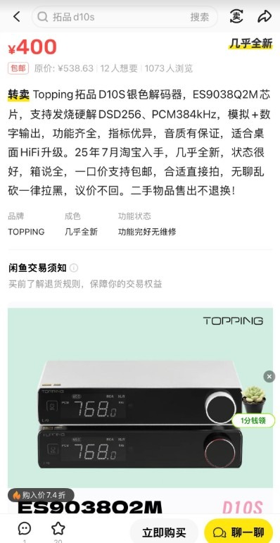
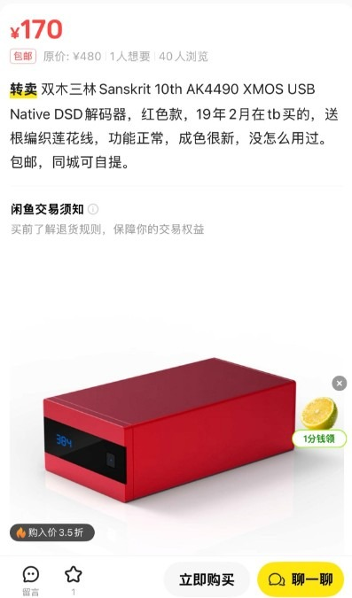

兄弟们，紧急加更一期！

咱们这个“现代服务”公众号转眼间关注已经破 300 了！感谢大家这一路硬核陪伴。

上一期《数播入门教程：解码篇》发出来后，阅读量直接冲到了 1000+。后台私信我回复到手软，大家伙儿清一色都在问同一个问题：

“老哥，你说了半天外置解码，到底买哪个？闲鱼上几十块的能用吗？以前的创新声卡行不行？”

甚至有兄弟想去淘 20 年前的 PCI 声卡插到我的 T620 推荐方案上……😱赶紧住手！咱们玩 Daphile（达菲）图的是 Linux 底层的纯净和 Bit-perfect（源码直出）。你弄个几十块的杂牌卡，或者驱动满天飞的老声卡，那是**“自废武功”**！

今天这篇**“番外进阶篇”**，不聊复杂的代码，只聊“怎么花小钱办大事”。我翻遍了闲鱼，给兄弟们整理了一份《Daphile 穷烧解码器掘金指南》。

全是干货，建议收藏，买的时候照着搜！👇

---

## ❌第一章：避坑黑名单（别买！）

在掏钱之前，先帮大家省钱。以下这三类东西，谁买谁是大冤种：

1. **PCI / PCIe 老声卡**（创新 SoundBlaster、华硕老虎卡等）
   * **理由**：时代的眼泪。这些卡是当年打游戏用的，味精味重。最要命的是 Linux 驱动极难搞，Daphile 很可能认不出。
2. **9.9 包邮的“发烧蓝牙接收器”**
   * **理由**：这玩意儿就是听个响，底噪比音乐声还大。你费劲装了达菲，结果出口是个这？
3. **安卓机顶盒直接外接（未经魔改）**
   * **理由**：很多兄弟问 15 块包邮的盒子能不能做数播。老实说，老旧安卓底层的 SRC（重采样）会把你的 DSD 音乐全变成劣质 48kHz 输出，那还听个啥？

---

## ✅第二章：入门试水区（预算 30 - 80 元）

如果你只是想把旧电脑利用起来，不想投入太多，看这两个：

1. **手机“小尾巴” (CX31993 / ALC5686 / CS43131)**
   * **闲鱼行情**：30 - 80 元
   * **推荐理由**：目前性价比最高的方案！它们其实就是微型 USB 解码器。
   * **玩法**：找个 USB-A 转 Type-C 的转接头插在电脑 USB 口上，另一头接耳机或者音箱。解析力吊打板载声卡。
2. **PCM2704 USB 声卡小板**
   * **闲鱼行情**：20 元左右
   * **推荐理由**：穷烧鼻祖。虽然不支持高清音频，但胜在有原生 RCA 接口（莲花头），接老功放特别方便，即插即用。

---

## 🏆第三章：黄金标准区（预算 300 - 450 元）

这是我最推荐的档位！素质已经能打平很多千元级的大厂入门机。

### 👑推荐一：拓品 (Topping) D10s

*图注：闲鱼上价格在 350-400 元左右的拓品 D10s，配有采样率显示屏并支持 ES9038Q2M 硬解，是高性价比入门台式解码器的代表。*

* **闲鱼行情**：350 - 400 元
* **硬核卖点**：
  1. **带屏幕**：能显示采样率，亮起 DSD 的字样时，满足感爆棚！
  2. **可换运放**：插拔式设计，后期几十块钱换个运放就能换种听感。
  3. **数字界面**：它能当 USB 转同轴/光纤的界面用，保值率极高。

### 🥈推荐二：双木三林 (SMSL) Sanskrit 10th (红砖)

*图注：双木三林 Sanskrit 10th（俗称红砖）闲鱼行情在 300 元左右，图中这台 170 元的漏可以说是超值好价，非常适合搭配老功放使用。*

* **闲鱼行情**：300 元左右
* **推荐理由**：颜值党首选。内置重力感应，竖着放屏幕会自动旋转。AKM 芯片的听感通常比 ESS 更润、更有感情。

---

## 🚀第四章：进阶发烧区（预算 500 - 800 元）

如果你想体验真正的“数码味”杀手，看看这个：

### 推荐：拓品 E30 / E30 II

* **闲鱼行情**：500 - 650 元
* **核心卖点**：AK4493 芯片（天鹅绒之声）。而且它带遥控器，有前级功能，可以直接控制音量。对接有源音箱（如漫步者、惠威）的兄弟非常友好。

---

## 📝总结 & 抄作业

* **不想折腾**：几十块买个 CX31993 小尾巴。
* **一步到位（强推）**：闭眼买拓品 D10s。
* **追求极致堆料**：看看那些带意大利界面 (Amanero) 的 DIY 机器，比如我自用的罗德雨 DA10 Pro，双 9038 芯片加持，那才是真正的硬核。

---

最后聊聊：

兄弟们手里现在都用什么解码器？是 170 块捡漏的红砖，还是几千块的台机？

你觉得 15 块的机顶盒到底能不能听出 Hi-Fi 效果？

欢迎在评论区留下你的看法，我会一一回复！👇

（还没进群的兄弟，后台回复“找队伍”，带你和 300 位老烧一起炸街！）
