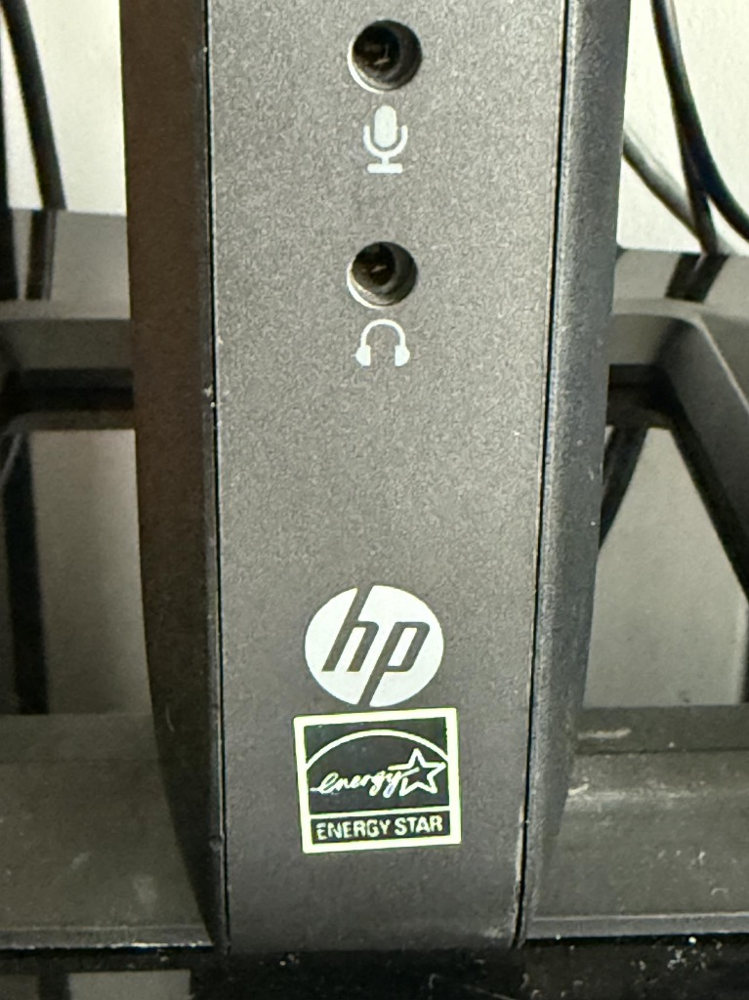
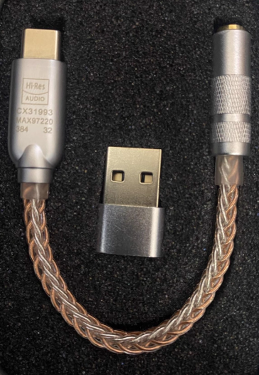
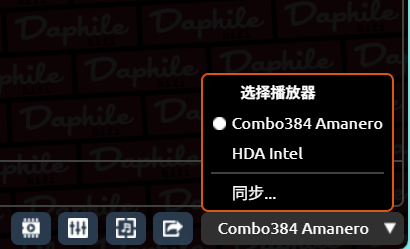
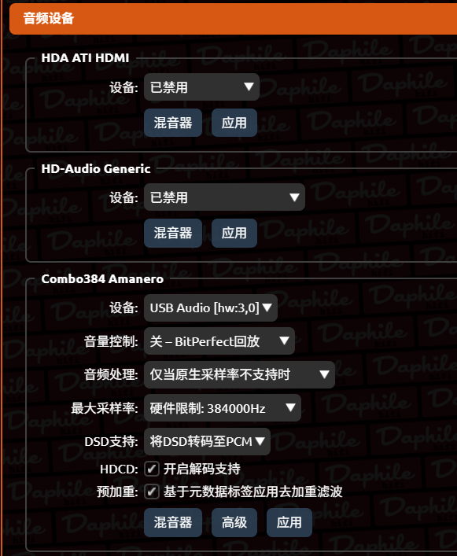
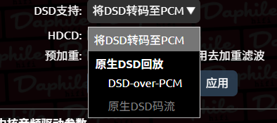

前言：为什么你的无损听起来像“收音机”？

经常有粉丝问我：“博主，我都按照你的教程装好了，也传了无损 FLAC，为什么插上耳机听，感觉和手机没啥区别，甚至还有滋滋的电流声？”

原因很简单：**你用错孔了！**

旧电脑（包括瘦客户机）自带的 3.5mm 耳机孔，是由主板上那个廉价的集成声卡驱动的。电脑内部复杂的电路干扰（电流声），加上几毛钱成本的解码芯片，出来的声音就是“脏”的。


*图注：旧电脑或瘦客户机前面板自带的 3.5mm 耳机孔，由于内部电磁干扰严重且放大电路极其廉价，声音往往干瘪嘈杂并带有明显的电流声。*

Daphile 的最强形态，是 **USB 独占输出**。

只有绕过主板声卡，把干净的数字信号通过 USB 交给外部设备，才能听到真正的“Hi-Fi”声音。

今天教大家根据预算，分两路走：“小尾巴” 和 “桌面解码”。

---

## 方案一：穷人的劳斯莱斯 —— “小尾巴”（USB 解码耳放线）

* **适合人群**：耳机党、学生党、预算 30-100 元。

所谓的“小尾巴”，原本是给没有耳机孔的手机用的，但它其实是一个独立的、高素质的 USB 声卡。把它插在电脑的 USB 口上，效果立竿见影。


*图注：百元内的高素质“小尾巴”——独立 USB 解码耳放线，是低成本隔离电脑内部干扰、提升推力和声音解析度的神器。*

### 为什么它能打？
1. **独立芯片**：哪怕是二三十块钱的 CX31993 芯片，信噪比也吊打旧电脑的板载声卡。
2. **外置隔离**：离开了电脑机箱内部的电磁干扰环境，背景瞬间变黑（安静）。

### 怎么选？（去海鲜市场搜，只看芯片）
* **入门级（30-50元）**：CX31993、ALC5686（听个响，但这声响比电脑强多了）。
* **进阶级（100-200元）**：CS43131、ESS9281（这就很有发烧味了，推力也大）。

---

## 方案二：正规军的入场 —— 桌面解码器（DAC）

* **适合人群**：音箱党、想要接功放（如老湖山）、预算 300 元+。

如果你想把数播变成家里的主力音源，用来推大音箱，那小尾巴就不够看了。你需要一台正经的桌面 USB 解码器。

### 连接链路：
```text
旧电脑 (USB口) ──> USB线 ──> 解码器 ──> 红白信号线(RCA) ──> 功放/音箱
```

### 避坑指南（重点！）：
很多 300 块的解码器号称支持 DSD，其实是用廉价 USB 芯片（如老款 Bravo）模拟的。

### 选购建议：
认准 **XMOS** 或 **Amanero 界面**（意大利界面）。只有这些才能在 Linux 下免驱识别，实现真正的源码输出。

---

## 核心操作：Daphile 必须做的设置（不做等于白买）

插上硬件只是第一步，要在系统里把它“扶正”，并把原来的劣质声卡“打入冷宫”。

### 第一步：选择输出设备（最关键！）

进入 Daphile 网页端控制台。
1. 点击右下角的 **Audio Player**（音频播放器）下拉菜单。
2. 取消勾选电脑自带的 `HDA Intel...`。
3. 勾选你新插上去的 USB 解码设备。


*图注：点击 Daphile 网页控制台右下角的播放器下拉菜单，取消勾选自带的 HDA Intel 板载声卡，勾选新接入的 USB 解码设备（如 Combo384 Amanero）。*

### 第二步：开启 Bit-perfect（源码直出）

这是 Daphile 最好声的秘诀！让音频流不经过任何修改，原汁原味送给解码器。

* **操作**：在 **Settings** -> **Audio Devices** 里，找到你的解码器，将 **Mixer Control** 选为 **None (Bit perfect)**。
* **注意**：选了这项后，网页上的音量条可能会失效（变成灰色），这是正常的！请用你的功放或耳放调节音量，这才是最纯净的音质。


*图注：在 Settings -> Audio Devices 页面中，将解码器的 Mixer Control 选择为 None (Bit perfect) 模式，关闭系统层面的数字音量干预。*

### 第三步：关于 DSD 的设置

如果你的解码器支持 DSD，记得在 **DSD Support** 选项里选择 **DSD over PCM (DoP)** 或者 **Native DSD**（如果支持的话）。


*图注：在 DSD 支持选项中，根据解码器硬件支持情况选择合适的 DSD-over-PCM (DoP) 或原生 DSD 回放输出。*

* **避坑提示**：如果选了 DSD 播放没声音，就改回 **Convert to PCM**，说明你的解码器不支持硬解，但这不影响听无损 FLAC。

---

## 第四章总结

恭喜你！走到这一步，你的旧电脑已经完成“脱胎换骨”了。

* **心脏**：强劲的 CPU 处理能力。
* **肚子**：本地硬盘里的无损音乐。
* **喉咙**：纯净的 USB 解码输出。

你现在听到的声音，在这个价位下（几十块钱成本），已经是可以秒杀手机和普通 PC 的存在了。

这就结束了吗？当然没有！

Daphile 还有更深不可测的玩法：
* 如何让声音背景黑到深不见底？（内存播放）
* 如何让这台机器只负责运算，让 NAS 负责搬砖？（双机推流）
* 如何榨干电脑内存？

这些“逼到极限”的玩法，我们将在后续的《进阶篇：双机架构与极致优化》中为大家揭晓！
