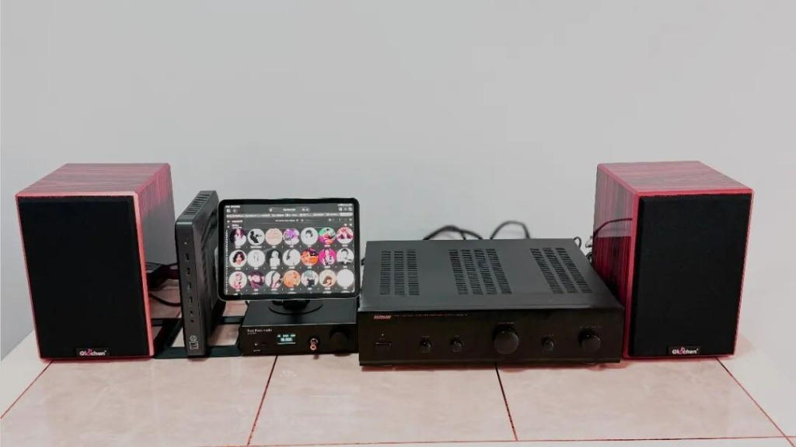
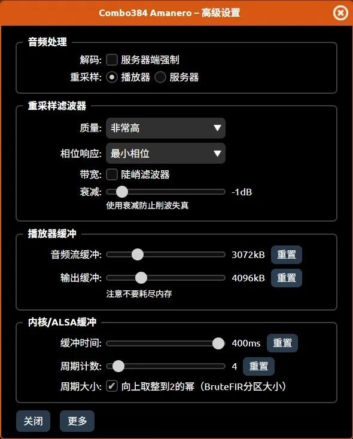
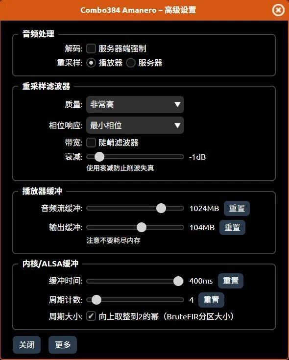

*图注：由惠普 T620 瘦客户机作为数播大脑，iPad 作为流媒体触摸屏控制端，下方接外置桌面解码器，右侧搭配 20 年前国产老功放与 5 寸书架箱组成的极具性价比的“新老世纪握手”桌面 Hi-Fi 系统。*

大家好，我是七木（现代服务主理人）。很多朋友吐槽账号名字像交水电费的，别急，新名字“七木·老机复活”正在审核路上了！以后认准这个新招牌。

看上面这张图。如果我不说，你可能会以为这是谁家几万块的高端听音室。中间是漂亮的触控大屏数播，下面是专业的桌面解码器，右边是推力十足的甲类老功放。

但如果我告诉你：这套系统中负责“大脑”的核心设备，只要几十块钱呢？

是的，就是那个立在平板后面、不起眼的惠普 T620 瘦客户机。今天这篇，是我们《Daphile 数播入门教程》的大结局。我们将把前四章学到的软件技术，真正应用到硬件系统中，完成这次“新与老”的世纪握手。

---

## 01 为什么要“新老结合”？

还记得那台被我花 800 块复活的国产老功放吗？老功放味道醇厚，但它是个“瞎子”——它不懂数字信号，没有蓝牙，没有 WiFi，只能插老式的红白线（RCA）。

以前我们为了听歌，要么接手机（推力太小），要么买 CD 机（一张碟 100 块，太贵）。而 Daphile 数播的出现，完美解决了这个问题：

* **它负责“新”**：用 T620 管理几 TB 的无损音乐，用 iPad 和手机做极其丝滑的遥控界面（如图所示）。
* **它保留“旧”**：通过 USB 源码输出，把最纯净的信号交给解码器和老功放。

---

## 02 系统揭秘：图里都有些什么？

很多粉丝后台问我这张图的搭配，其实逻辑非常简单：

1. **大脑（Source）：惠普 T620（闲鱼几十元）**
   它刷入了 Daphile 系统，静静地立在那里。无风扇 0 噪音，负责读取硬盘里的音乐。*(注：这台 T620 前几年只要三五十，最近被大家炒稍微贵了一点，但即便涨到几十块、一百块，在这个音质面前，依然是性价比之王。)*
2. **脸面（Control）：你的闲置 iPad/手机**
   不用给 T620 配显示器！打开浏览器输入 IP 地址，往支架上一放，它就是一台价值 2 万块的 Hi-End 级流媒体触摸屏。
3. **翻译官（DAC）：外置解码器**
   图中间这台带屏幕的是专业桌面解码器（接 T620 的 USB 口）。当然，如果你预算有限，几十块钱的 USB 小尾巴效果也完全够用！
4. **心脏（Amp）：20 年前的老功放**
   负责把解码后的模拟信号放大，推动音箱。

---

## 03 注入灵魂：开启“内存播放”（Ram Play）

硬件连接好只是第一步。为了让这台 T620 发挥出超越身价的实力，我们需要在软件里做一个“极客设置”。

在 Daphile 的 **Settings** -> **Audio Devices** 中，找到 **Buffer** 选项，开启 **RAM Play**（内存播放）。

*图注：Daphile 默认的音频流缓冲（3072kB）与输出缓冲（4096kB）只够满足一般的网络音乐或 MP3 播放，对于高码率 Hi-Fi 无损播放而言有些捉襟见肘。*

*图注：将音频流缓冲拖动调整到 1024MB，输出缓冲调整到 104MB，从而使 Daphile 在播放歌曲时能够将整首歌完全载入内存条中。*

音频流缓冲默认只有 3072K，输出缓冲只有 4096K。听 MP3 是足够了，但对我们玩 HiFi 来说远远不够，把这两个参数拖动到 **1024M** 和 **104M**。（T620 有 4G 内存，不用也是浪费）

### 原理是什么？
开启后，Daphile 会把整首歌曲的数据一次性加载到内存条里。在播放过程中，硬盘会停止转动（休眠），CPU 占用率降到最低。这意味着：**彻底切断了机械硬盘的震动和电磁干扰**。

当你按下播放键的那一刻，声音背景会变得像黑夜一样宁静。这种纯净度，是你用普通 Windows 电脑绝对听不到的。

---

## 04 写在最后

看着这张图：左边是代表现代科技的触控数播，右边是代表模拟时代的笨重功放。中间的一根线，连接了两个时代。

这就是我们“七木·老机复活”的意义：**不盲目追新，也不固守陈旧。用最低的成本、最硬核的技术，榨干每一台设备的剩余价值。**

至此，数播入门系列教程正式完结！但这只是开始。下一阶段，我们将挑战更硬核的玩法：《家庭服务器篇：如何把几百部 4K 电影塞进这台 T620？》

关注我，回复【数播】，获取全套教程合集和下载折腾工具。让你的老设备，再战十年！

`#数播` `#Daphile` `#HiFi` `#老机复活` `#DIY` `#T620` `#音响`
