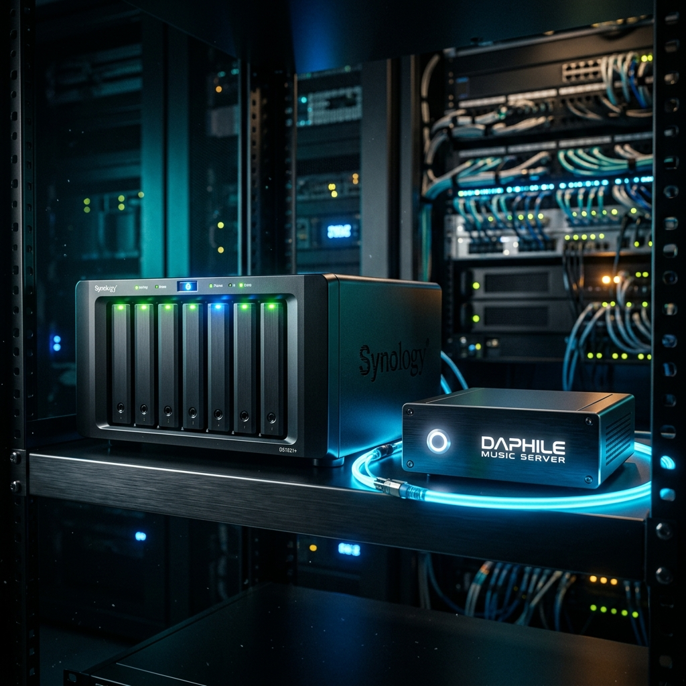

# 飞牛 NAS 挂载到达菲：零本地硬盘成本，丝滑流媒体播放网盘无损音乐全攻略！

各位达菲（Daphile）的玩家、发烧友们，大家下午好。

> **作者郑重承诺**：本教程所有步骤均由作者使用飞牛 NAS（FNOS）与达菲系统实操测试通过。其他品牌 NAS（如群晖、威联通等）原理相通，均可通过 SMB/NFS/WebDAV 协议进行连接，此处以飞牛系统作为实操演示。

对于许多喜欢达菲系统的乐迷朋友来说，把音乐存在随身带的 U 盘或者小硬盘里是第一步。但随着收藏的无损音乐、DSD 大歌越来越多，本地硬盘装不下怎么办？或者家里已经买了 NAS 存储器、开了网盘，该怎么接进达菲呢？

达菲的**“网络驱动器（Network Drives）”**功能正是为此设计的。它能让您的达菲播放器通过局域网或互联网，直接播放您 NAS 或是云端网盘里的海量无损音乐。这不仅帮您省下了买实体硬盘的昂贵费用，还能实现绝对的物理静音（没有硬盘旋转和寻道的噪音），让听歌背景更漆黑、音质更纯净。

今天，我们就用最通俗易懂的语言，教大家如何看懂并填写达菲后台的各种共享协议与 IP 地址！

---

## 一、 SMB3 / CIFS：最常用的局域网共享（Windows/普通 NAS）

*   **适合场景**：您的音乐存在 Windows 电脑、普通家用路由器（插 U 盘），或者 NAS 的共享文件夹里。
*   **协议特点**：兼容性极强，几乎所有设备都默认支持。

### 达菲后台填写格式：
1.  **类型**：选择 `smb3://` （优先选择版本较新的 smb3，速度和安全性更好）或者选择 `cifs` 是完全一样的。
2.  **远程路径**：格式为 `用户名@IP地址/共享文件夹名称`
    *   *举例*：如果您的 NAS 的 IP 地址是 `192.168.1.66`，共享文件夹名字叫 `HiFi_Music`，您的 NAS 登录账号是 `admin`，那么这里就填写：`admin@192.168.1.66/HiFi_Music`
3.  **密码**：填写您 NAS 或电脑账号对应的登录密码。
4.  **用途**：选择 **音乐**。
5.  **标识**：自己起个容易认的名字（比如 `NAS_SMB`）。

> **💡 发烧小贴士（添加多个文件夹）：**
> 如果你在 NAS 里设置的共享文件夹不止一个（比如一个放流行歌，一个放古典乐），您可以按照上述方法，继续添加相同的协议，只需在“远程路径”里指定不同的文件夹名称即可。

> **⚠️ 避坑指引：**
> Linux 系统对路径里的空格和特殊符号极其敏感。请确保您的共享文件夹名称里不要包含中文空格、减号等特殊字符。如果有，建议先在 NAS 或电脑里把它重命名为简单的纯英文（如 `HiFiMusic`），否则达菲可能会连接报错。

---

## 二、 NFS：极速且稳定的局域网专属（Linux/高阶 NAS）

*   **适合场景**：您的音乐存在基于 Linux 系统的 NAS 存储器里，且您追求极速响应和零延迟。
*   **协议特点**：这是 Linux 系统之间最原生的共享协议。它的传输效率比 SMB 更高，播放超大码率的 DSD 音乐时更加丝滑。

### 达菲后台填写格式：
1.  **类型**：选择 `nfs://`
2.  **远程路径**：根据您的 NAS 品牌，填写方式有所不同：
    *   **如果您用的是【飞牛 NAS（FNOS）】（强烈推荐）**：
        飞牛采用了先进的 NFSv4 协议，支持“虚拟根目录”投影。您不需要写具体的文件夹名称，直接填写飞牛的 NFS 根路径即可：`IP地址:/fs/1000/nfs`
        *(挂载成功后，飞牛里所有开启了 NFS 的文件夹都会一次性呈现在达菲里，省心省力！)*
    *   **如果您用的是【群晖、威联通等传统 NAS】**：
        需要填写每个文件夹的具体绝对路径：`IP地址:/volume1/music` （请在 NAS 共享设置里复制实际的 NFS 导出路径）。
3.  **用途**：选择 **音乐**。
4.  **标识**：自己起个名字（比如 `NAS_Music`）。

> **💡 发烧小贴士：**
> 使用 NFS 挂载之前，您需要在您的 NAS 后台管理系统中，为该文件夹开启 NFS 共享权限，并把达菲播放器的 IP 地址加入到“允许访问的客户端 IP 列表”中。

---

## 三、 WebDAV / WebDAVS：网盘与远程连接的终极神器（网盘/外网）

*   **适合场景**：您想直接流媒体播放百度网盘、天翼云盘、阿里云盘里的音乐，或者需要在外地远程连接家里的存储服务器。
*   **协议特点**：通过互联网网页接口传输数据，是玩“云端数播”和“无盘化播放”的黄金协议。

### ⚠️ 使用前提（重要）：
在达菲连接之前，您必须先在您的 NAS 上完成以下准备：
1.  在 NAS 的应用中心里安装并开启 **WebDAV** 服务。
2.  在 WebDAV 的设置中，勾选并允许访问您的音乐文件夹或远程挂载的网盘（如百度网盘）。

### 达菲后台填写格式：
1.  **类型**：局域网内选择 `http://` （未加密，速度快）；外网远程连接选择 `https://` （加密，防密码泄露）。
2.  **远程路径**：格式为 `用户名@IP地址或域名:端口号`
    *   **如果您在【家里（局域网）】使用**：
        IP 地址填写 NAS 的局域网本地 IP，端口通常为未加密的 `5005`。
        *例*：`admin@192.168.1.66:5005`
    *   **如果您在【外地（外网）】远程听歌**：
        需要使用您家里的公网 IP（需做好路由器端口映射）或者 DDNS 动态域名，端口通常为加密的 `5006`。
        *例*：`admin@您的动态域名.com:5006`
3.  **密码**：输入对应的 WebDAV 登录密码。
4.  **用途**：选择 **音乐**。
5.  **标识**：起个名字（比如 `NAS_WebDav`）。

> **💡 发烧小贴士（最常见误区）：**
> 很多朋友配置好 WebDAV 端口后，尝试在电脑浏览器里直接输入 `http://192.168.1.66:5005` 访问，结果网页报错显示 `Method Not Allowed`（方法不允许），以为是服务坏了。
> 请放心，这完全是正常的！WebDAV 是一种专门给播放器和挂载软件对接的数据协议，普通网页浏览器无法直接“像逛网站一样”打开它。只要达菲里填对地址并打上绿勾，就说明它在正常工作！

---

## 🚫 重磅避坑指南：为什么我不推荐用 WebDAV 直接在线扫描网盘？

很多朋友在达菲里挂载好网盘的 WebDAV 链接后，刚开机显示绿色的“对勾”，但达菲一“扫描媒体库”没多久，连接就断开变成了“红叉”。这是为什么？

### 1. 高频并发限速导致超时
达菲在扫描媒体库时，会在极短时间内向网盘发送成百上千次数据请求，去读取每一首歌的标签信息（歌名、歌手、封面等）。
如果您没有购买网盘超级会员（SVIP），网盘检测到如此高频的请求，加上普通用户的严重限速，就会直接导致数据传输超时（Timeout）。一旦超时，达菲底层的 WebDAV 挂载通道就会断开，显示红叉。

### 2. 完美的“折中提速”方案
1.  在飞牛 NAS 中安装官方的“百度网盘”应用。利用您的“NAS 会员极速下载特权”，把网盘里常听的音乐文件夹，在后台自动同步/下载到 NAS 的本地硬盘上。
2.  达菲系统只挂载飞牛本地的那个文件夹（即 NFS 或 SMB3，这两个连接雷打不动，极其稳定）。
3.  这样，达菲扫描曲库时是直接读取本地，速度快上百倍，且永远不会断连报错。

---

## 🏁 总结：如何选择最适合您的协议？

1.  **普通局域网听歌，省心首选** ➔ **SMB3**（设置最简单，Windows 和各类 NAS 均支持）。
2.  **专业 NAS 玩家，追求极致音质与流畅度** ➔ **NFS**（速度最快，开机挂载极速就绪，飞牛系统支持一键挂载多盘）。
3.  **白嫖云端空间，外网远程听歌** ➔ **WebDAV**（适合在外地或办公室远程穿透连接家里的 NAS 听歌）。

花小钱办大事，用技术把老硬件的潜能发挥到极致，这才是发烧的真谛。如果您在安装、写盘或挂载 NAS 的过程中有任何技术疑问，欢迎点击页面底部的下载链接获取我们的智能汉化写盘工具，或直接联系客服微信进行一对一咨询！

👉 **[点击这里访问 3.1.1 稳定版发布及写盘工具下载页面](/blog/daphile-v311-release)**
