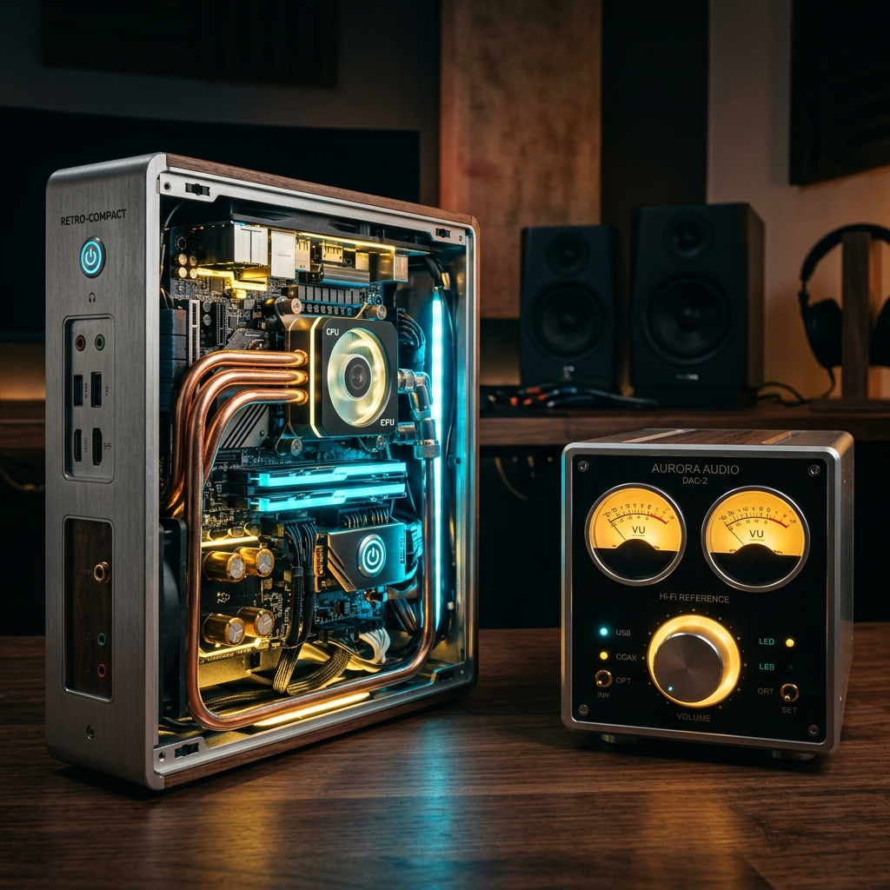

# 几十块的旧电脑，怎么挑才能做出一台好数播？达菲小主机选型避坑指南！

各位达菲（Daphile）玩家、发烧友们，大家下午好。

随着**达菲中文 v3.1.1 稳定版**的发布，越来越多的烧友开始把手头吃灰的老机器拿出来，准备改造成高颜值的数播。但很多刚刚接触达菲的新手，在闲鱼或家里翻箱倒柜找硬件时，往往会陷入一个极大的误区：

*   *“是不是 CPU 性能越强，数播声音就越好？”*
*   *“家里那台 100 瓦的大台式机能用吗？”*
*   *“几十块钱买的瘦客户机，能带得动高保真无损解码吗？”*

今天，我们就来聊聊**如何低成本挑选一台完美的达菲主机**，并把机内电磁干扰、静音散热、网卡兼容性等核心避坑点一次性跟大家说透。

---

## 🚫 达菲硬件选型的“三大致命误区”

在掏钱买主机前，请务必在脑海中格式化掉以下观念：

### 误区一：CPU 性能越强越好
**事实**：达菲基于极度精简的 Gentoo Linux，它在播放无损甚至 DSD 音乐时，对 CPU 的占用率通常只有 **1% ~ 5%**。高配 CPU（如旧 i7、i5）不仅对音质没有任何提升，反而会带来大量的发热、风扇噪音和高电磁辐射（EMI）。低功耗的赛扬（Celeron）、奔腾（Pentium）或者低压酷睿（如 i3-4010U）才是达菲的最佳拍档。

### 误区二：老旧大台式机很适合做数播
**事实**：很多烧友想把淘汰的传统 ATX 大台式机做数播。这种机器有三大死穴：一是功耗巨大（整机动辄 80W~150W），24 小时开机电费感人；二是机箱内大风扇嗡嗡响，严重破坏听音背景黑度；三是廉价的电脑开关电源波纹极大，会通过 USB 严重污染解码器的声音。

### 误区三：无线网卡连接很方便
**事实**：在数播中，无线 Wi-Fi 的电磁辐射是机内最大的射频干扰源之一。更要命的是，达菲底层对一些廉价国产无线网卡的驱动支持极差。做数播，**有线千兆网线连接是音质与稳定性的唯一选择**。

---

## 💻 闲鱼高性价比三大“达菲神机”类型盘点

如果你打算花几十到一百块钱在闲鱼掏一台机器，以下三类主机是经过广大烧友实测的“黄金选择”：

### 1. 1L 瘦客户机 / 迷你工控机（性价比之王，推荐指数：⭐⭐⭐⭐⭐）
*   **代表机型**：联想 M73/M93p 迷你版、惠普 ProDesk 400 G1/G2 DM、戴尔 Wyse 5070（赛扬 J4105）等。
*   **价格区间**：¥80 - ¥180 元。
*   **优点**：体积只有一本书大小，外观精致漂亮，功耗通常只有 10W 左右。内部设计紧凑，主板电磁屏蔽较好。
*   **缺点**：部分极低价机型采用单通道内存，且拆装固态硬盘需要一定动手能力。

> **💡 关于发烧圈著名的“入门神机”惠普 T620 的特别说明：**
> 很多初烧朋友会问，为什么没有推荐闲鱼上 ¥40-¥60 元的经典神机 **惠普 T620**？
> 实际上，对于绝大多数**不折腾“空间卷积滤波（Brutefir）”或复杂“手动 EQ”等高阶玩法**的初学玩家来说，T620 依旧是**性价比和静音的终极选择**！它最大的杀手锏是**完全无风扇被动散热（零噪音）**，价格又极其便宜。只要你只是日常播放标准无损 CD 格式、常规 DSD 源码输出，T620 的性能完全能够轻松拿捏，是不折不扣的“入门良心券”。
> 
> 我们这里提醒性能吃紧，主要是针对打算玩**双机桥核模式、挂载超大曲库做高强度扫描、或者以后想折腾高阶声学滤波（FIR/Brutefir）**的深度发烧友，这类玩家建议一步到位选择 Intel 平台（如 J4105、N5105 或 J1900）以确保系统余量。

### 2. 废旧低配置笔记本（天然的“蓄电池隔离”，推荐指数：⭐⭐⭐⭐）
*   **代表机型**：淘汰的 ThinkPad X220/X230、联想/华硕的赛扬旧本。
*   **价格区间**：家里闲置（免费）或闲鱼 ¥100 左右。
*   **优点**：**自带电池！** 笔记本的电池在拔掉交流电时，相当于给系统提供了一路极其纯净的直流电供电，阻断了市电电网的杂波干扰，音质背景非常黑。同时自带屏幕和键盘，调试极为方便。
*   **缺点**：占地方较大，如果屏幕或主板风扇老化可能产生高频噪音。

### 3. 英特尔官方 NUC 系列（兼容性天花板，推荐指数：⭐⭐⭐⭐）
*   **代表机型**：Intel NUC 4代/5代 赛扬或低压 i3 版。
*   **价格区间**：¥150 - ¥250 元。
*   **优点**：主板设计极为规范，底层 BIOS 兼容性极强。在达菲的实时内核（RT Kernel）下，驱动契合度接近 100%。
*   **缺点**：价格比同档次的瘦客户机略贵。

---

## 🛠️ 达菲主机硬件选型的“核心避坑清单”

在确定机型时，请务必核对以下硬性指标：

### 1. 优先选择 Intel 网卡，避开低端 Realtek 网卡
达菲对 Intel 芯片的有线网卡（如 I219-V、I211 等）支持最为完美。部分低端工控机采用的廉价螃蟹卡（Realtek），在安装达菲实时内核（RT）版时，偶发性会出现开机无法获取 IP 地址、网络中断的现象。

### 2. 固态硬盘（SSD）是标配，彻底抛弃机械硬盘
不要使用淘汰的机械硬盘做系统盘或歌曲缓存盘。机械硬盘的马达旋转会产生高频震动和物理噪声，严重破坏机架的避震。一块 ¥50 元的 120G SATA 固态硬盘，就能带给你绝对的静音和秒速开机的流畅感。

### 3. 检查 USB 接口布局
如果你的解码器需要通过 USB 连接达菲，尽量选择有 **USB 2.0 独立通道** 或带有 **USB DAC 专用优化口** 的主板。部分小主机的 USB 3.0 接口由于和无线网卡、蓝牙共用总线，在高频数据传输时会产生明显的电磁杂音。

### 4. 散热结构：被动散热（无风扇）优于主动散热
如果能选购到被动散热（通过铝制机壳导热，无任何风扇）的工控主机，那是最完美的。没有了风扇的震动和风噪，你的音乐系统背景会变得像深夜一般漆黑、通透。

---

## 💎 总结：把复杂交给我们，开启发烧第一步

选好主机后，如何将其无损、傻瓜式地刷入标准全中文系统，并完美搞定 SACD-ISO 直读和 VU 指针？

您可以直接选购我们为您准备好的 **【Daphile 中文智能写盘汉化工具】**（¥49 一次性技术服务授权，支持终身升级），只需一个 U 盘，一键让您的老旧小主机重焕青春。

👉 **[点击这里访问 3.1.1 稳定版发布及写盘工具下载页面](/blog/daphile-v311-release)**

如有关于旧电脑硬件选型、主板 BIOS 设置、或是双机“桥核分离”的技术疑问，欢迎点击页面右下角的微信悬浮按钮，直接添加站长微信（`wxcq888`）获取专属的一对一技术解答！
