前言：别慌，这是唯一需要动手的环节

很多朋友担心：“我的旧电脑里有 Windows，需不需要先格式化？”、“不懂 PE 系统怎么办？”

答案是：**完全不需要。**

Daphile 系统自带了一把“尚方宝剑”，可以在启动时直接把旧硬盘清理得干干净净。你只需要按一个键：**F1**。

> ⚠️ **高能预警**：接下来的操作会彻底清空旧电脑硬盘里的所有数据！请确保重要数据已经备份。

---

## 第一步：制作“系统启动盘”

这一步在你的主力电脑（即你平时正常使用的电脑）上操作。

### 准备工具
* 拿出你下载好的 Daphile ISO 镜像。
* 准备好 Rufus 烧录软件。
* 一个 2GB 以上的闲置 U 盘。

### 写入 U 盘（看图操作）
1. 插入 U 盘，打开 **Rufus**。
2. **设备**：选你的 U 盘。
3. **引导类型选择**：点击右侧的【选择】，加载你下载的 Daphile 的 ISO 文件。
4. **分区类型**：老电脑（2012 年前）选 **MBR**，新电脑选 **GPT**。
5. 点击最下方的【开始】，并在弹出的警告中点击【确定】。
6. **完成**：等底部的进度条跑完（显示“准备就绪”）后，直接拔掉 U 盘。

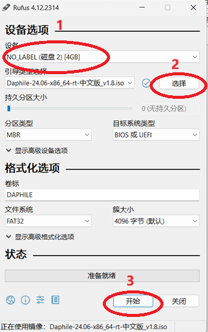
*图注：Rufus 写入设置，确认设备、引导镜像及分区类型，确认无误后点击开始。*

---

## 第二步：关键操作 —— F1 初始化硬盘

这是最关键的一步，请集中注意力！很多小白安装失败就是因为漏掉了这一步。

1. **连接线路**：给旧电脑插上电源、网线（必须插网线）、刚才做好的 U 盘。
2. **U 盘启动**：
   * 旧电脑开机，狂按启动热键（F12/F11/Esc 等，根据你的电脑型号不同来选择按哪个键）进入启动菜单（Boot Menu）。
   * 选择你的 **USB 设备** 启动。
3. **捕捉 F1 时机（手速要快）**：
   * 当屏幕刚出现 Daphile 的 **Welcome 欢迎界面**（或者倒计时）时，**千万不要等它跑完！**
   * **立刻按下键盘上的【F1】键！**
4. **进入初始化菜单**：
   * 此时屏幕会变成全英文的文本菜单。
   * 设置语言，可以保持 **English** 不变直接按回车，一直按回车，直到出现下图内容：

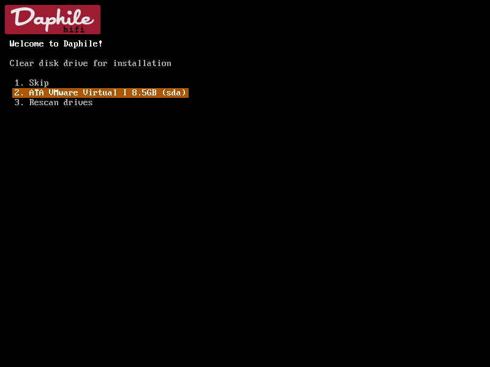
*图注：在初始化菜单中，使用键盘上下方向键选择你要安装的旧电脑硬盘，按回车确认。*

   * 选择你的硬盘再按回车，这个时候屏幕上会弹出一个红色的警告和一组四位数字，你需要手动输入这四位数字确认，再按下回车。

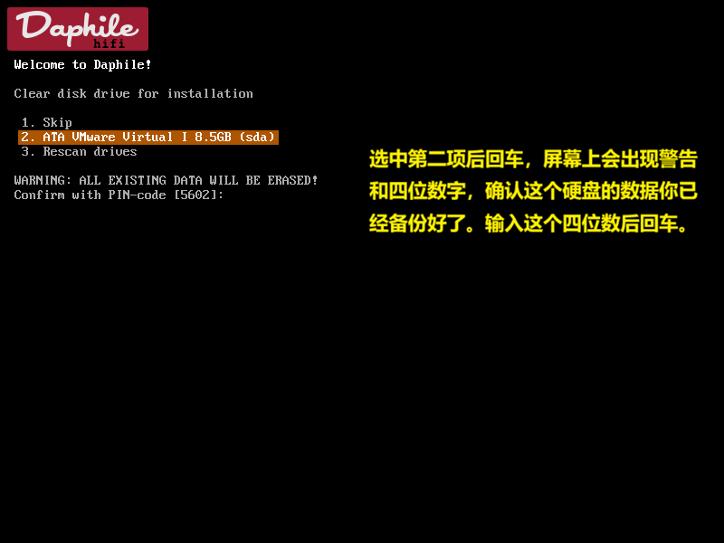
*图注：系统弹出警告提示数据将全部丢失，手动输入屏幕上提示的四位 PIN 码（如本例中的 5602）并按回车确认。*

   * （此时你的旧硬盘已经被“洗白”了，变成了一张白纸，静静等待系统的写入。）

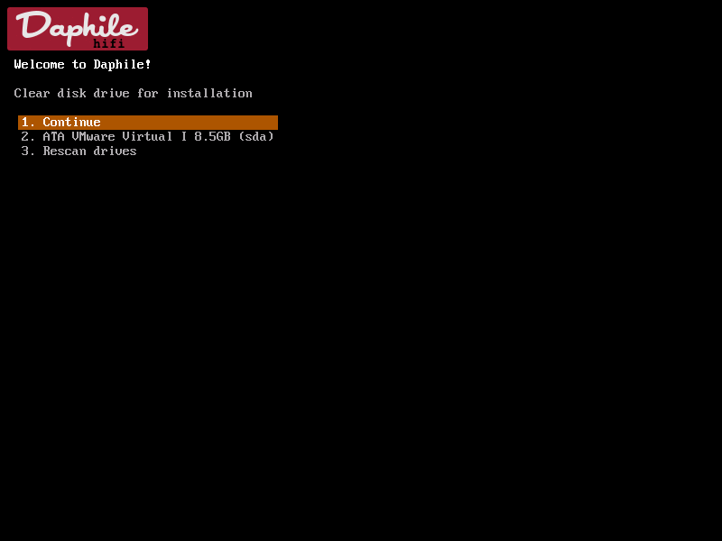
*图注：硬盘清空完成后，选中第一项 Continue 按回车，系统会自动继续启动。*

   * 选择第一项 `1. Continue` 后回车，系统会自动继续启动，开始在屏幕上跑代码。

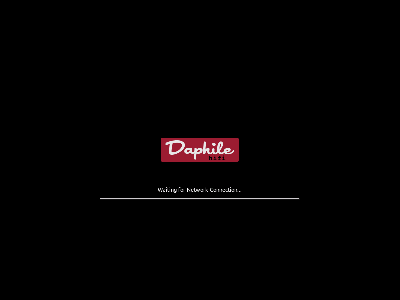
*图注：系统选择 Continue 后会自动启动加载，若尚未建立网络连接会显示 Waiting for Network Connection... 状态。*

---

## 第三步：获取“控制权”

当屏幕上的代码跑完，变黑，最后停留在：

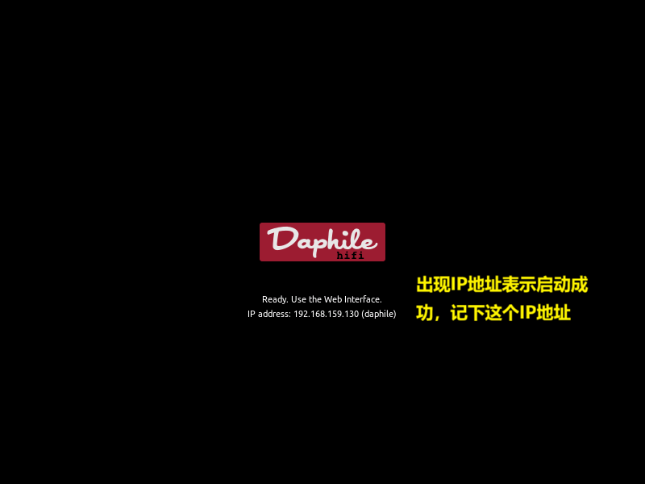
*图注：系统启动成功，屏幕底部会显示 Ready. Use the Web Interface 并附带系统的 IP 地址。*

看到 `IP Address: 192.168.x.xxx` 后，说明系统已经在 U 盘里成功运行起来了。

1. **记下这个 IP 地址**。
2. 此时你可以把旧电脑的显示器和键盘拔掉了（如果不放心，继续留着也行）。

---

## 第四步：网页端正式安装（落户硬盘）

现在，回到你的手机或主力电脑上（**注意：必须在同一个局域网内**）。

1. **登录**：在浏览器地址栏输入刚才记下的 IP 地址。

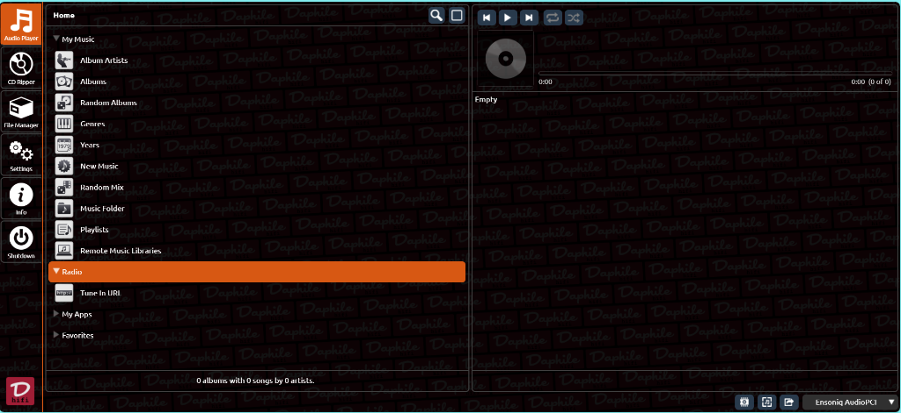
*图注：在主力机或手机浏览器中输入刚才的 IP 地址，进入 Daphile 的橘红色控制台网页界面。*

2. **进入设置**：看到橘红色界面后，点击左侧导航栏下方的 **Settings**（小齿轮图标）。

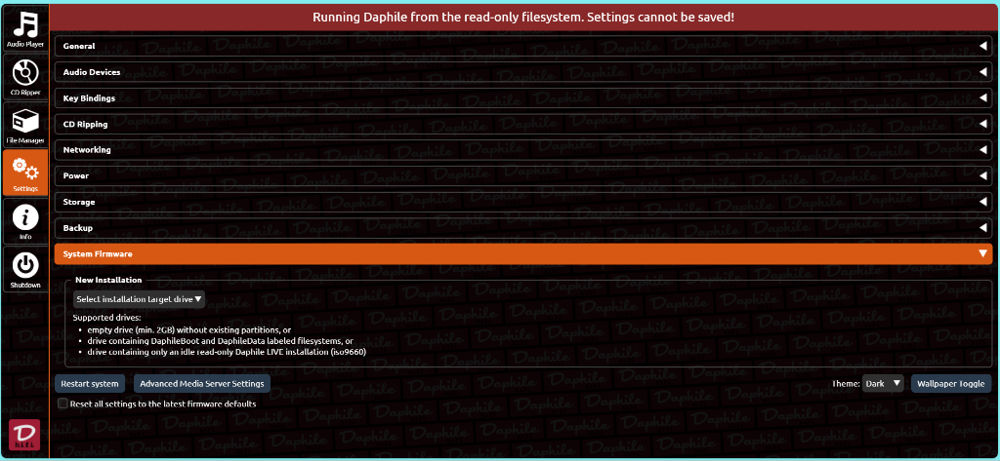
*图注：点击左侧的 Settings 齿轮图标，即可在主界面右侧加载出系统设置面板。*

3. **找到固件选项**：向下拉，找到 **System Firmware**（系统固件）。
4. **选择硬盘**：

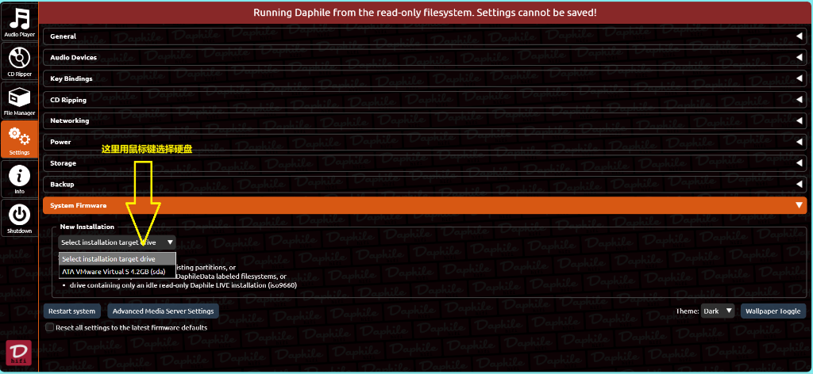
*图注：在 System Firmware 的 New Installation 下拉菜单中，用鼠标选择我们刚刚擦除洗净的旧电脑硬盘。*

   * 在 **New Installation** 的下拉框里，你应该能看到刚才被我们用 F1 洗白的那块硬盘（通常显示为 `ATA...` 或具体的硬盘品牌名）。
   * （*注意：如果没有执行 F1 这一步，这里经常是空的，或者根本找不到硬盘*）。

5. **开始安装**：

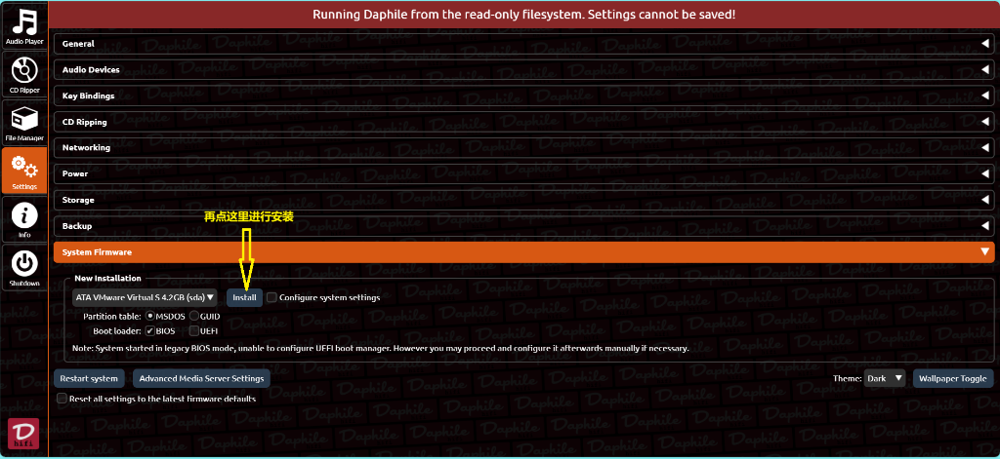
*图注：点击 Install 按钮启动正式的硬盘安装写入过程。*

   * 点击 **Install** 按钮。

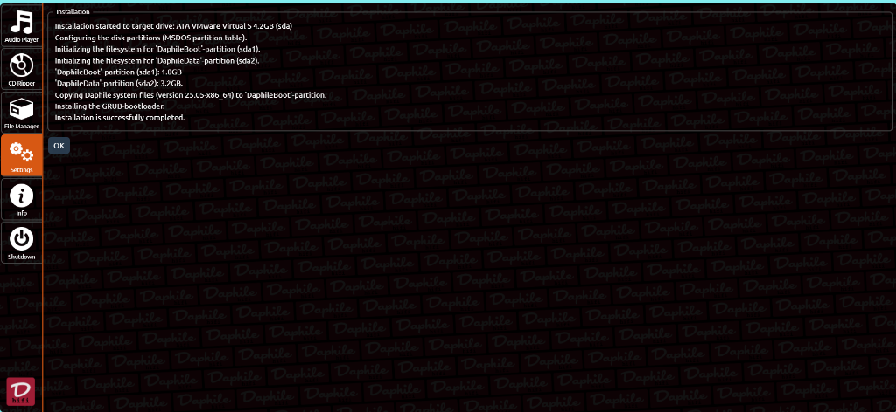
*图注：写入进度提示，请耐心等待系统将核心固件彻底拷贝到你的旧电脑硬盘中。*

6. **拔管重启**：

*图注：网页端控制台再次打开，出现 Daphile 经典音乐播放界面，说明系统已经成功落户旧电脑硬盘！*

   * 点击左下方的 **Restart System** 按钮，系统会自动重启。
   * 等待 2 分钟，网页界面会自动刷新打开。

---

如果觉得英文版不习惯的朋友，我找到了一个中文版，有需要的可以私信我。

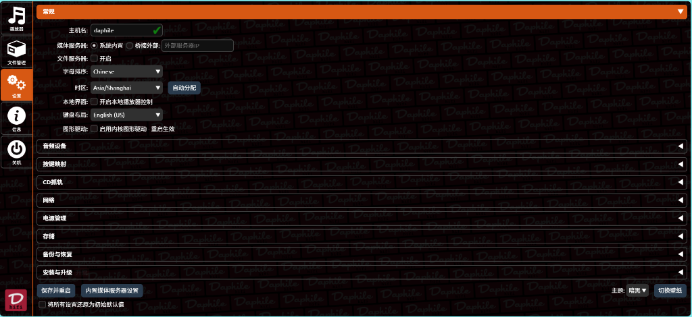
*图注：中文汉化版 Daphile 的主界面效果（有汉化包需求的朋友可以私信博主获取）。*

---

## 第二章总结

通过“F1 擦除硬盘”这一招，我们成功绕过了所有复杂的 PE 分区工具，直接利用 Daphile 原生功能解决了最棘手的“硬盘识别”与“旧系统清理”问题。

现在，你的旧电脑已经彻底脱胎换骨，变身为一台专业的 **Hi-Fi 专机**。

你可以试着在浏览器里随便点点看，虽然现在里面一首歌都没有。

下一章**《存储篇》**，我们将解决最头疼的问题：
**既然硬盘被格式化空了，怎么把电脑里的几百 G 无损音乐拷贝进去？**
**难道要拆出硬盘来拷贝吗？**

当然不需要！我们有更优雅、更简单的方法，敬请期待下一期教程！
