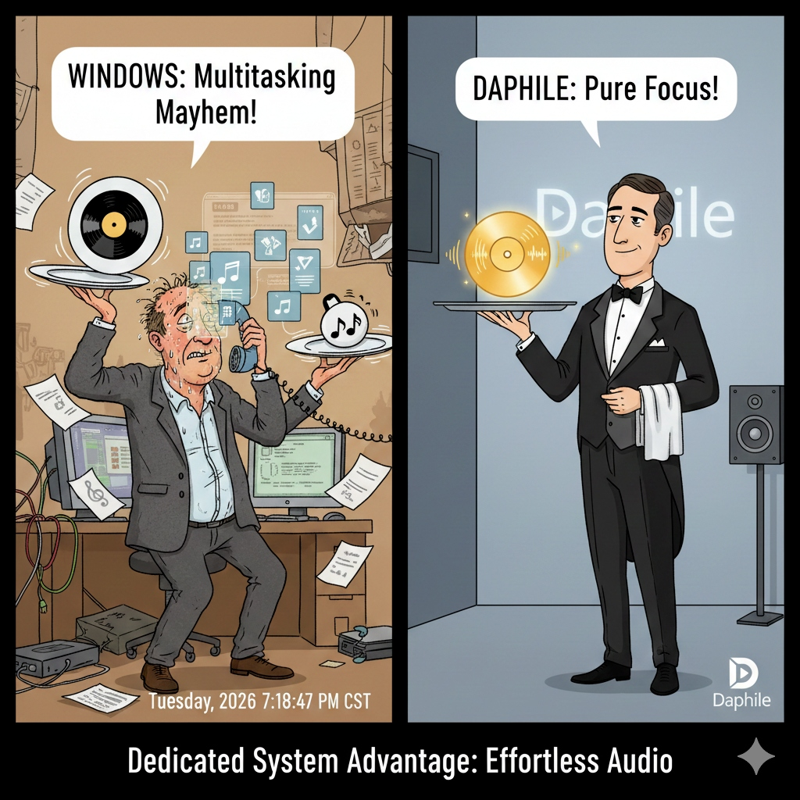
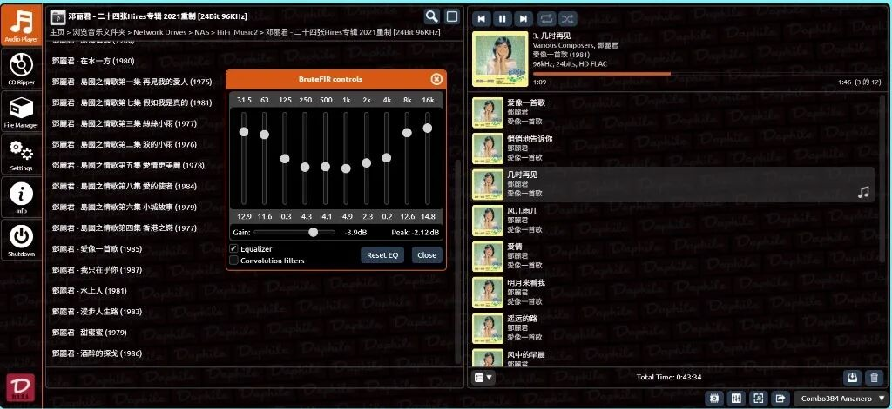
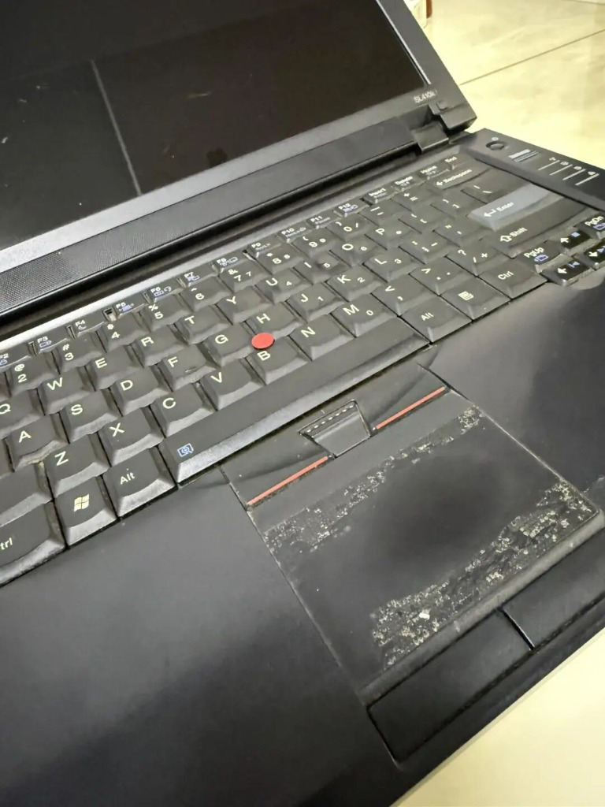
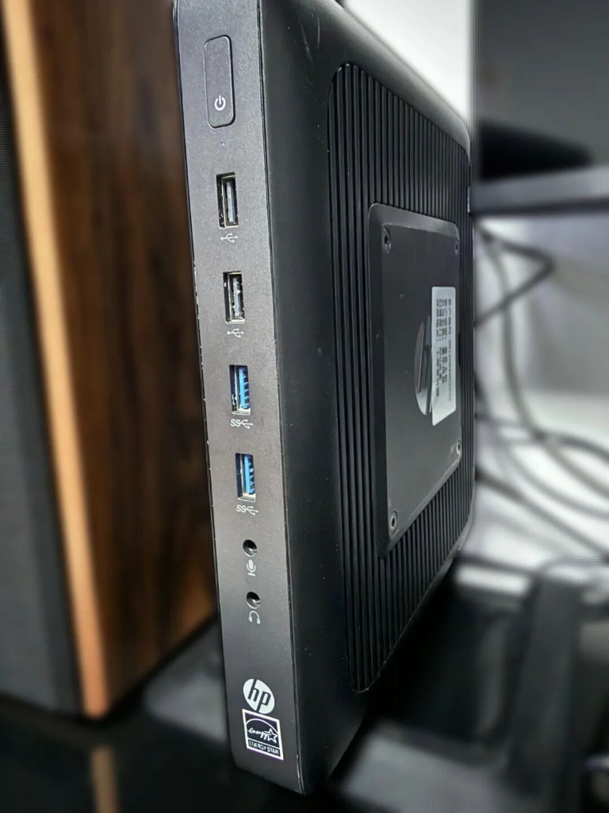

一、为什么要折腾“数播”？

很多朋友听歌习惯用电脑打开网易云、QQ音乐，或者用 Foobar2000。你可能会问：“我都已经在用电脑听歌了，为什么还要专门搞个‘数播系统’？这不是脱裤子放屁吗？”

答案很简单：因为 Windows/macOS 系统太“忙”了。

想象一下，你的电脑是一个餐厅服务员。你在听歌时，这个服务员不仅要给你端菜（播放音乐），还要去后厨催单（运行杀毒软件）、去门口迎宾（弹窗广告）、去打扫卫生（系统后台更新）。

在这么忙乱的情况下，它端给你的菜（音频数据），往往是经过了压缩、甚至被劣质调料（Windows 混音器强制重采样）污染过的。

*图注：Windows 与 Daphile 的音频处理对比：多任务干扰 vs 纯净专注。*

而我们要搭建的数播系统（Daphile），相当于一位私人管家。

他这辈子只做一件事：把音乐数据，完完整整、一尘不染地交给你的音响。

没有干扰，没有中间商赚差价，出来的声音背景更黑、细节更多、那种“数码味”更少。

最重要的是：获得这位“私人管家”，你不需要花一分钱。

二、核心主角：Daphile 是什么？

不要被英文名字吓到。Daphile就是我们要用的软件系统。

* 它不是一个安装在 Windows 里的播放器（像 PotPlayer 那样）。
* 它是一个操作系统（OS）。它会直接替代 Windows 来接管你的电脑。
* 它的特技：极简、免费、声音好。它砍掉了所有与音乐无关的功能（没有图形桌面、不能打字、不能看图），把电脑的所有性能都贡献给音质。

*图注：Daphile 网页端控制界面，内置丰富的专业音频设置（如 BruteFIR 均衡滤波）。*

*图注：通过手机浏览器即可无缝控制 Daphile 播放，体验丝滑。*

三、硬件寻宝指南（翻翻你家箱底）

我们要组建的是一套“穷人的劳斯莱斯”，原则是：能用旧的，绝不买新的。

### 1. 主机（数播转盘）

去床底下、储藏室找一找，你肯定能找到一台落满灰尘的旧电脑。

*图注：一台闲置积灰的旧笔记本，正是最理想的免费数播转盘。*

*   **优势 1**：自带电池。这相当于自带了一个几百块的 UPS（不间断电源），电流更纯净。
*   **优势 2**：屏幕坏了？键盘坏了？都没关系！只要能开机就行（因为我们以后根本不用它的屏幕和键盘）。
*   **旧台式机/小主机**：以前淘汰下来的办公电脑、Mac mini 等。
*   **瘦客户机（进阶推荐）**：如果你实在没有旧电脑，去闲鱼搜“升腾”、“惠普 T610/T620”等瘦客户机。几十块钱一台，无风扇设计（0 噪音），是完美的数播载体。

*图注：几十块钱淘来的瘦客户机，采用无风扇设计，实现真正的 0 噪音运行。*

### 2. 启动盘（系统钥匙）

找一个闲置的 U 盘。
容量 2GB 以上即可。

> 📌 **【图示占位 6：准备一个 2GB 以上的 U 盘】**
> *(您可以翻箱倒柜找出一个闲置的小容量 U 盘作为 Daphile 的启动与安装盘。)*

### 3. 网络连接

*   **网线（首选）**：插网线最稳，不用担心设置 Wi-Fi 密码的麻烦。
*   **Wi-Fi**：也可以用，但第一次安装时建议先插网线，进系统后再配置 Wi-Fi。

### 4. 解码设备（DAC）

> 📌 **【图示占位 7：外接 USB 解码器（DAC）或小尾巴】**
> *(虽然旧电脑自带 3.5mm 耳机孔，但底噪感人。发烧推荐外接一个 USB DAC，将数字信号高精度转换为模拟信号。)*

旧电脑自带的耳机孔通常底噪很大，听个响可以，想发烧不行。
如果你手头有 USB 解码器（台式或便携小尾巴），那是最好的。如果没有，这一章先不急着买，我们先把系统跑起来。

四、动手前的准备（软件篇）

在开始下一章的安装之前，请在你的主力电脑（就是你现在正在用的这台）上准备好以下两样东西。

### 1. 下载 Daphile 系统镜像（ISO 文件）

Daphile 的官网是全英文的，不用慌，也不用去啃英文，直接点击下面的链接进入下载列表：

官方下载地址：https://www.daphile.com/firmware/stable/
打开页面后，你会看到一堆文件，请根据你的旧电脑年龄，二选一：

> 📌 **【图示占位 8：Daphile 固件官方下载列表】**
> *(进入 stable 目录后，选择文件名带 x86_64 且后缀为 .iso 的最新文件进行下载。)*

*   **大多数电脑（推荐）**：
    如果你用的是 2012 年以后的电脑（或者是近几年的瘦客户机），请找文件名里带 `x86_64` 的文件。
    *目标文件示例*：`daphile-25.05-x86_64.iso`（中间的数字是版本号，选列表里最下面那个，也就是最新的）。
    *注意*：后缀名必须是 `.iso`，不要下成 `.md5`。
*   **古董电脑（极少数情况）**：
    如果你是从仓库翻出来的 2010 年以前的老古董（比如奔腾 4、早期 Atom 上网本），请找文件名里带 `i486` 的文件。
    *目标文件示例*：`daphile-23.01-b261225-i486.iso`

> 💡 **老鸟提示**：
> 官方服务器在国外，有时候网速会像蜗牛一样慢（只有几 KB/s），甚至下载失败。
>
> **方案一**：动手能力强的朋友，可以用迅雷挂着下，或者去论坛找分流。
> **方案二（最省事）**：如果你实在搞不定下载，直接私信博主，或者在本条内容下留言（比如“求安装包”），我看到后直接把下载好的国内高速网盘链接发给你！

### 2. 下载“写盘工具”

我们需要一个专门的软件，把上面下载的 ISO 系统文件“烧录”进 U 盘里，而不是直接复制进去。

*   **推荐工具**：Rufus
*   **中文官网下载**：https://rufus.ie/zh/
*   **使用方式**：下载页面往下拉，看到“下载”两个大字，点下面的 `rufus-4.12.exe` 即可（不仅免费，而且自带中文）。

> 📌 **【图示占位 9：Rufus 写盘工具官方下载界面】**
> *(在 Rufus 官网选择最新版（如 rufus-4.12.exe）下载，该工具体积极小且无需安装，双击即可使用。)*

第一章总结

恭喜你，你已经迈出了发烧的第一步！

现在，请把那台旧电脑找出来，擦擦灰，插上电源。

下一章，我们将手把手教你《只需一根 U 盘，3 分钟复活旧电脑》，让它变身为专业的 Hi-End 播放器。
