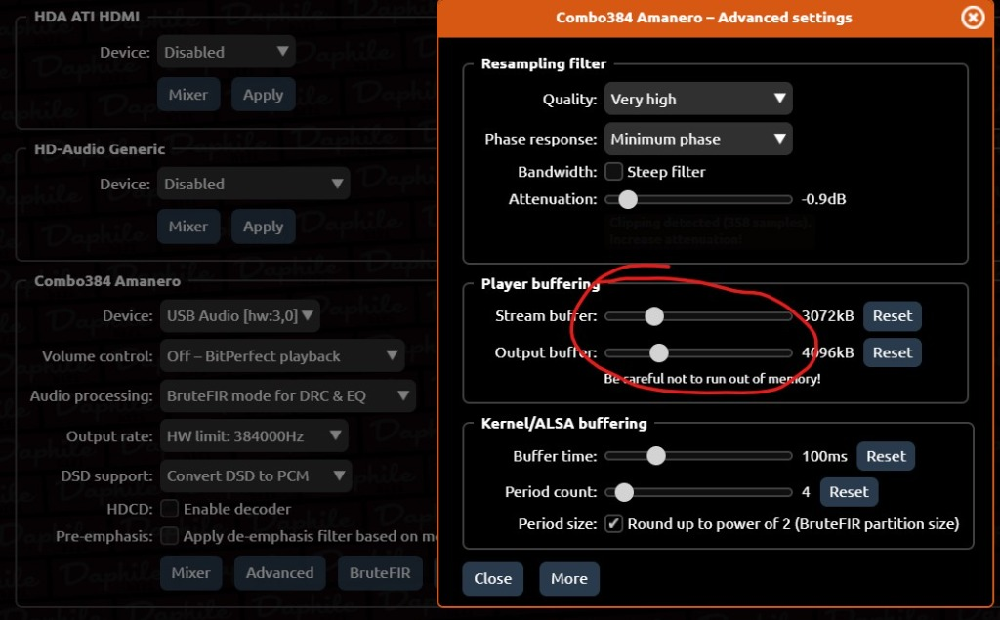
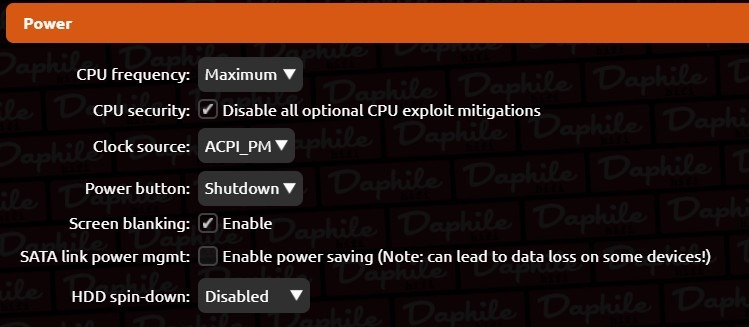

玩 Daphile (达菲) 的硬核玩家，绝不应该让这套优秀的基于 Linux 实时内核的系统，沦为一个简单的免费播放器。

抛开“水电火电”的伪科学玄学，今天我们只谈 **OS 级调度、I/O 阻断和网络层优化**。以下 3 个底层配置，改完直接从物理层面降低系统数字抖动和电磁干扰。

---

## 01 阻断 I/O 干扰：强开 RAM (内存) 播放

硬盘马达的机械震动和寻道时的电流波动，是机箱内最大的电磁干扰源。

首先，我们在播放界面右下角找到你的声卡设置按钮：

*图注：点击 Daphile 播放界面右下角声卡名称左侧的“芯片”图标，进入声卡的高级缓存设置页面。*

点击后会弹出声卡的高级设置窗口，我们在缓存选项中照图抄作业：

*图注：在声卡的 Advanced 页面中，将 Player buffering (播放器缓冲) 中的 Stream buffer 与 Output buffer 拖动重置为极小值。*

### 实操步骤
1. 点击播放界面右下角声卡左侧的**“芯片”图标**进入设置。
2. 勾选 **Play from RAM**。
3. 在弹出的 `Advanced settings` (高级设置) 中，将 **Stream buffer** 和 **Output buffer** 的滑块重置为极小值（如上图）。

### 核心逻辑
此操作将整轨音频预读并锁入内存，彻底切断播放期间的硬盘读取干扰。去除了多余的缓冲层层叠加，数据流直通解码器，背景宁静度提升是纯粹的物理现象。

> [!WARNING]
> **避坑提醒 (原生 DSD 玩家慎用！)**
> 
> 开启此功能会导致达菲强制将 DSD 转换成 PCM (WAV) 格式，破坏原生 DSD 数据流。纯 PCM (如 WAV/FLAC) 听众请闭眼开启。

---

## 02 内核时钟与 CPU 调度优化 (极致性能模式)

老机复活不差那几瓦电费，我们要的是绝对的线性输出。进入 `Settings` -> `Power` 页面照图抄作业：

*图注：在 Daphile 系统 Settings 中的 Power 配置页面，调整 CPU 频率、安全补丁与时钟源。*

### 实操步骤
进入 **Settings** -> **Power**，按如下进行配置：
- **CPU frequency**: 选择 **Maximum** (锁死最高性能，拒绝 CPU 变频跳频)。
- **CPU security**: 勾选 **Disable all optional CPU exploit mitigations** (卸载全部安全漏洞补丁，彻底释放处理器的计算性能)。
- **Clock source**: 锁定 **ACPI_PM** (提供极低的时钟漂移与极高的时钟精度)。

### 核心逻辑
通过在底层物理锁死 CPU 运行频率和时钟源，消除了 CPU 因为动态节能变频带来的微秒级延迟波动。这不是脑放，这是工业级实时系统（Real-time OS）的常规物理基操。

---

## 03 协议降维：踢掉 SMB，拥抱 NFS

使用 NAS 挂载歌库是老哥们的基操，但使用 Windows 体系的 SMB 协议挂载属于给自己找不痛快。SMB 协议本身握手极其繁琐，网络传输的协议开销也巨大。

### 实操步骤
1. 在你的 NAS 端（群晖、飞牛、Unraid 等）开放共享歌库文件夹的 **NFS 权限**。
2. 在达菲端的 Settings -> Storage 中，网络存储协议强制选择 **NFS** 进行挂载。

### 核心逻辑
NFS 作为 Linux 系统原生的网络文件系统，由系统内核驱动直接进行数据块的读写，网络传输负担和 CPU 协议解析开销降到最低。

**有线千兆直连加上 NFS 协议，是 NAS 作为数字音源的唯一正解。**

---

## 附加：物理原教旨主义者的“玄学”排雷

### 关于线性电源（线电）
- **核心逻辑**：给数字转盘（PC 主机/瘦客户机）加线性电源，是纯粹的智商税！PC 内部输出的只是 0 和 1 的数字信号，只要普通开关电源没有坏到引发死机，传给解码器的数据包就没有任何区别。现代高品质解码器内部都自带多级稳压整流，花几千块在 PC 端搞线电，不如翻开初中物理课本重修。坚决抵制！

### 关于 USB 隔离器
- **避坑提醒**：千万别碰 ADuM3160 等廉价隔离器！这是过时的老旧残废方案，传输带宽极低，连高码率的 PCM 格式都跑不满，用它纯属物理劣化数字信号。如果觉得系统有地线底噪，先去检查墙上的插座有没有真正连入地线，别妄想用几十块的电子垃圾来掩盖家里电气施工的缺陷。

---

## 折腾结语

Daphile 的本质是用极简的底层换取极低的延迟。动动手把这些底层参数调对，收益远超你在某鱼上买两根“带仙气”的二手发烧音频线。别问为什么，照着改就完了，物理定律永远不会骗你。

---

### 推荐阅读 (数播入门与进阶系列教程)

#### 数播入门教程：
- [【数播入门教程】第一章：系统介绍与硬件准备](/blog/daphile-introduction)
- [【数播入门教程】第二章：只需一根 U 盘，3 分钟复活旧电脑（安装篇）](/blog/daphile-installation)
- [【数播入门教程】第三章：扔掉数据线！给你的数播“喂饱”音乐](/blog/daphile-music-transfer)
- [【数播入门教程】第四章 解码篇：几十块钱让旧电脑音质起飞 —— 拒绝 3.5mm 耳机孔！](/blog/daphile-decoder)

#### 数播进阶教程：
- [【全网首发】扔掉小主机！飞牛NAS虚拟机直通硬件跑 Daphile，音质性能双起飞](/blog/fnos-daphile-vm)
- [极致榨干老硬件！“双达菲”数播系统保姆级搭建教程](/blog/dual-daphile-setup)
- [别交学费了！我让AI算了一段FIR代码扔进达菲，几十块的破音箱秒变百万调音](/blog/ai-fir-filter)
