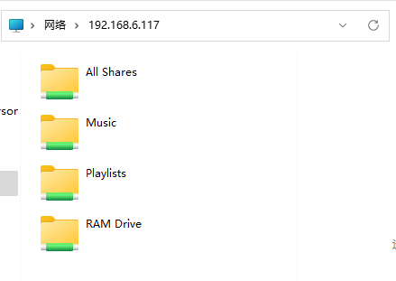
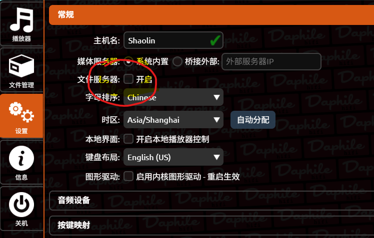
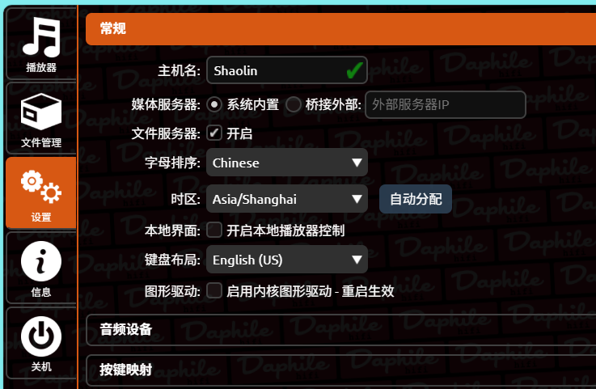
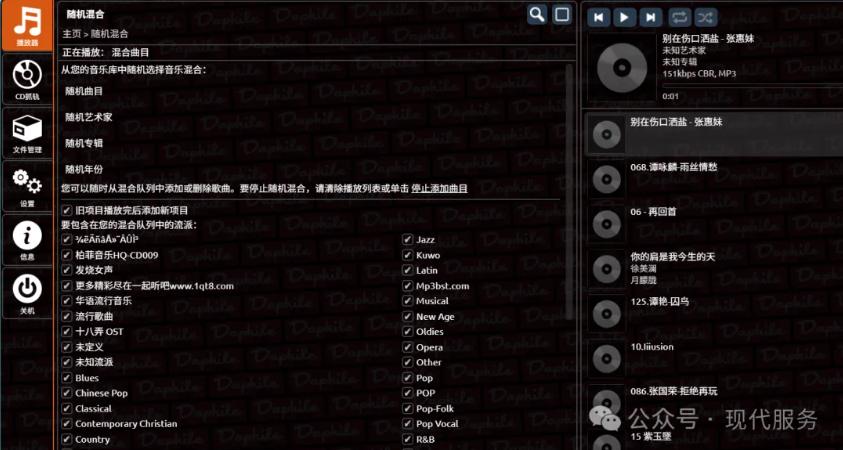
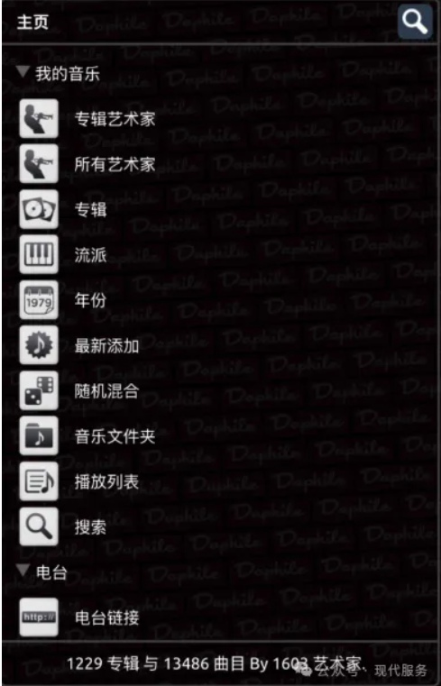
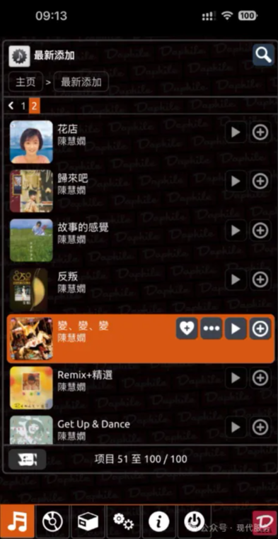
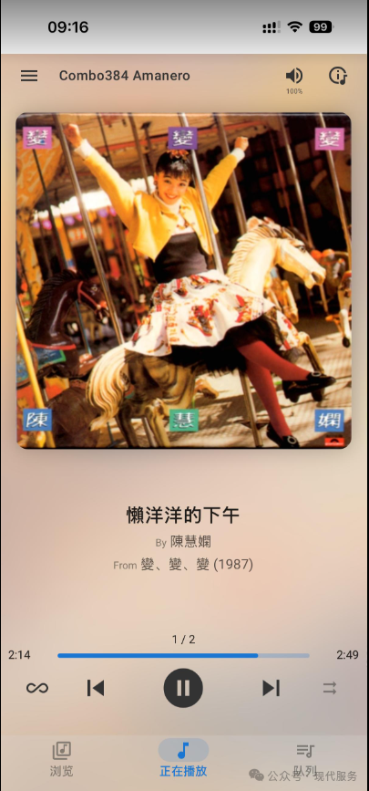

前言：别动那把螺丝刀！

上一章我们成功给旧电脑装上了 Daphile 系统。现在的它，虽然“脑子”很聪明，但“肚子”是空的——里面一首歌都没有。

很多朋友下意识的反应是：“我是不是要把旧电脑的硬盘拆下来，插到主力电脑上拷歌？”

**千万别这么做！🙅‍♂️**

原因很简单：Daphile 为了好声音，把硬盘格式化成了 Linux 专用的格式（ext4）。这种格式，你的 Windows 电脑根本不认识！插上去不仅读不出盘符，甚至会提示你“需要格式化”，一旦手滑点了确定，系统就白装了。

今天教大家一招“隔空投送”，不用拔硬盘，不用插线，坐在主力电脑前就能把歌传进去。

---

## 方法一：网络邻居法（最优雅，推荐！）

只要你的主力电脑（Windows）和数播（Daphile）连在同一个路由器下（Wi-Fi或网线都行），它们其实已经是“邻居”了。

### 操作步骤

1. **打开“我的电脑”**：在你的主力电脑上，打开“此电脑”或“文件资源管理器”。
2. **输入神秘代码**：
   * 点击最上方的地址栏（就是显示 `C:\Users...` 的那个长条框）。
   * 清空里面的字，输入：`\\` 加上你数播的 IP 地址。
   * *举例*：如果你数播的 IP 是 `192.168.6.117`，那就输入 `\\192.168.6.117`。
   * **注意**：斜杠是向左倾斜的 `\`（反斜杠），不是网页链接那个 `/`。
3. **见证奇迹**：
   * 按下回车（Enter）。
   * 你会看到一个名为 `Music` 的文件夹。
   * 双击进去，这里就是你旧电脑硬盘的“肚子”！


*图注：在 Windows 资源管理器地址栏输入反斜杠双斜线及达菲 IP 地址，即可直接访问其内置共享文件夹。*

### 注意：使用我提供的中文版的朋友要增加一个步骤

当你用上面的方法打不开文件夹的时候，请做下面的操作：

1. 进入达菲网页界面，在【设置】里开启“文件服务器”，如下图，然后重启达菲。


*图注：如果无法直接访问共享文件夹，进入达菲网页设置界面，在“常规”设置下勾选“文件服务器”后的“开启”选项。*

2. 重启后的达菲设置就是这样：


*图注：勾选“文件服务器：开启”并重启后的界面状态。*

3. 这个时候再回到前面的步骤，继续完成操作。

### 开始传歌：
现在，把你电脑里珍藏的几百 G 无损音乐，直接复制、粘贴到这个文件夹里。
速度取决于你的网络（插网线通常能跑满 100MB/s，飞快！）。

---

## 方法二：外挂硬盘法（适合海量资源）

如果你的音乐库大得惊人（比如有 4TB 的 DSD 资源），或者你的旧电脑硬盘太小装不下，怎么办？
简单：挂个“外挂”。

1. **准备移动硬盘**：把你的歌都存进移动硬盘里。
   * *注意*：移动硬盘建议格式化为 **NTFS** 格式（这是 Windows 最通用的格式，Daphile 也能完美识别）。
2. **插！**：直接插到旧电脑的 USB 接口上。
3. **自动识别**：Daphile 会自动扫描到这块硬盘。不需要任何设置，几分钟后，你就能在手机控制端看到这些歌了。

---

## 进阶：如何让你的音乐库“美如画”？

歌传进去了，但为什么在手机上打开 Daphile，显示的都是乱七八糟的文件名，也没有漂亮的专辑封面？

因为你的音乐文件“缺家教”（元数据不全）。

想拥有像海报墙一样的音乐库，只需做好两点：

### 1. 文件夹结构要规整

不要把几千首歌一股脑丢在一个大文件夹里。请养成好习惯，按以下层级建立文件夹：

```text
📂 周杰伦 (歌手)
└─ 📂 范特西 (专辑)
    ├─ 🎵 爱在西元前.flac
    ├─ 🎵 简单爱.flac
    └─ 🖼️ cover.jpg (关键！)
```

### 2. 封面的秘密（必看！）

Daphile 怎么知道这张专辑的封面长什么样？

* **方法**：找一张这张专辑的高清大图，重命名为 `cover.jpg` 或者 `folder.jpg`。
* **动作**：把这张图丢进专辑文件夹里。
* **效果**：刷新一下 Daphile，你会发现原本光秃秃的列表，瞬间变成了精美的 CD 墙。


*图注：Daphile 网页端控制面板下的随机混合播放模式，右侧展示当前播放队列。*


*图注：Daphile 手机网页控制端的“我的音乐”主页面，支持按专辑艺术家、流派、年份等详细维度分类浏览音乐库。*


*图注：Daphile 手机控制端经典的播放列表与控制器界面，完美展现流媒体音乐的封面与歌名。*


*图注：通过手机端同样可以便捷地设置各类流派、随机混合等高级播放选项。*

---

## 小白避坑指南（FAQ）

**Q：为什么我输入 IP 地址后提示“无法访问”？**
**A**：请检查你是不是输错了斜杠（要用 `\`）。或者检查你的 Windows 防火墙是不是把“文件共享”给关了。最简单的办法：重启两台电脑再试。

**Q：传进去的歌怎么在手机上看不到？**
**A**：传完歌后，Daphile 需要一点时间“消化”（扫描数据库）。你可以在手机控制端的 **Settings** -> **Storage** 里点一下 **"Rescan"**（重新扫描）。

---

## 第三章总结

现在，你的旧电脑里已经装满了精神食粮。

它不再是一个空壳，而是一个拥有海量资源的媒体中心。

但是，“存得好”不代表“放得好”。

下一章**《解码篇》**，我们将迎来整个系统的音质核心：
* 几十块钱的“小尾巴”真的能打几千块的机器吗？
* 怎么设置才能让 Daphile 输出最纯净的源码（Bit-perfect）？

（准备好你的耳机，下一章我们要让耳朵怀孕！）
