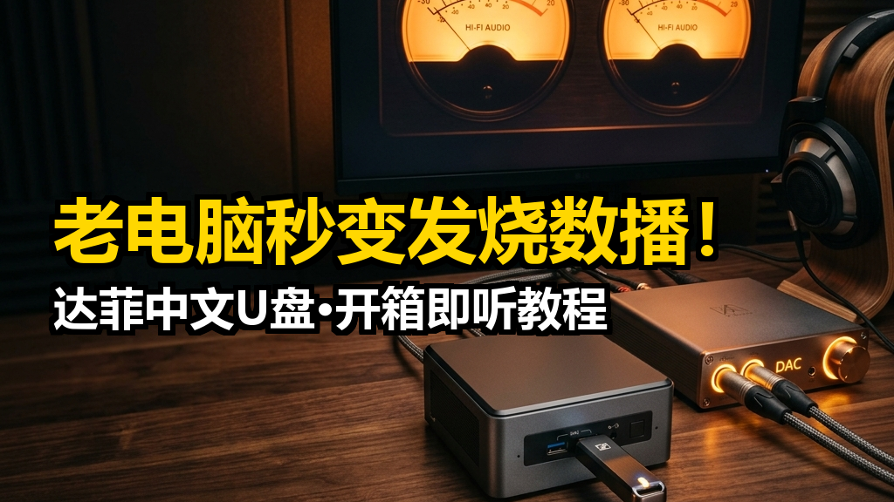
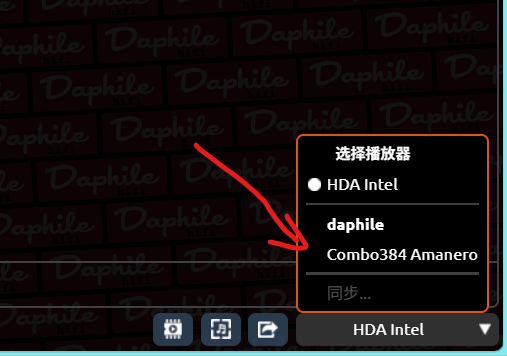

恭喜您收到**老机复活**独家定制的达菲中文发烧 U 盘！本 U 盘已为您预装并完成技术服务授权最新的 **Daphile 25.05 实时内核全中文系统**，并内置了发烧级必备插件。请按照以下三个步骤，开启您的极客数播之旅。

---

## 🔌 第一步：硬件连接（插盘与插线）

在电脑**处于关机状态下**，完成以下连接：

1. **插紧 U 盘**：
   * **台式机**：请务必将 U 盘插在**电脑主机箱背面的主板 USB 接口上**（建议插在蓝色/红色的 USB 3.0/3.1 接口上，供电和速度更稳）。
   * **笔记本/一体机**：直接插在侧面的 USB 接口上。
2. **连接有线网线**：
   * 用网线将数播电脑的网口连接到**家里路由器的 LAN 口**。（**极其重要**：首次开机强烈建议使用有线连接，系统会自动分配 IP，最方便用手机控制）。
3. **连接解码器/音响**：
   * 将您的 USB 解码器（DAC）或者声卡用 USB 线连接到数播电脑；如果是简单听，也可以直接在数播电脑的 3.5mm 耳机孔上接音箱。

---

## 🖥️ 第二步：开机并引导启动 U 盘

1. **狂按启动快捷键**：
   按下数播电脑开机键的一瞬间，右手**立刻、连续快速地狂按**键盘上的**启动菜单快捷键**（按键时机要快，直到屏幕弹出一个选择菜单）。
   * **常用启动快捷键参考**：
     * **联想（Lenovo）台式机/笔记本**：开机狂按 `F12`
     * **华硕（ASUS）主板/台式机**：开机狂按 `F8`
     * **技嘉（GIGABYTE）主板**：开机狂按 `F12`
     * **微星（MSI）主板**：开机狂按 `F11`
     * **戴尔（DELL）/惠普（HP）**：开机狂按 `F12`
     * **其他老旧组装机**：狂按 `F11` 或 `Esc`
     * **未列出的电脑品牌请自行百度或问“豆包”等 AI 工具**
2. **选择 U 盘启动**：
   在弹出的菜单中，使用键盘上的上下方向键（↑ ↓），选中带有 **`USB`**、**`Generic Flash Disk`** 或 **`Acer`** 字样的选项，然后按下回车键（Enter）。
3. **静候开机完成**：
   屏幕会变成黑底白字并快速滚动，最后屏幕上会静止显示一行白色的 IP 地址（例如：`http://192.168.1.100` ）。看到这个 IP，说明系统已经启动成功！**此时您可以关掉数播电脑的显示器了。**

---

## 📱 第三步：手机/电脑远程控制听歌

达菲系统是专为“无头主机（无需显示器）”设计的，您只需要用家里的手机或另一台电脑就能完美控制它。

1. **确保在同一个 Wi-Fi 网络**：
   确认您的手机/平板所连接的 Wi-Fi，与数播电脑连接的是**同一个路由器**。
2. **浏览器输入 IP 访问**：
   打开手机浏览器，在地址栏直接输入数播电脑屏幕上显示的 IP 地址（例如输入 `192.168.1.100`），或者输入 `http://daphile.local`，点击前往.
3. **进入全中文发烧界面**：
   网页打开后，您会看到精美、高档的全中文数播控制台。
4. **选择声音输出设备（首次使用需设置）**：
   * 点击控制界面右下角的“选择播放器”下拉菜单（默认通常显示为 `HDA Intel` 或类似本地声卡，我们需要将其切换为您连接的 USB 解码器）。
   * 如下图红线锁定所示，在弹出的设备列表中，**选中您插入的 USB 解码器**（例如带有 `Combo384 Amanero` 等名称的设备）：

   

   * 现在，挑选一首您喜爱的歌曲，点击播放，开始享受高保真音乐吧！
5. **展现炫酷大屏表盘**：
   如果您想在数播电脑自己的显示器屏幕上展现大屏正圆暖橙 VU 动态指针表盘，请参看教程指南：[《如何展现达菲大屏VU表盘》](https://www.284868.xyz/blog/daphile-vu-meter-setup)

---

## 📞 贴心售后服务
如果您在进 BIOS、插线或者寻找 IP 时遇到任何阻碍，**请不要着急，随时用手机拍下屏幕画面发送到我的微信。我们可以直接开通微信视频通话，一对一为您现场指导，确保您的老电脑完美复活！**
