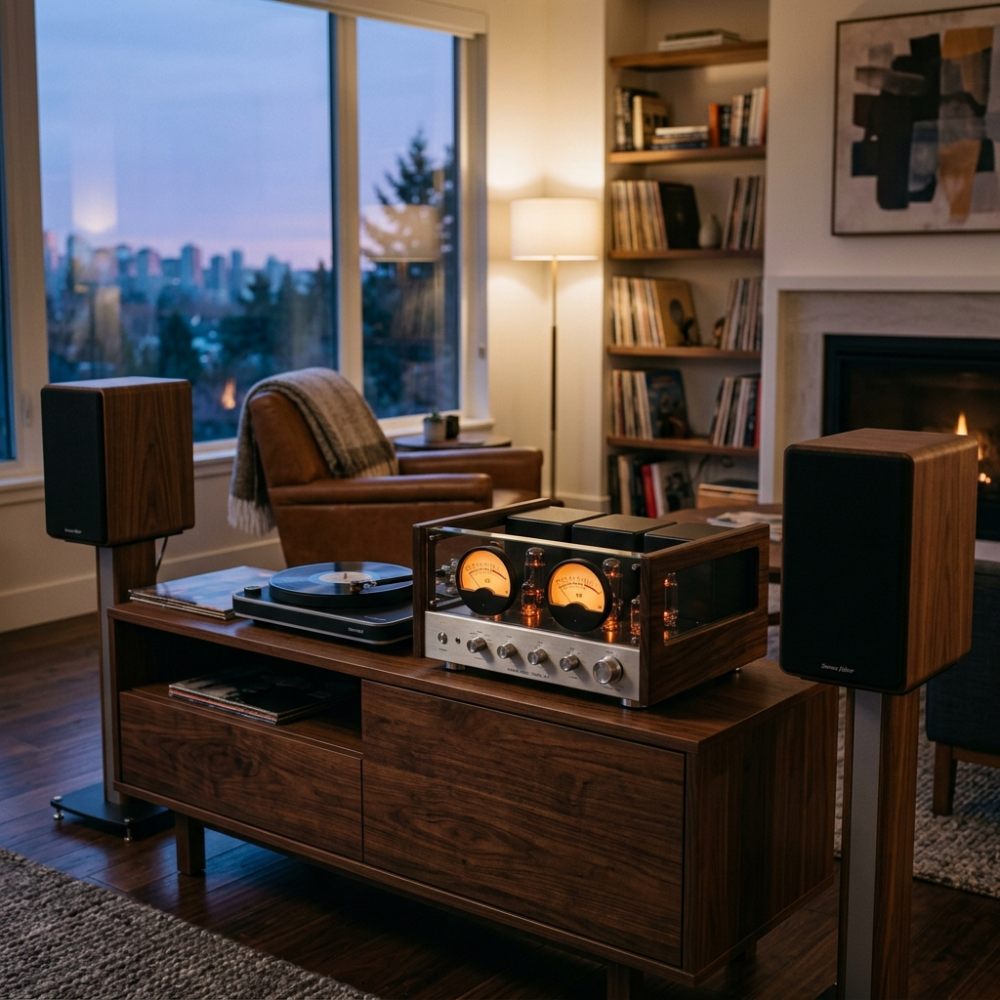
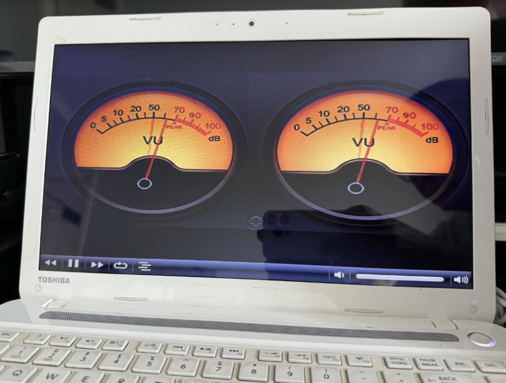
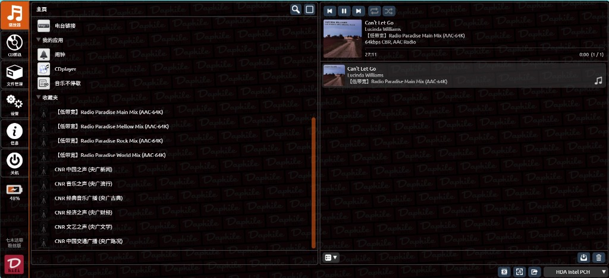
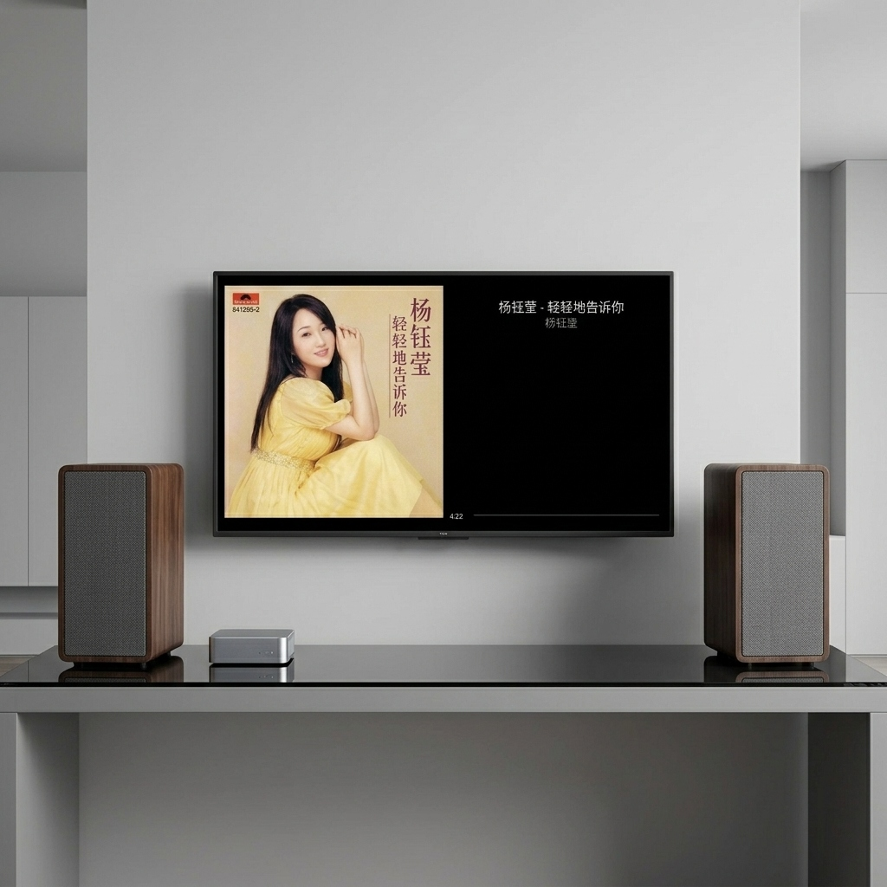

> **系统简介**：Daphile 中文定制版今日迎来 **v2.8 正式版** 的重大升级！本次更新重点提升了**大屏幕视觉动态表现**与**国内网络电台的播放流畅度**。我们彻底解决了此前版本中歌曲文字遮挡表盘，以及播放国外发烧电台时容易频繁卡顿的痛点，并完美修正了表盘上的设计 Typo。

---

## 💾 系统镜像下载

请根据您的硬件需求选择下载对应版本的系统镜像（ISO格式）：

| 系统版本 | 推荐指数 | 适用场景 | 网盘下载链接 |
| :--- | :--- | :--- | :--- |
| 🚀 **Daphile-25.05-x86_64-rt-中文版_v2.8.iso** | ⭐⭐⭐⭐⭐ | **实时内核版**：专为追求极致音质的发烧友设计，超低时钟抖动（Jitter），背景更黑更通透。 | [点击进入文末下载通道](#download-section) |
| 💻 **Daphile-25.05-x86_64-中文版_v2.8.iso** | ⭐⭐⭐⭐ | **标准内核版**：兼容性极佳，适合各种新老电脑硬件或虚拟机环境运行。 | [点击进入文末下载通道](#download-section) |

---

## 🛠 v2.8 核心升级说明

### 1. 模拟 VU 指针大屏自适应与纯净显示
*   **自主研发设计**：这套精美的暖橙色正圆双表头视觉，属于**我们纯手工自主研发设计、并完成数十帧的独立指针渲染制作**，拥有独家底层算法支持，绝非简单的搬运。
*   **刻度误差完美修复**：修正了原版表盘红色高电平区域标示为重复 `70` 的印刷手误（现已采用高匹配半粗体精确修补为 `90`，呈现标准的 `70 90 100` 电平指示）。
*   **全信息隐藏**：彻底清除了正在播放（NowPlaying）界面中覆盖在指针表盘上的所有文字信息与播放进度条，提供 100% 纯净的复古双表盘动态展示。
*   **黄金指针比例**：重新精密调校了表针长度与轴心高度。现在的双圆表头比例更符合经典发烧功放的复古美学，大屏观感极为协调。
*   **动感摆幅匹配**：针对系统的音频输出进行了完美的幅值匹配算法优化。指针动作灵敏敏捷，既不会因为音量大而频繁拍边爆表，也不会因为轻音乐而缩在左侧，大饱眼福。

### 2. 出厂内置极速“模拟味”电台收藏夹 (开箱即用)
为了让大家无需繁琐的手动配置就能畅听优质电台，我们重新设计了出厂预装电台：
*   **Radio Paradise (低位码流畅版)**：预装了发烧友公认音质极佳的 Radio Paradise 发烧电台（包含主频道、轻松音乐、摇滚、世界音乐四大频道）。精选的广播流不仅保持了温暖、耐听、润泽的“模拟声”，更优化为 64kbps AAC 低带宽推流，仅耗费约 8KB/s。即便在大陆网络晚高峰期，也能做到秒播、丝滑且完全不卡顿。
*   **国家高清台直推源**：内置了 CNR 中国之声、音乐之声、经典音乐广播（古典乐）、经济之声、文艺之声、中国交通广播等国家级数字直推电台。无电磁底噪和电流声，声音极其清澈纯净。
*   *新系统在开机后，上述电台将直接显示在“收藏夹”中，即点即播。*

### 3. 底层多设备连接稳定性优化
*   **指针状态智能对齐**：优化了后台的播放器识别逻辑。无论您是切换解码器还是有多台虚拟播放设备，VU 指针表都能在开机后自动对准活跃的音频流，绝不出现卡死或不动的情况。

---

## ⚙️ 体验模式与技术服务计划

为了让广大烧友在决定前能够“耳听为实，眼见为真”，本系统采用**先体验、后绑定**的技术服务模式：

*   **🆓 15分钟免费体验模式**：
    系统每次开机后，均可获得 **15分钟全功能免费体验时间**。在此期间，全中文操作、高精度 RT 内核音质、手机无损投歌、大屏 VU 指针等所有增值功能完全向您开放。
*   **🤝 为什么要收取服务绑定费**：
    我们收取的费用并非软件本身的销售费，而是针对我们团队在**全系统深度中文汉化翻译、大屏指针防卡死算法优化、多插件离线集成与测试、以及后续终身技术升级与售后支持**的智力劳动与人工服务费。

---

## 💎 服务授权方案与资费

### 方案 A：单台电脑设备服务绑定（💻 电脑特征码绑定 - 适合自己下载刷写的烧友）
*   **🎉 618 年中狂欢特惠**：**`29 元`**（**限时特惠至 2026年6月20日 24:00 截止**，过后将恢复原价 49 元）
*   **绑定机制**：与您自己的主机主板特征码（UUID）进行硬件硬加密绑定。
*   **适用场景**：适合自己会用电脑刷写 U 盘镜像的烧友。绑定后，**这台电脑可以任意更换、升级 U 盘或硬盘**，系统服务永久有效。

### 方案 B：32G 高品质免折腾实体 U 盘（💾 预装+已绑定服务 —— 强推给省心烧友）
*   **服务定价（全国包邮）**：**限时推广价：`¥99` 包邮**（截止到 6 月 20 日。由于近期闪存颗粒大幅度涨价，推广期过后将恢复原价 `¥119` 包邮）
*   **包含内容**：寄送一个 **16GB 品牌高品质物理 U 盘**。内部已预装最新的 v2.8 系统镜像，并完成了该 U 盘特征码的永久服务授权绑定。
*   **使用场景**：收到 U 盘后直接插在您的电脑上启动即可永久使用。**不用下载、不用配置，真正即插即用**！

### 方案 C：VIP 尊享会员计划【软硬双调校·声学定制服务】（🔥 极致发烧首选）
*   **服务定价**：**`99 元`**（不含 U 盘实物，常年固定价，不参与限时活动）
*   **包含权益**：
    1.  获得 **方案 A 电脑服务授权码 1 个**；
    2.  加入 **VIP 俱乐部技术支持群**，享受专属的一对一系统调试与网络搭建售后指导；
    3.  **🌟 核心价值：专属房间/音箱 FIR 卷积滤波器定制服务（一次）**：
        您只需提供您的**房间三维尺寸（长宽高）与您的音箱型号/摆位**，我们的声学工程师将为您计算出专属于您听音室的 **`WAV` 格式高精度 FIR 卷积校准文件**。导入达菲后，一键干掉房间低频共鸣与驻波，声音层次瞬间提升！
*   **📦 升级套餐服务**：
    *   **方案 C 升级物理 U 盘**：如果您选购了方案 C，想要加购 32G 预装绑定实体 U 盘，**只需再加价 `50 元`（合计 `149 元`）**，即可将包含的授权服务包邮寄送实体 U 盘。
    *   **方案 B 升级声学定制**：如果您已选购了方案 B 的实体 U 盘，想要升级获得方案 C 的 VIP 技术指导及一次专属房间/音箱 FIR 卷积滤波器定制服务，**同样只需再加价 `50 元`（合计 `149 元`）**！

---

## 🛠️ 设备服务绑定流程（三步走）

1.  **获取特征码**：
    将系统镜像写入 U 盘启动。体验期结束后，屏幕会自动弹出“技术服务绑定”拦截界面。请抄写或拍照记录您的 **【电脑特征码】** 或 **【U盘特征码】**。
2.  **扫码支持并发送特征码**：
    通过微信收款码支持您选择 of 您选择的相应服务方案，并将您的**特征码照片或文本**发送给客服微信。
3.  **输入授权码解锁**：
    客服会在第一时间为您核对并返还唯一的 12 位 **【服务授权码】**。将授权码填入输入框，点击“立即绑定”，系统即可瞬间解锁，开启无限播放与终身更新服务。

👉 **立即联系客服微信**：微信搜索公众号 **“老机复活”** 并关注，在后台回复“客服”或发送您的特征码与客服取得联系。

---

## 🔑 服务授权与升级指南
1.  **老用户无缝升级**：已经绑定过技术服务的机器，直接覆盖刷入新版 v2.8 即可。系统将自动识别并保留您的授权状态（安装写盘时确保“格式化 DaphileData”未勾选即可），无需重新绑定。
2.  **新用户体验与绑定**：新用户可免激活免费体验 15 分钟（体验模式）。若满意汉化、大屏指针与预装电台体验，可随时联系客服微信购买**专有服务授权码**进行绑定。

---

## ⚖️ 免责声明

1.  本定制版系统基于 Kipeta 开发 of Daphile 系统优化而来，原版系统著作权归原作者所有，系统本身遵循免费原则。
2.  我们收取的服务费仅针对全中文翻译、定制大屏代码优化、插件打包集成测试、人工声学 FIR 数据计算、以及后续的技术升级和一对一售后服务支持。
3.  本系统的授权验证（`sysauth`）作为独立第三方技术服务运行，不修改或干涉任何底层 GPL 开源组件的许可证及运行规则。

---

<h2 id="download-section">💾 镜像下载地址</h2>

本下载内容已开启“回复可见”，请在页面下方发表评论回复后，重新刷新网页即可解锁下载链接：

  <ul>
    <li><strong>百度网盘下载链接</strong>：<a href="/download/daphile-v28">点击进入百度网盘下载</a></li>
    <li><strong>提取码</strong>：<code>ljfh</code></li>
  </ul>

*(注意：若下载链接失效，请在下方留言区或通过「关于本站」页面联系站长更新。)*
