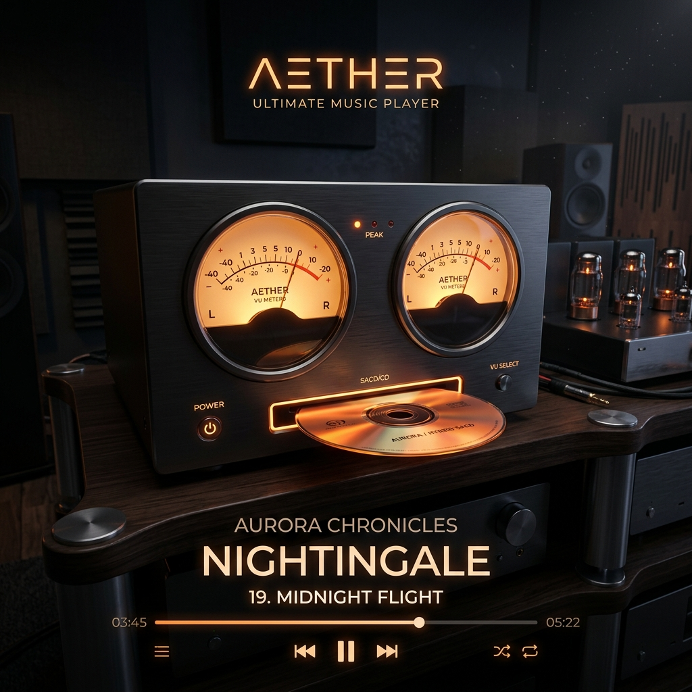

# 破冰数播十年封锁！七木达菲 v3.1 震撼首发：开启 SACD ISO 免解压播放新纪元！

各位乐迷、发烧友：

你是否也曾为这样的场景感到无奈？
*   满怀期待地下载了心仪已久的 **SACD ISO** 镜像音乐包，却发现：
*   必须在电脑上先用复杂的工具，花上大半天时间，把几个G的镜像文件慢吞吞地解压成几百兆一首的 DSF 单曲；
*   解压出来的零散歌曲不仅占用双倍的硬盘空间，还把原本整洁的音乐文件夹搞得杂乱无章、难以整理；
*   市面上各种数播系统换了一圈，唯独在这小小的 ISO 镜像直接播放前吃了闭门羹……

**这层数播界的“冰封屏障”，从达菲（Daphile）诞生至今，已经横亘在广大发烧友面前十多年之久。十多年来，无数人尝试，无数人放弃，它似乎成了数播系统里一个“心照不宣”的遗憾。**

今天，这个遗憾将被彻底终结！

**七木达菲研发团队，历时整整三个月的日夜攻坚，战胜了数不清的研发瓶颈，终于彻底攻克了这一数播领域沉寂十多年的历史级难题！**

我们无比自豪地向大家宣告：**七木达菲 v3.1 中文正式版** 震撼发布！数播设备“直接播放 SACD ISO 镜像文件”的时代，正式开启！

---

## ✨ v3.1 核心震撼功能：

### 💿 免解压！SACD ISO 镜像复制即播
从今天起，告别繁琐的电脑解压步骤。您只需要把下载好的 **SACD ISO 镜像文件** 拷贝到您的笔记本、内置硬盘、USB 移动硬盘，甚至是家里的 NAS 网络存储中。七木达菲 v3.1 将自动识别并直接播放！

### 🔍 极速自动扫描，单曲完美呈现
镜像放入后，系统将在后台自动秒级解析。ISO 内部的每一首单曲、专辑信息都会整整齐齐地呈现在您的媒体库中。选歌、切歌、快进，一切就像播放普通单曲一样丝滑自然。

### ⚡ 极致流畅，重塑老旧主机活力
通过底层逻辑的深度重构与效率压榨，播放 SACD ISO 镜像时的 CPU 资源消耗被降到了不可思议的极低水平。即使是低功耗的便携小主机或退役笔记本，也能在播放 DSD 音乐时流畅得像 PPT 翻页一般顺滑，声音干净、纯粹，声音毫无延迟与爆音。

### 🔊 依旧强悍的增值发烧体验
我们不仅攻克了 ISO 直接播放这一难关，还保留了七木达菲备受好评的**全界面深度中文汉化、高精度房间声学校正（FIR/EQ）**、以及精美的 **VU 动态电平指针** 等发烧级功能。

---

## 💡 懂升级，更懂发烧友的温度

我们深知发烧友对音乐库和系统设置的珍视。因此，七木达菲 v3.1 **完美支持无损覆盖升级**。
如果您以前使用的是七木达菲旧版本，您可以直接覆盖安装升级到 3.1 版——您的音乐文件、系统配置以及原有的**服务授权**将自动保留，无需重复操作，开机即享全新体验。
*(注：全新安装的设备或未授权的旧系统，升级后将正常提示进行硬件服务绑定)*

数播不仅是冷冰冰的硬件与代码，更是为了唤醒我们耳畔那最动人的一缕声线。这三个月的坚守与突破，只为让您在追求极致声音的路上，少一分折腾，多一分优雅。

**七木达菲 v3.1 中文发烧版已正式开放下载与升级。**
关注微信公众号“老机复活”，联系您身边的技术合伙人，立刻开启您的 SACD 免解压发烧之旅！

---

## 💎 技术服务授权方案与定价

写盘工具为绿色免安装软件。写盘后每次开机提供 15 分钟免费功能体验。若您满意汉化与大屏体验，可以选择以下方案购买服务：

### 💻 方案 A：写盘汉化工具（单机技术服务授权码）
*   **服务定价**：**`¥49`** / 台（一次性授权，支持后续版本终身免费升级）
*   **交付机制**：直接下载 `Daphile中文写盘工具.exe`。将系统写入 U 盘后，使用 U 盘启动你的电脑，当屏幕弹出电脑特征码时，拍照或抄下该特征码并联系客服微信，换取唯一的 **12位服务授权码** 解锁，永久绑定您的主板硬件。
*   **价值主张**：一键让您下载的官方最新 25.05 原版系统变成大屏 VU 中文版。

### 💾 方案 B：16G 高品质免折腾物理 U 盘（全国包邮）
*   **服务定价**：**`¥119` 包邮**
*   **交付机制**：寄送一个完成授权绑定的 **16GB 品牌高速品牌 U 盘**，内部已使用本写盘工具预装并永久技术服务授权。
*   **适用场景**：适合不想自己折腾写盘、下载原版镜像的烧友，到手即插即用。

### 🔊 方案 C：VIP 专家调音包【声学定制+一对一远程】
*   **服务定价**：**`¥99`**（常年固定价，不参与限时活动）
*   **包含权益**：
    1.  获得 **方案 A 电脑服务授权码 1 个**；
    2.  加入 **VIP 俱乐部技术支持群**，享受专属的一对一系统调试与网络挂载 NAS 售后指导；
    3.  **🌟 专属服务：房间/音箱 FIR 卷积滤波器定制（1次）**：提供您的听音室尺寸 and 音箱摆位，我们的声学工程师为您生成专属于您房间的 WAV 格式 FIR 滤波校准文件，导入达菲一键干掉房间低频共鸣驻波，声音层次瞬间通透！
*   **📦 升级套餐福利**：
    - 若选购方案 C，想要加购 16G 预装物理 U 盘，**只需再加价 `50` 元（合计 `149` 元包邮寄送到家）**。
    - 若选购方案 B，想加购方案 C 的 VIP 技术指导及房间 FIR 定制服务，**只需再加价 `30` 元（合计 `149` 元）**！

---

<h2 id="download-section">💾 写盘汉化工具下载</h2>

写盘工具为绿色免安装软件（约 34.9 MB），已开启“回复可见”。请在页面下方发表评论回复后，重新刷新网页即可解锁下载链接：

  <ul>
    <li><strong>百度网盘下载链接</strong>：<a href="https://pan.baidu.com/s/1Zs7-uWplpK-aScq2LxKtFg?pwd=ljfh" target="_blank" rel="noopener noreferrer">点击进入百度网盘下载</a></li>
    <li><strong>网盘内含资源</strong>：
      <ol>
        <li><code>Daphile中文写盘工具.exe</code>（我们独家开发的汉化写盘软件）</li>
        <li><code>daphile-25.05-x86_64-rt.iso</code>（配套官方英文原版镜像，已贴心为您做好了高速分流，免去国外官网慢、打不开的烦恼）</li>
      </ol>
    </li>
    <li><strong>提取码</strong>：<code>ljfh</code></li>
  </ul>

*(注意：运行写盘工具会格式化 U 盘，请提前备份数据。如有写盘疑问，欢迎随时点击右下角微信悬浮按钮进行咨询。)*
