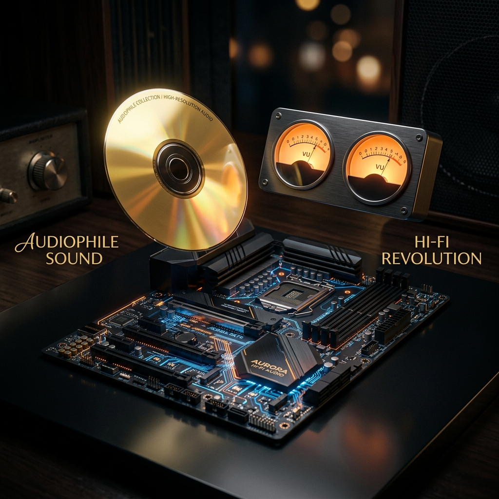

# 达菲 Daphile 中文系统 v3.1.1 稳定版发布：告别媒体卡死，无损完美升级！

各位音乐发烧友与达菲用户：

经过多轮实机打磨与深入优化，今天，**Daphile 达菲中文系统 & 智能写盘工具 v3.1.1 稳定版** 正式面向全网发布！

本次更新是一次**针对使用体验的终极完善**。我们收网了前期大家反馈的所有共性痛点，带来了更加顺畅、省心的听歌体验。**如果您此前遇到过媒体库扫描缓慢、播放卡顿等现象，建议立即升级！**

---

## ✨ 升级带来的四大核心改变

### 1. 彻底根治“媒体库无限卡死、无法播放”的 Bug
*   **过去**：在部分小主机上，系统会一直处于“正在扫描媒体库”的状态，卡在某个文件数（例如 1499 个文件）无法动弹，导致播放器无法顺利放歌，且在局域网共享中会看到无限套娃的音乐文件夹。
*   **现在**：**该问题已彻底根治**！媒体库扫描速度恢复到“秒级”，不再产生任何套娃死循环，点歌播放即刻响应，顺畅无比。

### 2. SACD-ISO 虚拟音轨极速读取与播放
*   新版本中，大容量 SACD 镜像（ISO 格式）的虚拟 DSF 音轨挂载与读取变得更加稳定。系统开机后即可秒级识别并生成干净的虚拟音轨，完美支持播放与无缝切歌。

### 3. 老旧小主机 / 老笔记本引导率大幅提升
*   全新升级的 **v3.1.1 写盘工具**，大幅增强了对老旧电脑、早期工控机等 Legacy BIOS 引导的兼容性。以往部分“老机器无法通过 U 盘开机引导”的硬件痛点得到了有效解决。

### 4. 更加出色的系统运行稳定性
*   优化了系统底层的自动化服务调度，无论是长期插 U 盘运行，还是将其作为固态硬盘主系统，都能保证 7×24 小时的高稳定低延时播放，不卡顿、不闪退。

---

## 🛠️ 简单三步，无损完美升级

本次升级支持**无损修复**。您原先存储的歌曲、歌单与系统偏好配置将**完好保留**，不会受到任何影响。

*   **第一步**：下载最新版 **【Daphile中文写盘工具 v3.1.1】**。
*   **第二步**：将您的 U 盘插入电脑，在写盘工具中选择官方原版镜像，点击**一键写入并注入中文补丁**。
*   **第三步**：将制作好的 U 盘插回您的达菲小主机/笔记本引导开机，在系统网页端直接选择**安装**到内置硬盘。

重启之后，您的系统即刻升级为 v3.1.1 完美状态，重新享受纯净、无忧的音乐之旅！

---

## 💎 技术服务授权方案与定价

写盘工具为绿色免安装软件。写盘后每次开机提供 15 分钟免费功能体验。若您满意汉化与大屏体验，可以选择以下方案购买服务：

### 💻 方案 A：写盘汉化工具（单机技术服务授权码）
*   **服务定价**：**`¥49`** / 台（一次性授权，支持后续版本终身免费升级）
*   **交付机制**：直接下载 `Daphile中文写盘工具.exe`。将系统写入 U 盘后，使用 U 盘启动你的电脑，当屏幕弹出电脑特征码时，拍照或抄下该特征码并联系客服微信，换取唯一的 **12位服务授权码** 解锁，永久绑定您的主板硬件。
*   **价值主张**：一键让您下载的官方最新 25.05 原版系统变成大屏 VU 中文版。

### 💾 方案 B：16G 高品质免折腾物理 U 盘（全国包邮）
*   **服务定价**：**`¥119` 包邮**
*   **交付机制**：寄送一个完成授权绑定的 **16GB 品牌高速品牌 U 盘**，内部已使用本写盘工具预装并永久技术服务授权。
*   **适用场景**：适合不想自己折腾写盘、下载原版镜像的烧友，到手即插即用。

### 🔊 方案 C：VIP 专家调音包【声学定制+一对一远程】
*   **服务定价**：**`¥99`**（常年固定价，不参与限时活动）
*   **包含权益**：
    1.  获得 **方案 A 电脑服务授权码 1 个**；
    2.  加入 **VIP 俱乐部技术支持群**，享受专属的一对一系统调试与网络挂载 NAS 售后指导；
    3.  **🌟 专属服务：房间/音箱 FIR 卷积滤波器定制（1次）**：提供您的听音室尺寸 and 音箱摆位，我们的声学工程师为您生成专属于您房间的 WAV 格式 FIR 滤波校准文件，导入达菲一键干掉房间低频共鸣驻波，声音层次瞬间通透！
*   **📦 升级套餐福利**：
    - 若选购方案 C，想要加购 16G 预装物理 U 盘，**只需再加价 `50` 元（合计 `149` 元包邮寄送到家）**。
    - 若选购方案 B，想加购方案 C 的 VIP 技术指导及房间 FIR 定制服务，**只需再加价 `30` 元（合计 `149` 元）**！

---

<h2 id="download-section">💾 写盘汉化工具下载</h2>

写盘工具为绿色免安装软件（约 34.9 MB），已开启“回复可见”。请在页面下方发表评论回复后，重新刷新网页即可解锁下载链接：

  <ul>
    <li><strong>百度网盘下载链接</strong>：<a href="https://pan.baidu.com/s/1Zs7-uWplpK-aScq2LxKtFg?pwd=ljfh" target="_blank" rel="noopener noreferrer">点击进入百度网盘下载</a></li>
    <li><strong>网盘内含资源</strong>：
      <ol>
        <li><code>Daphile中文写盘工具.exe</code>（我们独家开发的汉化写盘软件，内含 v3.1.1 最新升级支持）</li>
        <li><code>daphile-25.05-x86_64-rt.iso</code>（配套官方英文原版镜像，已贴心为您做好了高速分流，免去国外官网慢、打不开的烦恼）</li>
      </ol>
    </li>
    <li><strong>提取码</strong>：<code>ljfh</code></li>
  </ul>

*(注意：运行写盘工具会格式化 U 盘，请提前备份数据。如有写盘疑问，欢迎随时点击右下角微信悬浮按钮进行咨询。)*
