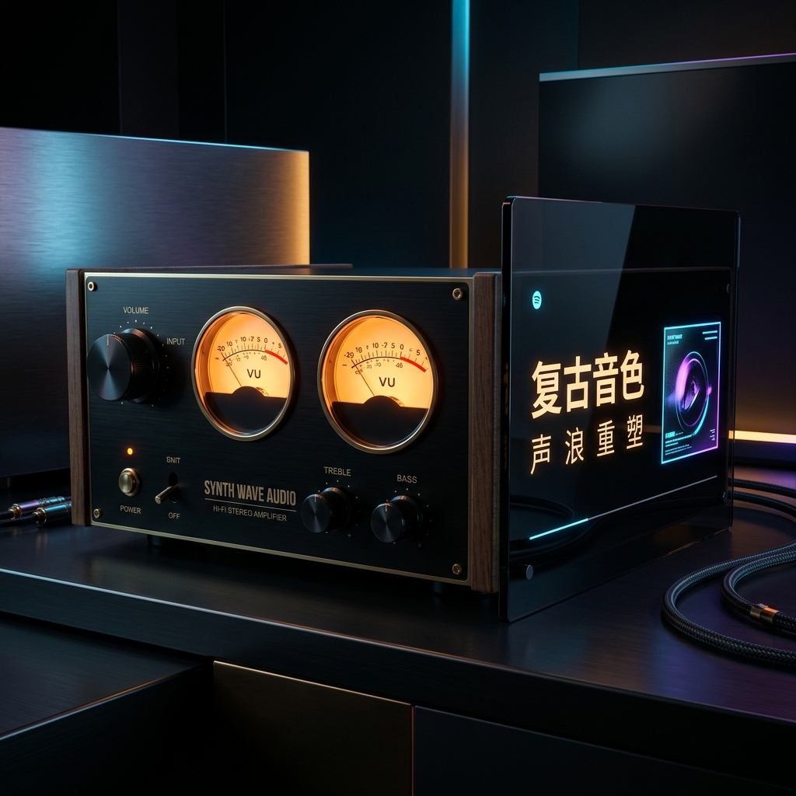

# 达菲中文版 V3.2.0 正式发布｜全新表头、SACD直解、中文信息，一次全到位

亲爱的烧友们，好消息来了！

经过一段时间的打磨与测试，**达菲中文版 V3.2.0 正式发布**。这一版在界面颜值、音乐信息呈现、动态效果三个方向都做了重要升级，老用户值得更新，新朋友更是直接上手最好的版本。

废话不多说，直接看亮点👇

---

## 🌟 亮点一：三款全新表头样式，颜值直接拉满

V3.2.0 新增了三款精心设计的"正在播放"表头皮肤，满足不同审美口味：

*   **① 蓝色玻璃质感大表头**：深邃蓝色渐变背景，配合高光反射层，整个表盘看起来像一块真实的蓝色玻璃仪表。刻度线细腻精准，指针金属质感强烈，摆动时赏心悦目，一眼就能感受到那份仪式感。
*   **② 复古暖色系**：致听经典模拟设备的暖黄色调，配合做旧纹理，适合喜欢复古风格的发烧友。
*   **③ 极简黑金风**：深黑背景、金色刻度，简洁大气，适合追求低调奢华风格的用户。

> 💡 **提示**：在"正在播放"界面长按屏幕，即可切换不同表头样式，无需重启，即改即用。

---

## 🌟 亮点二：动态模拟 VU 指针，随音乐实时摆动

这是本次更新里最令烧友们期待的功能。达菲中文版 V3.2.0 实现了**真正的模拟 VU 表指针动态效果**：

*   指针根据实时音频电平灵敏响应，强音重拍时猛甩，轻柔段落时缓缓回落。
*   左右声道独立显示，立体声层次感一目了然。
*   帧率流畅，摆动自然，不卡顿、不跳针。
*   **适配任何机器**，全新安装后开机即用，无需任何额外设置。

这种效果在以往的达菲版本中从未有过，V3.2.0 是第一个把它做完整、做稳定的版本。播放《加州旅馆》的时候，那根指针跟着鼓点甩开，真的很过瘾。

---

## 🌟 亮点三：SACD ISO 发烧镜像直接播放，中文专辑信息完美呈现

对于喜爱高解析度音乐的烧友来说，无需再做任何多余操作：

*   **直解播放，省时省力**：无需提前拆分或繁琐转换格式，达菲中文系统可直接解调播放 SACD ISO 镜像文件，保留无损的原汁原味。
*   **专辑信息中文显示，告别乱码**：部分 SACD ISO 文件内嵌的曲目信息为英文或出现乱码，达菲中文系统支持读取同名 XML 配置文件，优先以 XML 中的信息覆盖显示，让专辑名称、艺术家、曲目全部清晰呈现中文。
*   **写盘工具一键生成 XML**：没有 XML 文件？不用担心。我们的写盘工具内置 XML 生成功能，针对您的 SACD ISO 文件自动生成配套的 XML 模板，填写中文信息后放在同一目录即可，操作简单，老烧友也能轻松上手。

---

## 🌟 亮点四：全中文界面，老烧友零门槛上手

达菲原版是纯英文系统，许多功能藏在菜单深处，不熟悉的用户很难摸清楚。中文版对界面、菜单、提示信息进行了全面汉化：

*   主界面、设置菜单、播放控制全部中文显示。
*   文件管理器支持中文文件名和路径，中文歌曲名不乱码。
*   媒体服务器默认启动中文模式，新装即中文，无需手动切换。

---

## 🌟 亮点五：五大插件预装，开箱即用

为了让新用户不必为插件下载而烦恼，V3.2.0 预装了以下常用插件：

| 插件 | 功能 |
|------|------|
| **Material Skin** | 现代化网页播放控制界面，手机电脑均可使用 |
| **DSD Player** | DSD 格式无损播放支持 |
| **CD Player** | 光驱读取播放支持 |
| **AirPlay（ShairTunes2W）** | 苹果设备无线推流到达菲 |
| **DLNA/UPnP（UPnPBridge）** | 与 DLNA 设备互联互通 |

以上插件安装完系统后**自动激活，无需联网下载**，即便在无网络环境下同样可用。

---

## 📦 本次发布文件说明

| 文件名 | 说明 |
|--------|------|
| `Daphile-25.05-x86_64-rt-中文版_v3.2.0.iso` | **实时内核版**（推荐，适合专用音乐播放机） |
| `Daphile-25.05-x86_64-中文版_v3.2.0.iso` | 标准内核版（适合日常使用） |
| `Daphile中文写盘工具_v3.2.0.exe` | Windows 写盘工具（推荐使用） |
| `Daphile中文写盘工具_v3.2.0_Win7专供版.exe` | 兼容 Windows 7 的写盘工具 |

---

## 💾 安装方法

### 方法一：使用我们的写盘工具（推荐）
1. 下载 `Daphile中文写盘工具_v3.2.0.exe`，双击运行。
2. 选择目标 U 盘（建议 8GB 以上）。
3. 选择您下载的 ISO 文件。
4. 点击"一键写盘"，等待完成。
5. 用写好的 U 盘引导目标电脑，按提示完成安装。

### 方法二：直接使用 ISO（Rufus / Ventoy）
下载 ISO 文件后，使用 Rufus 或 Ventoy 写入 U 盘，启动后按界面引导安装即可。

> ⚠️ **注意**：安装过程会格式化目标硬盘，请提前备份重要数据。

---

## 🙋 常见问题

*   **Q：从旧版升级需要重装吗？**
    *   **A**：需要全新安装，升级会覆盖系统分区。您的音乐文件存储在数据分区，正常情况下不会丢失，但建议安装前备份。
*   **Q：VU 指针效果需要什么特殊配置？**
    *   **A**：不需要任何特殊配置，普通的 x86 主机安装后即可使用，开箱即用。
*   **Q：SACD ISO 的 XML 文件放在哪个目录？**
    *   **A**：与 ISO 文件同名，放在同一个文件夹下即可。例如：`XXX专辑.iso` 对应 `XXX专辑.xml`，系统会自动识别读取。

---

## 📥 写盘工具与系统镜像下载

我们为您提供了一键下载的高速分流通道：

👉 **[点击这里直接访问百度网盘下载](https://pan.baidu.com/s/1Zs7-uWplpK-aScq2LxKtFg?pwd=ljfh)**
*   **网盘密码/提取码**：`ljfh`
*   如有任何技术疑问，可直接添加站长微信：`wxcq888` 进群讨论或获取一对一远程点亮支持！
