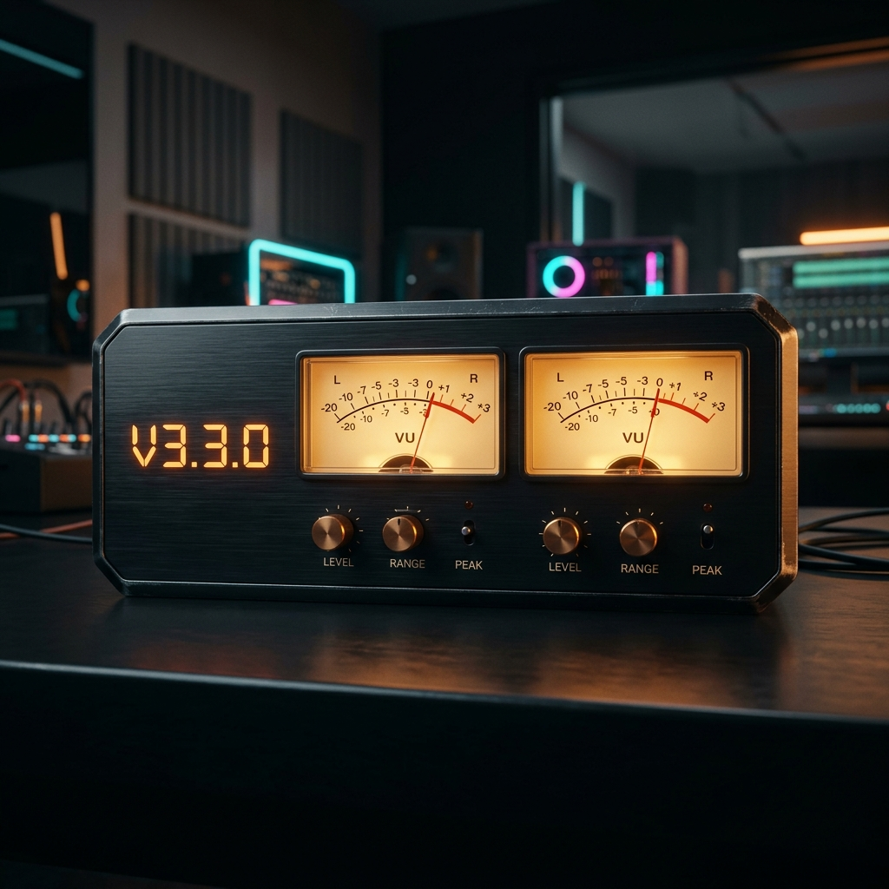

# 七木达菲 v3.3.0 旗舰版来了！复古双VU表、SACD直放、音质全面跃升！

对于追求极致音质的乐迷和发烧友来说，有一款优秀的数播系统，就像是为家里的音响系统注入了灵魂。

今天，备受期待的 **【七木达菲粉丝定制版 v3.3.0】** 正式发布！

本版本基于官方最新的 **25.05 实时高优先级（RT）旗舰系统** 深度定制，不仅在声音表现上更加温润、通透，更带来了多项令人惊艳的视觉与功能升级。快来一起看看本次升级的四大重磅亮点！

---

## 🌟 亮点一：复古动态双 VU 指针表，让音乐“看得见”

许多老烧友都对麦景图、金嗓子机身上那两只温暖摆动的蓝色/黄色指针表念念不忘，那是属于模拟时代的独特仪式感。

在 v3.3.0 版本中，我们为您带来了**全新适配的动态双柱 VU 仪表盘**：

*   **完美像素贴合**：针对不同显示设备进行了精细的边缘像素微调，画面比例严丝合缝，呈现饱满的视觉美感。
*   **随乐律动**：指针灵敏度经过专业声学映射调校，摆动频率完美契合音乐起伏。无论是蔡琴的低回宛转，还是交响乐的爆棚动态，指针都在您的屏幕上优美起舞，听觉与视觉双重享受！

---

## 🌟 亮点二：SACD ISO 免解压直放，智能双声道防卡死保护

DSD（母带级音频）是发烧友的终极追求，但以前播放 SACD ISO 镜像总是繁琐无比，动辄需要用电脑解压成几吉字节的 DSF 分轨，既占地方又折腾。

七木达菲 v3.3.0 带来了**“插盘即播”**的终极便利：

*   **ISO 直接播放**：直接将 SACD ISO 镜像拷贝入硬盘，系统会自动识别并瞬间呈现曲目列表，点下即播。
*   **智能双声道防死锁（独家优化）**：传统系统在双声道解码器（DAC）上播放多声道（环绕声）DSD 文件时，极易因硬件通道冲突导致系统卡死。新版固件加入了**智能通道过滤器**，能自动过滤不兼容的多声道音轨，只为您呈现纯净、安全的双声道音乐，再怎么切歌也绝不卡机，稳如磐石！

---

## 🌟 亮点三：母语级全中文界面，老旧设备瞬间焕发新生

为了让家里的长辈、以及不熟悉英文设置的乐迷也能轻松玩转高档数播，我们对系统进行了全面、彻底的**本土化润色**：

*   **菜单级全汉化**：上至复杂的网络配置、声卡采样率限制，下至日常的专辑封面缓存，全部提供通俗易懂的中文说明。
*   **老机复活利器**：新系统对各种老旧 PC、工控机硬件进行了底层优化，仅需 1G 以上内存即可极速运行。让您闲置的旧电脑一秒变身为身价万金的高端数播转盘！

---

## 🌟 亮点四：发烧级“桥核分离”深度优化，背景黑度超乎想象

对于双机“桥核模式”（一台作服务器，一台作解码桥接器）的发烧友，v3.3.0 带来了更纯净的声音表现：

*   **数据与播放彻底隔离**：对网络传输与音频渲染进行了优先级重构，数据读取与解码互不干扰。
*   **音质耳听可闻的变化**：高频沙石感消失殆尽，中频人声温润贴耳，声场背景黑度极大提升，器乐定位更加清晰。这才是高格式母带音乐该有的松弛感与信息量！

---

## 📂 一键式便捷网页管理，轻松拷贝歌包

新版本中，网页端文件管理器也得到了极大的性能优化：

*   您无需繁琐的共享设置，直接在浏览器里就能将新下载的歌包拖拽上传到数播硬盘中。
*   无论是整理歌单、新建文件夹，还是批量删除，操作就像本地电脑一样简单直接。

---

## 📥 写盘工具与升级获取通道

为了规避版权风险，我们不直接在网站提供修改后的系统镜像下载。我们通过微信服务通道为您提供技术支持：

👉 **老用户绿色通道**：
如果您之前已拥有我们的终身技术服务授权，可直接联系客服免费获取最新的 v3.3.0 适配包及升级工具。

👉 **新用户加入通道**：
请微信搜索并关注公众号 **【老机复活】**，在后台回复关键词 **【写盘工具】** 获取最新的一键写入汉化工具。如有技术疑问或需要一对一远程点亮服务，可直接添加站长微信：**`wxcq888`**。

*动感指针，母带音质，中文相伴。这个夏天，让七木达菲陪伴您的每一段午后音乐时光。*

**【关注我们，获取更多数播调音秘籍与最新固件动态！】**
