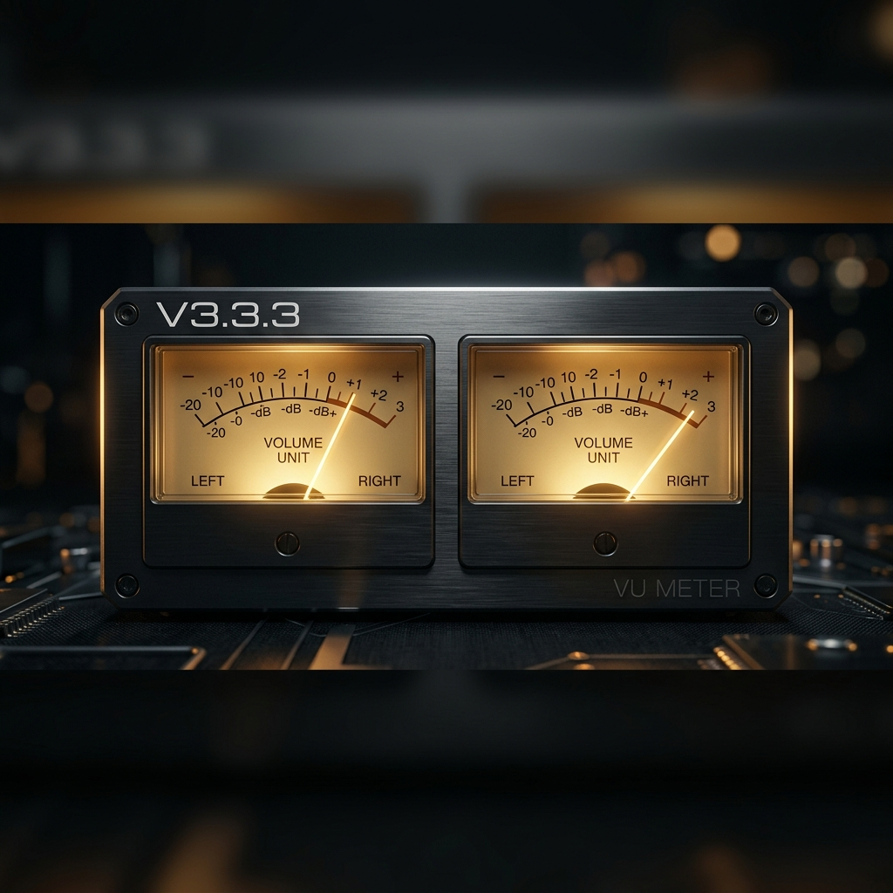

# 【终极稳定版】七木达菲 v3.3.3 发布：修复高分屏指针穿帮，优化 U 盘自动扫描！

各位烧友、达菲爱好者们，大家好！

为了给各位带来最省心、最完美的聆听体验，我们今天正式发布 **【七木达菲中文发烧版 v3.3.3】** 稳定版本！

很多老烧友都知道，之前的版本在特定高分辨率设备（如苹果 iMac 一体机）上可能会出现显示微调问题，或者插入新 U 盘后需要手动去设置里刷新或重启机器才能识别歌曲。

**v3.3.3 版本不堆砌冗余的新功能，而是将精力 100% 集中在“修补体验漏洞、完善系统细节”上**。这是一次极为重要的**稳定性与体验优化更新**，老用户强烈建议升级！

---

## 🛠️ v3.3.3 核心修复与优化亮点

### 1. 🎛️ 彻底解决 4K/iMac 高分屏下指针“冲出表盘”的穿帮问题
*   **痛点背景**：在此前版本中，如果用户在超高分辨率（2K/4K/5K）或特殊比例显示器（如 iMac 一体机）上运行达菲，由于系统背景底图缩放，画线指针的长度（半径）没有自适应，导致白色的指针会直接“穿透”蓝框或黄框顶部，冲进黑背景中，十分影响美观。
*   **完美修正**：新版固件重新校准了 Jivelite 的指针渲染半径和图层位置。现在，无论是在普通的 1080p 电视上，还是在超高分辨率的 4K 屏幕、Retina iMac 屏幕上，**指针都在仪表盘内精准、完美摆动，绝对不会再冲出框外**！

### 2. 🔌 U 盘即插即播，秒级更新曲库（无需重启）
*   **痛点背景**：以前插入存有新歌的 U 盘或移动硬盘，系统通常需要重启或者手动进网页后台进行繁琐的 Rescan，甚至可能出现不识别的情况。
*   **完美修正**：优化了底层的热插拔（Hotplug）检测和挂载脚本。现在，在开机状态下随时插入新 U 盘，系统会在几秒钟内自动挂载并秒级扫描曲目。邓丽君、蔡琴、周杰伦等无损歌曲瞬时呈现，即点即播！

### 3. 🛡️ 系统内核与授权安全体系更稳健
*   进一步理顺了后台媒体数据库与前端 Jivelite 的协作逻辑，大幅降低了长时间高频切歌时的内存占用，确保系统连续开机数月依然流畅、不卡顿。
*   无缝衔接现有授权激活体系，升级过程不丢失任何服务状态。

---

## 📂 写盘工具与系统镜像下载

我们为您提供了一键下载的高速分流通道：

👉 **[点击这里直接访问百度网盘下载最新 v3.3.3 写盘工具与镜像](https://pan.baidu.com/s/1Zs7-uWplpK-aScq2LxKtFg?pwd=ljfh)**
*   **网盘密码/提取码**：`ljfh`
*   如需获取老用户终身免费升级包、加入发烧讨论群或购买一对一远程协助服务，可直接添加站长微信：**`wxcq888`**。

---

## 💾 升级与安装方法

1.  **全新安装 / U 盘制作**：
    下载最新版 `Daphile中文写盘工具_v3.3.3.exe`，插上 U 盘，点击“一键写盘”即可快速完成制作。
2.  **已有系统无损升级（推荐）**：
    已安装旧版本的烧友，**不需要格式化数据分区**。直接使用写盘工具写好的 U 盘引导系统，在网页设置中选择升级（升级时确保“格式化 DaphileData”未勾选即可），您原有的曲库设置、播放列表以及技术授权全部无损保留！

---

每一款完美的系统，都源于细节的不断打磨。感谢群里各位烧友的实机测试与即时反馈，是你们的鞭策让我们越做越好。

**祝大家听音愉快，频频出好声！** 🎶
