不少玩达菲（Daphile）系统的烧友都非常喜欢经典老式功放上的那对“大表头”——看着金黄色的指针随着音乐的律动轻轻摇摆，不仅耳朵得到了享受，视觉上也充满了复古温暖的仪式感。

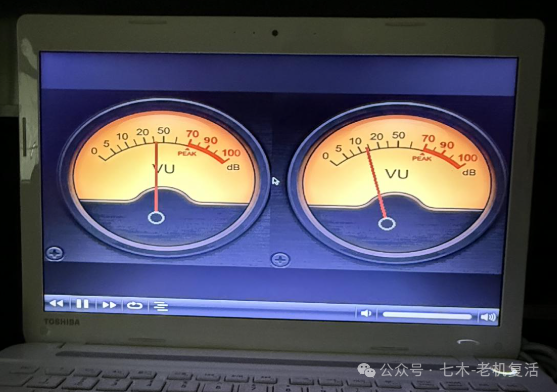

今天，我们就为大家带来这篇**本地显示界面开启教程**，烧友们可以参考本教程尝试在自己的系统上开启本地显示。
💡 特别说明：关于“圆形黄光 UV 表”的显示
【使用提示】
>默认/原版系统：由于本地界面（Jivelite）的皮肤组件及依赖库版本不同，默认情况下可能仅支持基础的封面图、歌曲文字或线条频谱，无法直接显示高清晰度的双圆形 UV 指针表头。
> 中文汉化集成版 (v2.8 技术服务版)：此版本已完成了相关的中文汉化集成、底层显示驱动调优以及组件配置。如果您在开启过程中找不到圆形双表头选项，或者遇到界面显示不全的问题，说明系统缺少对应的组件包。如需获取完整的中文集成系统及技术指导服务，可联系我们获取支持。
## 🛠️ 第一阶段：在网页端开启本地显示 (Jivelite)
在默认状态下，达菲系统为了极致的音频性能，本地显示输出是关闭的（外接屏幕只显示 Linux 系统命令行黑屏）。我们需要在网页控制端将其开启。
1. 登录网页控制后台：用手机或电脑浏览器访问达菲 IP 地址（或 `http://daphile.local`）进入控制页面。
2. 进入设置界面：点击左侧导航栏中的 「设置 (Settings)」按钮，再展开第一项 「常规 (General)」。
3. 启用本地界面与图形驱动：
将「本地界面 (Local UI)」 选项从「禁用」改为「Jivelite」。
勾选 下方的 「图形驱动」（启用内核模式设置 KMS 驱动，确保屏幕能正常显示画面）。
4. 保存并重启：点击页面最下方的 「保存并重启 (Save & Restart)」按钮。

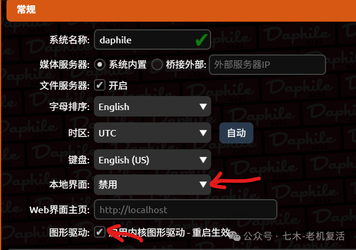

等待主机重启，此时连接在达菲主机上的显示器/电视屏幕上就会亮起图形操作界面。
## 🌐 第二阶段：将本地界面切换为中文
如果屏幕显示为英文，可以通过以下步骤切换为中文：
1. 在屏幕主界面中，使用键盘方向键或遥控器，移动到最下方选中「Settings」设置），按回车进入。

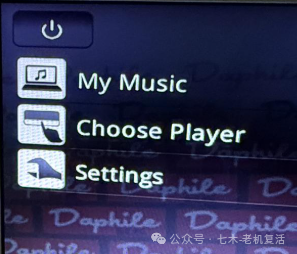

2. 继续移动到最下方，选中 「Advanced」（高级设置）并进入。

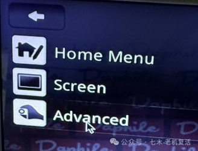

3. 选中最上方的 「Language」（语言）选项，并在列表中选中 「简体中文」确认。

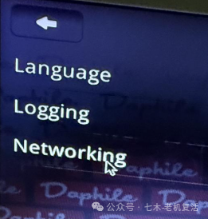

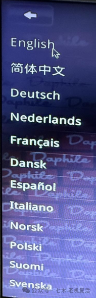

4. 点击屏幕左上角的 向左箭头 (←) 按钮，连续点击几次，直到退回到主菜单。
## 🔊 第三阶段：绑定您的声卡设备（指针动不动的关键！）
达菲的本地表头必须和您当前正在放出声音的声卡（播放器）进行绑定，否则指针不会随音乐摆动。

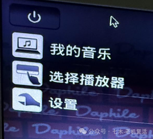

1. 在中文主界面中，选中并进入 「选择播放器」。
2. 屏幕上会列出当前系统识别到的所有音频设备（例如：`Combo384 Amanero`、`HD-Audio Generic` 等）。
3. 根据您当前连接的 USB 解码器或声卡名称进行选择绑定。
## 📊 第四阶段：调出并永久锁定 UV 指针表头
系统默认有多种循环显示模式：【封面+歌曲信息】、【纯大封面图】、【专业音频频谱分析】以及【圆形 UV 指针表】。
快捷切换方法：
在播放音乐时，进入 「正在播放」 界面，直接点击屏幕左侧的图片区域，即可在各个显示模式之间依次循环切换。

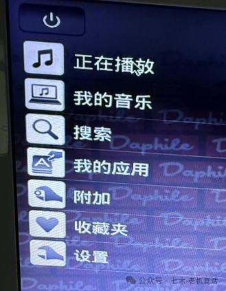

永久锁定表头（只显示表头）：
如果您希望平时完全不显示封面和频谱，只保留纯粹的动态指针表头，请按以下步骤设置：
1. 从主界面进入 「设置」。

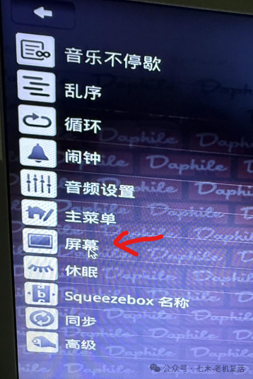

2. 选中并进入 「屏幕」选项 -> 「正在播放」。

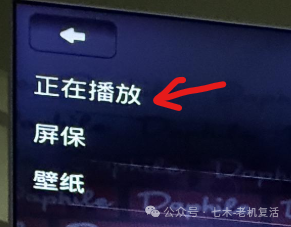

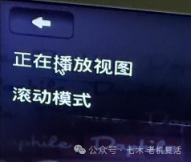

3. 过滤不需要的项目：取消勾选 所有不需要的项目（如“封面图”、“频谱分析”等），仅保留「VU 指针表」。

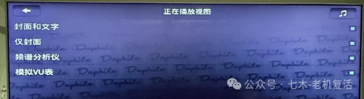

4. 设置完成后，点击左上角箭头返回，再点击【正在播放】按钮，漂亮的UV表头就显示在屏幕上了。

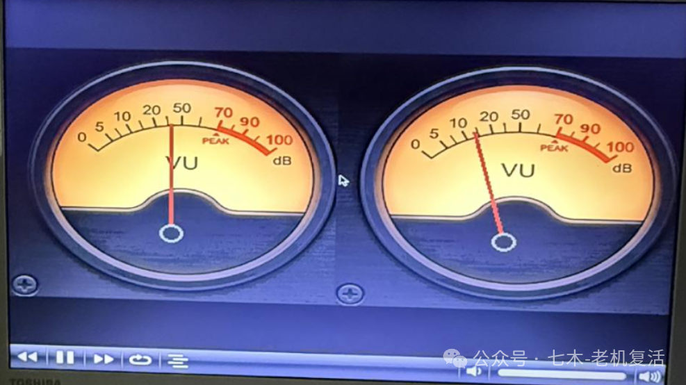

## 🔍 常见排查问题
### Q：为什么播放音乐时，UV 指针一动不动？
绑定播放器错误：99% 的情况是因为在“第三阶段”中选错了播放器。例如，您手机放歌的声音是从“声卡A”出来的，但电视端的 Jivelite 却绑定在“声卡B”上。请回到「选择播放器」中重新选择。
播放了源码 DSD 音乐：在 Native DSD 直通模式下，系统由于无法解析波形，指针会保持静止。播放普通的 PCM 音乐（如 FLAC/WAV/APE 等）即可正常起舞。
音量被限制：如果系统端输出音量开得极低，信号强度不足，指针幅度也会极小。请在手机端尝试将音量调至 80% 以上。
💡 **温馨提示**：如需获取已完成全系统深度汉化集成、大屏显示调优的 **Daphile v2.8 中文集成系统** 及专属技术支持，请访问我们的 [v2.8 正式版发布与下载专区](/blog/daphile-v28-custom)，或微信搜索并关注公众号 **“老机复活”** 联系客服。

