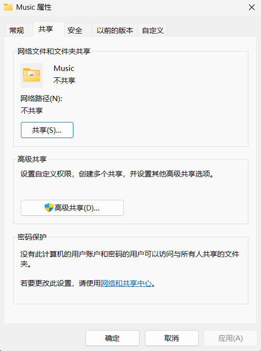
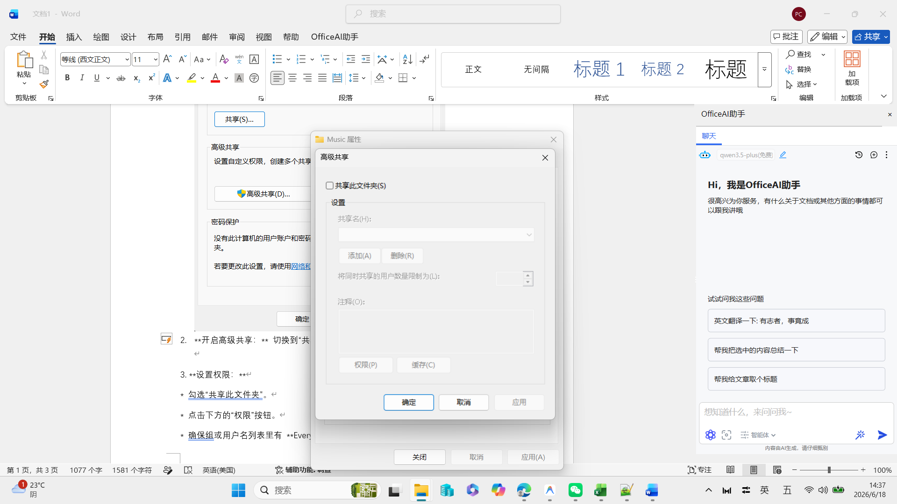
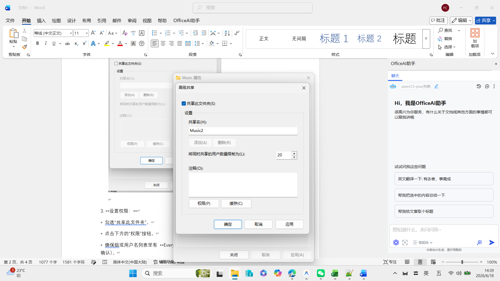
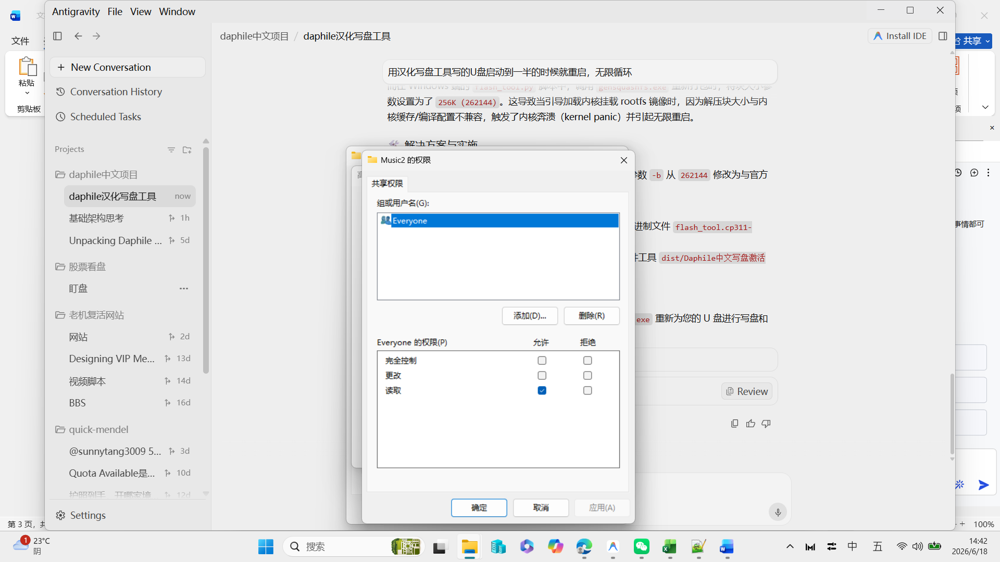
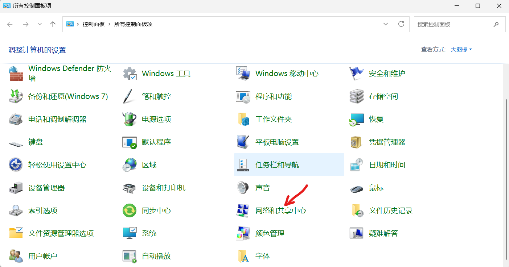
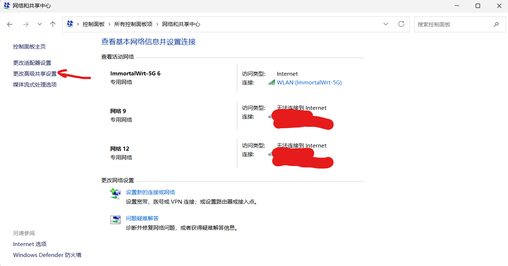
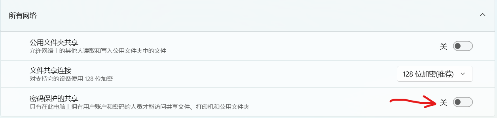
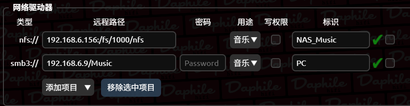

在局域网中，达菲（Daphile）数播系统除了播放本地内置硬盘或外接 U 盘里的音乐，还可以直接通过网络读取同一局域网下 Windows 电脑、NAS 或其他设备的音乐文件。

把 Windows 电脑变成“文件服务器”，让 Daphile 作为“客户端”去读取音乐，这是很多发烧友的首选方案——电脑里存满海量音乐，达菲主机只需安稳播放，既省去了频繁拔插 U 盘的麻烦，又免去了折腾硬盘对拷的时间。

整个共享和读取过程非常简单，主要分为两步：**先在 Windows 端设置开放共享**，**然后再去 Daphile 端添加网络路径**。下面我们就一步步来实操。

---

## 🛠️ 第一阶段：在 Windows 电脑上设置共享文件夹

### 1. 准备并配置共享属性
找到您存有音乐的文件夹（例如命名为 `MyMusic`），右键点击它，选择 **“属性”**。

### 2. 开启高级共享
在弹出的属性窗口中，切换到 **“共享”** 选项卡，然后点击 **“高级共享”** 按钮。

在新弹出的高级共享窗口中：
* 勾选 **“共享此文件夹”**。
* 共享名称可以保持默认文件夹名，也可以另起一个简单的英文名字（如 `Music`）。

### 3. 设置用户权限
点击共享名称下方的 **“权限”** 按钮。
* 确保“组或用户名”列表里包含 **Everyone**。
  *(如果没有，点击“添加”，在输入框中填入 `Everyone`，点击确定添加。)*
* 在 Everyone 的权限列表里，确保勾选了 **“读取”** 权限。
  *(如果您希望将来能在达菲端直接对电脑里的音乐进行修改或删除，可以勾选“完全控制”，通常我们仅需播放，勾选“读取”就够了。)*
* 点击 **“确定”** 保存并返回。

### 4. 关闭密码保护（免密挂载关键步骤）
为了让达菲挂载时更顺利，免去复杂的账户认证麻烦，建议在局域网内关闭密码保护共享：
* 按下 `Win + S` 搜索并打开 **“控制面板”**。

* 点击进入 **“网络和 Internet”** -> **“网络和共享中心”** -> 点击左侧的 **“更改高级共享设置”**。

* 展开 **“所有网络”**（Windows 11 通常在底部展开），找到 **“密码保护的共享”** 项，将其勾选为 **“无密码保护的共享”**（或直接关闭密码保护共享），最后点击保存更改。

> [!WARNING]
> **⚠️ Windows 11 用户挂载失败的“致命原因”：**
> Windows 11 的安全策略非常严格，默认会**拦截一切无密码的来宾账户（Guest）访问**。也就是说，即便您在这里关闭了密码保护，Windows 11 依然可能会拒绝达菲的挂载请求，导致达菲后台显示为空或提示连接失败。
> 
> **解决办法一：创建一个专用本地账户（100% 成功，推荐所有系统版本使用）**：
> 1. 按下 `Win + R` 输入 `netplwiz` 回车，点击 **“添加”** 按钮。
> 2. 选择 **“不使用 Microsoft 帐户登录”** -> **“本地帐户”**。
> 3. 设置用户名（例如：`daphile`）和密码（例如：`daphile123`），点击确定完成创建。
> 4. 回到您要共享的文件夹属性中，点击 **“高级共享”** -> **“权限”** -> 点击 **“添加”** -> 输入 `daphile` 并保存。给这个新账户勾选 **“读取”** 权限。
> 5. 之后在第二阶段达菲设置中，将 **Identification（身份验证）** 填写为 `daphile:daphile123` 即可，亲测 100% 成功挂载！
> 
> **解决办法二：修改本地组策略开启来宾登录（适合 Windows 专业版 / 企业版用户）**：
> 如果您不想创建新账户，可以通过修改组策略来放行无密码共享：
> 1. 按下 `Win + R` 输入 `gpedit.msc` 回车，打开 **本地组策略编辑器**。
> 2. 依次展开左侧菜单：**计算机配置** -> **管理模板** -> **网络** -> **Lanman 工作站**。
> 3. 在右侧列表中双击打开 **“启用不安全的来宾登录”** (Enable insecure guest logons) 项。
> 4. 将其状态修改为 **“已启用”**，点击确定保存。然后再去达菲端尝试免密挂载。
> *（注意：Windows 家庭版默认没有组策略功能，家庭版用户请直接使用“解决办法一”）。*

> [!TIP]
> **💡 补充检查：网络配置文件类型必须为“专用”**
> 不管是 Windows 10 还是 11，如果您的网络被系统识别为“公用网络”，Windows 会为了安全默认屏蔽一切局域网共享和访问。
> 
> **检查与修改方法**：打开系统设置 -> **“网络和 Internet”** -> 点击当前连接的 Wi-Fi 或以太网，确保“网络配置文件类型”被勾选为 **“专用”**（Private）。如果当前是“公用”，请务必切换为“专用”。

### 5. 获取 Windows 电脑的局域网 IP 地址
* 按下 `Win + R` 键，输入 `cmd` 后回车。
* 在弹出的命令行黑框中，输入 `ipconfig` 回车。
* 找到您当前连接网络的“IPv4 地址”（例如：`192.168.1.50`），记下这个 IP，我们在达菲端挂载时需要用到。

---

## 🌐 第二阶段：在 Daphile（达菲）端挂载网络驱动器

确保运行 Windows 的电脑与您的达菲主机处于同一个局域网（连接同一个路由器）。

1. **登录达菲管理页面**：在手机或电脑浏览器中输入达菲的 IP 地址，进入 Web 管理后台。
2. **进入存储设置**：点击左侧菜单底部的 **Settings（设置）**，在设置项中滚动找到 **Storage（存储）** 版块。
3. **添加网络驱动器**：在 Storage 版块的最下方找到 **Network Drives（网络驱动器）**，点击 **Add new（添加）** 按钮。
4. **填写共享路径信息**：
   - **Share（共享路径）**：填写 `Windows电脑IP/共享文件夹名称`。例如：`192.168.1.50/Music`。*(注意这里是正斜杠 `/`)*
   - **Identification（身份验证）**：由于前面已经关闭了 Windows 的密码保护共享，这里直接 **保持留空** 即可。
     *(如果您的电脑开启了密码保护且无法关闭，请严格按照 `电脑用户名:开机密码` 的格式在此填入，例如 `admin:123456`。)*
   - **Usage（用途）**：下拉菜单选择 **Music**。
   - **Type（类型）**：下拉菜单选择 **smb3**。
5. **保存并重启**：确认填入信息无误后，点击页面最下方的 **Save & Restart（保存并重启）**。

---

## 📊 第三阶段：扫描并播放音乐

1. 达菲系统重启完成后，重新刷新浏览器进入后台页面。
2. 再次进入 **Settings** -> **Storage**，检查刚才添加的网络驱动器。如果该行后面显示了**具体的硬盘容量与已用空间信息**，说明网络驱动器挂载成功。
3. 达菲系统通常会自动对新加入的挂载存储进行媒体扫描。您可以点击主界面的 **Audio Players** 或媒体库图标，寻找新增的音乐文件。
4. 如果长时间没有显示新音乐，可以在系统设置里找到 **Rescan（重新扫描）** 按钮，强制刷新一下媒体库。

---

> 💡 **温馨提示**：设置完成后，只要这台 Windows 电脑处于开机且联网的状态，达菲主机就可以随时高速读取并播放里面的高品质音乐了。
> 
> 如果您想省去配置多台电脑共享的麻烦，需要更专业、已完成深度汉化调优、大屏显示优化以及内置出厂发烧电台的 **Daphile v2.8 中文集成系统** 及 1 对 1 技术指导，欢迎点击右下角的 [💬 微信咨询] 或直接添加站长微信 **`wxcq888`**（也可以点击这里 <a href="#contact" data-trigger-contact>👉【微信咨询/购买】</a> 快速唤起联系面板）联系我获取支持！
