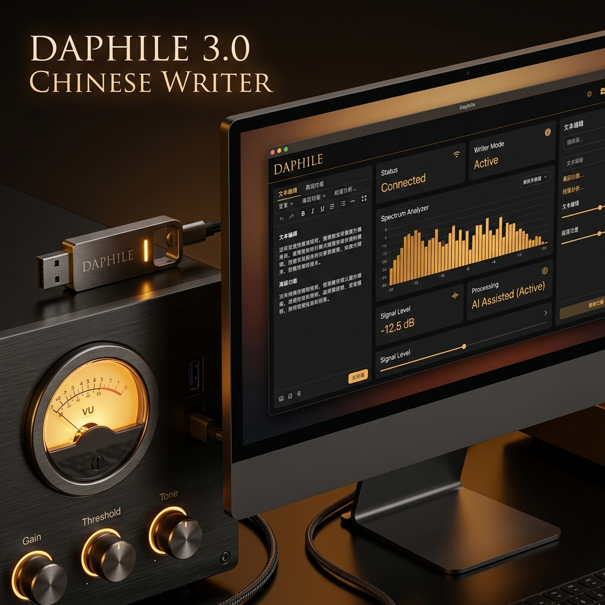

各位数播烧友，今天我们带来一个关于“老机复活”数播项目具有里程碑意义的转型宣告：

**为了彻底规避潜在的版权与发行争议，走向 100% 的合法合规化运营，即日起，我们正式下架此前发布的所有达菲（Daphile）中文定制系统镜像（包括广受好评的 v2.8 专享版及历史所有版本），并且未来也将不再制作或发布任何达菲中文修改版 ISO 镜像包。为表明决心，目前我们百度网盘上的相关中文镜像文件已全部彻底删除，不再保留备份，今后亦不再提供任何私人获取通道。**

**在此，我们也要特别感谢各位热心粉丝朋友的友情提醒与合规反馈！正是在大家的善意督促与启发下，才使得我们下定决心，推出了这款完全自主的全新写盘汉化方案，也让我们的写盘工具得以正式出炉！**

这绝不意味着折腾的终结！相反，我们通过技术创新，带来了一套更安全、更强大、完全合规且体验完美的全新解决方案——**由我们独家开发、拥有独立知识产权的 Daphile 达菲中文写盘工具 v3.0 绿色版软件今日正式发布！**

有烧友会问，这个全新的工具里到底集成了什么？
简单来说，它包含了三大核心要素：
1. **我们独家开发的写盘软件**：零代码侵入、100%自主编写的绿色辅助写盘工具；
2. **我们独家制作的汉化包**：本地一键翻译注入，完美解决官方原版无中文的痛点；
3. **我们精心打包的数播必备插件**：Material Skin自适应手机界面、DLNA/UPnP等常用插件离线打入，免去国内在线下载网络卡死的尴尬。

这是一次颠覆性的技术变革：我们将“写盘工具软件”与“官方系统数据”进行了彻底的物理与法律解耦。您只需自己前往达菲官方网站，下载与之配套的最新的 **25.05 官方原版镜像**。然后运行我们的写盘工具，即可在本地一键完成汉化与插件的注入写入。

---

## 🛠️ 一、 为什么写盘工具 v3.0 是更完美的替代方案？

许多烧友会问：这与以前发布的中文定制镜像文章有什么不同？这可不是简单的“换汤不换药”，而是一次全方位的底座升级：

| 维度 | 以前的定制镜像（如 v2.8） | 全新 v3.0 独家写盘工具（配合官方 25.05） |
| :--- | :--- | :--- |
| **法律合规** | 包含修改版官方代码并二次分发，存在版权灰色争议 | **100% 合规合法**。纯本地工具，不分发任何官方系统数据，软件与数据彻底解耦 |
| **系统版本** | 锁定在旧版本（如 v23.01），无法享受官方最新优化 | **直刷官方最新 25.05 镜像**，与官方同步享受最新实时内核（Real-time Kernel） |
| **硬件兼容** | 对最新的主板、网卡、无线蓝牙模块兼容性差，容易卡死 | **完美兼容最新硬件**。官方 25.05 极大地扩充了网卡与主板驱动，老机新机均能完美适配 |
| **安全可靠** | 网传定制镜像来源复杂，烧友担心有后台隐患 | **纯本地动态补丁注入**。绿色免安装，无网络连接，完全透明，不挂载任何后门 |
| **插件下载** | 国内网络下载官方插件极易报错、失败卡死 | **离线一键打入必备插件**。本地打包注入，无需联网下载，开箱即用 |

---

## 🚀 二、 写盘工具 v3.0 核心注入与汉化技术

当您使用写盘工具导入您自己下载的官方 **25.05 英文原版 ISO** 时，软件会在写入 U 盘的瞬间，动态在本地完成以下发烧配置的写入：

*   **⚡ 本地实时中文汉化**：自动重构语言层依赖，刷入即可直接显示全中文，免去您繁琐的语言配置和命令行汉化操作。
*   **🔌 离线集成 5 大发烧级常用插件**：
    由于国内网络环境极其恶劣，官方后台在线下载插件经常卡死报错。写盘工具在写盘时会在本地直接打入 **Material Skin 现代自适应手机网页端**、**DLNA/UPnP 音频投歌插件（支持手机 QQ音乐/网易云一键无损投歌）** 等 5 个必备插件包，开箱即用。
*   **🍊 正圆双圆形暖橙 VU 动态指针表盘**：
    官方原版的本地大屏皮肤通常比较粗糙，无法支持高精度的双圆表头。本工具刷写时会自动载入我们**自主手工渲染制作的自适应圆形 VU 指针表盘**（修复了官方红色高电平区标示为重复 `70` 的印刷手误，修补为标准的 `70 90 100` 指示），指针摆幅完美契合音频振幅。
*   **📻 预置极速发烧电台**：
    出厂预装发烧级 Radio Paradise 音乐电台（AAC 低带宽推流，在大陆网络晚高峰也丝滑不卡顿）以及国家高清数字直推广播源。

---

## 💎 三、 软件授权方案与定价

写盘工具为绿色免安装软件。写盘后每次开机提供 15 分钟免费功能体验。若您满意汉化与大屏体验，可以选择以下方案购买服务：

### 💻 方案 A：写盘汉化工具（单机授权激活码）
*   **服务定价**：**`¥49`** / 台（一次性授权，支持后续版本终身免费升级）
*   **交付机制**：直接下载 `Daphile中文写盘工具.exe`。将系统写入 U 盘后，使用 U 盘启动你的电脑，当屏幕弹出电脑特征码时，拍照或抄下该特征码并联系客服微信，换取唯一的 **12位服务授权码** 解锁，永久绑定您的主板硬件。
*   **价值主张**：一键让您下载的官方最新 25.05 原版系统变成大屏 VU 中文版。

### 💾 方案 B：16G 高品质免折腾物理 U 盘（全国包邮）
*   **服务定价**：**`¥119` 包邮**
*   **交付机制**：寄送一个完成授权绑定的 **16GB 品牌高速品牌 U 盘**，内部已使用本写盘工具预装并永久激活。
*   **适用场景**：适合不想自己折腾写盘、下载原版镜像的烧友，到手即插即用。

### 🔊 方案 C：VIP 专家调音包【声学定制+一对一远程】
*   **服务定价**：**`¥99`**（常年固定价，不参与限时活动）
*   **包含权益**：
    1.  获得 **方案 A 电脑服务授权码 1 个**；
    2.  加入 **VIP 俱乐部技术支持群**，享受专属的一对一系统调试与网络挂载 NAS 售后指导；
    3.  **🌟 专属服务：房间/音箱 FIR 卷积滤波器定制（1次）**：提供您的听音室尺寸 and 音箱摆位，我们的声学工程师为您生成专属于您房间的 WAV 格式 FIR 滤波校准文件，导入达菲一键干掉房间低频共鸣驻波，声音层次瞬间通透！
*   **📦 升级套餐福利**：
    - 若选购方案 C，想要加购 16G 预装物理 U 盘，**只需再加价 `50` 元（合计 `149` 元包邮寄送到家）**。
    - 若选购方案 B，想加购方案 C 的 VIP 技术指导及房间 FIR 定制服务，**只需再加价 `30` 元（合计 `149` 元）**！

---

## 🛠️ 写盘与服务授权三步走

1.  **自行准备原版 ISO 与 U 盘**：
    前往达菲官方网站（或者通过我们提供的原版网盘分流）下载 **最新的 25.05-x86_64-rt.iso** 文件，并插入一个空白 U 盘。
2.  **管理员身份一键写盘**：
    右键选择以“管理员身份运行”本软件。选择原版 ISO 文件，选中目标 U 盘，点击一键写盘。
3.  **微信发送特征码解锁**：
    写好后插在数播电脑上启动。体验期结束后，屏幕会显示特征码。点击本页右下角的 **[💬 微信咨询]** 或直接添加站长微信 **`wxcq888`** 获取 12 位激活授权码，填入解锁即可永久使用。

---

<h2 id="download-section">💾 写盘汉化工具下载</h2>

写盘工具为绿色免安装软件（约 34.9 MB），已开启“回复可见”。请在页面下方发表评论回复后，重新刷新网页即可解锁下载链接：

  <ul>
    <li><strong>百度网盘下载链接</strong>：<a href="https://pan.baidu.com/s/1Zs7-uWplpK-aScq2LxKtFg?pwd=ljfh" target="_blank" rel="noopener noreferrer">点击进入百度网盘下载</a></li>
    <li><strong>网盘内含资源</strong>：
      <ol>
        <li><code>Daphile中文写盘工具.exe</code>（我们独家开发的汉化写盘软件）</li>
        <li><code>daphile-25.05-x86_64-rt.iso</code>（配套官方英文原版镜像，已贴心为您做好了高速分流，免去国外官网慢、打不开的烦恼）</li>
      </ol>
    </li>
    <li><strong>提取码</strong>：<code>ljfh</code></li>
  </ul>

*(注意：运行写盘工具会格式化 U 盘，请提前备份数据。如有写盘疑问，欢迎随时点击右下角微信悬浮按钮进行咨询。)*
