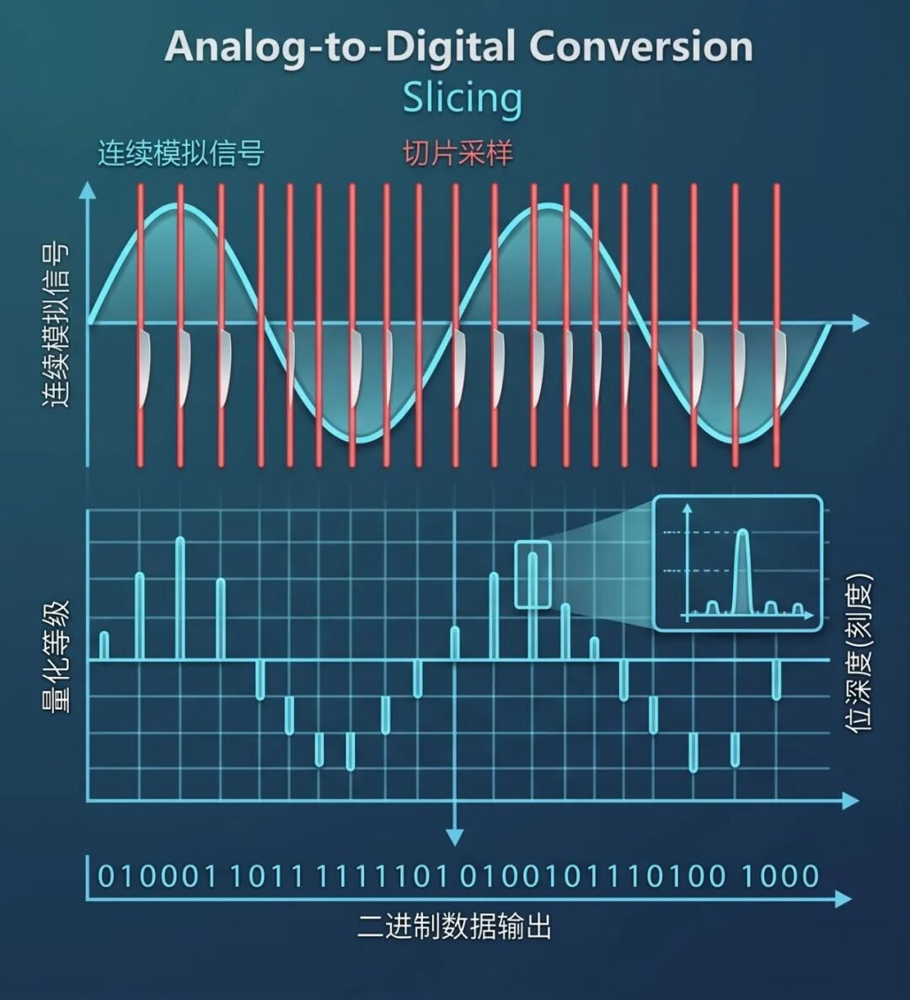
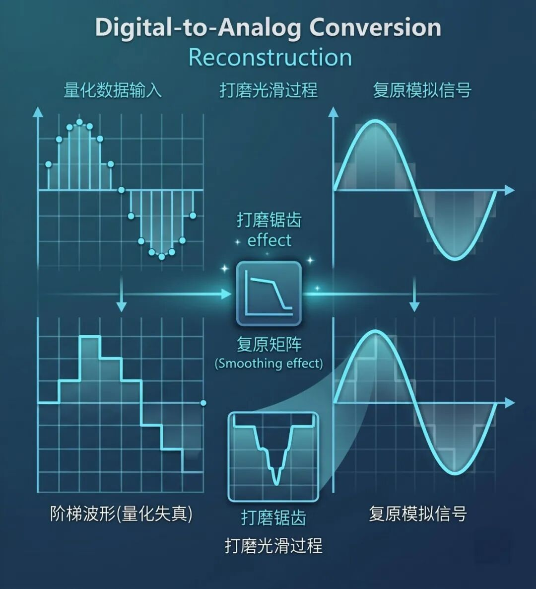

在上一篇文章里，我们用硬核的物理常识粉碎了一些关于电源和线材的“玄学”。很多朋友在后台留言：**既然不信玄学，那真实的声音在电子设备里到底是怎么跑的？**

作为每天和电路板、代码打交道的人，我觉得有必要给大家梳理一下。今天咱们不谈几万块的玄学线材，就聊聊最基础的物理和电子科学。

声音，本质上是空气的震动，是一种连续不断的**模拟信号（Analog）**。但在计算机的数字世界里，只有冷冰冰的 **0 和 1（Digital）**。这俩跨界是怎么沟通的？

咱们这就发车，重走一遍声音的“数字转化之旅”。

---

## 第一步：采集 —— 录音室里的“切菜魔法”（ADC）

歌手在麦克风前唱歌，麦克风将声波的物理震动转换成了连续波动的微弱电流。此时，它还是**模拟信号**。怎么把它塞进电脑里？

这就需要一位“切菜大师”——**ADC（Analog-to-Digital Converter，模数转换器）**。

想象一下，模拟信号是一根完整、光滑的火腿肠。电脑一口吃不下，ADC 就负责把这根火腿肠切成极其极薄的小片。

*图注：模数转换（ADC）的过程。上图展示了连续模拟信号被“切片采样”；下图展示了每一个采样点被测量并量化为对应的二进制数据输出。*

这里有两个极其关键的参数：

- **采样率（频率，Hz）**：一秒钟切多少刀。
  - CD 的标准是 **44100Hz (44.1kHz)**，意思就是 ADC 芯片在一秒钟内，对着这段声音“切”了 44100 刀，记录下 44100 个瞬间的声音状态。你切得越快，还原出来的动作就越连贯。
- **位深度（比特率，Bit）**：切出来的每一片，量得有多准。
  - **16bit** 意味着系统用一把有 **65536** 个刻度的精细尺子去测量每一刀声音的“高度”。**24bit** 则是一把有 **1677 万** 个刻度的尺子！刻度越细，声音的动态范围越广，记录的细节就越丰富。

经过 ADC 这一顿疯狂“切片”和“测量”，原本连续的波浪线，就被死死地定格成了一大串由 0 和 1 组成的数字文件。

---

## 第二步：传输与存储 —— 绝对理性的“数字快递”

现在，声音已经失去了物理形态，彻底变成了硬盘里的一堆数据。

在这个阶段，无论你是把这首歌存在 NAS 服务器里，还是放在 U 盘里，亦或是通过 USB 线、光纤、同轴线传输给播放设备，它跑的都是纯粹的**数据包**。

> [!IMPORTANT]
> **为什么在数字传输阶段“谈音色”是扯淡？**
>
> 数字世界是极其严谨的，0 就是 0，1 就是 1。只要你的线材不至于劣质到严重干扰信号导致系统直接“丢包”（如果是网络传输还有重传机制），这首歌在传输过程中就不会发生任何改变。它就像你发给朋友的高清照片，收到的时候，绝不会因为网线不同而变色。

---

## 第三步：转换 —— 桌面上的“复原大师”（DAC）

现在，带着 0 和 1 数据包的数字信号来到了你的音响系统。但喇叭是个纯物理的“蠢”家伙，它听不懂 0 和 1，它只认电流的波动。

这时候，就需要我们的核心大脑出场了——**DAC（Digital-to-Analog Converter，解码器）**。

*图注：数模转换（DAC）与重建过程。左侧展示了量化数据输入后还原出的阶梯波形（量化失真）；中间通过复原矩阵和低通滤波电路“打磨锯齿”；右侧展示了复原后无限逼近原始状态的平滑模拟信号。*

DAC 的工作，就是把刚才 ADC 切碎的那一堆数据，重新拼凑起来。

想象一下，把之前切好的千万片火腿肠，按照编号一片片重新贴回去。因为它是被“切片”的，拼回去的时候边缘必然会有“锯齿”（阶梯状波形）。

一台优秀的解码器，不仅能精准地把这些阶梯拼对位置，它的内部电路还会经过复杂的**滤波处理**，把这些“锯齿”打磨得光滑如初，无限逼近最初在录音室里唱出的那条平滑曲线。

---

## 第四步：输出 —— 最后一公里，大力出奇迹（AMP）

经过 DAC 的神级复原，信号终于又变成了美妙的连续模拟信号（微弱电流）。

但这股电流太微弱了，虚弱得连个蚊子都推不动。这就到了最后一步：**功率放大器（Amplifier，功放）**登场。

它以 DAC 送来的微弱信号为“模板”，复制出一个波形一模一样，但能量放大成百上千倍的强大电流，从而推动喇叭物理震动空气，重新发出我们能听到的声波。

---

## 结语：到底是什么在决定你的音质？

所以从整个过程你不难发现，对声音影响最大的是什么？

**对，就是 DAC（数模转换器）和最后的功放/喇叭！**

DAC 的还原精度和模拟输出电路的设计才是真正对声音有影响的关键因素。在进行数模转换之前，二进制的 0 和 1 只要传输和存储介质没有损坏，它就会保持 100% 的准确。不管你是用几万块的“金线”还是几十块钱的“铜线”传输，0 依然是 0，1 依然是 1。

> [!TIP]
> **声音的数字转化链路总结：**
> 
> `真实声音` ➔ `ADC (切片)` ➔ `数字传输 (搬运)` ➔ `DAC (还原)` ➔ `功放 (放大)` ➔ `喇叭发声`

看懂了这个流程你就会明白：**在数字端，咱们要的是“准确无误”；在模拟端（DAC 转换之后），咱们拼的才是“纯净和控制力”**。玩音响，搞懂了底层的电子电路逻辑，钱才能真正花在刀刃上。

拒绝玄学，咱们下次接着硬核折腾！

---

### 推荐阅读 (数播入门与进阶系列教程)

#### 数播科普与防坑：
- [一米线缆两千块？从“双达菲”底层逻辑，撕开天价线材的遮羞布](/blog/hi-fi-cables-myth)
- [把Jitter拼成JIFFTER，还教人玩数字音频？揭穿发烧圈的“物理神棍”](/blog/jitter-jiffter-hifi-myth)
- [拒绝智商税：几千块的天价线材，不如几十块的物理隔离](/blog/reject-hifi-cables-tax)
- [扒下五千块数播的底裤：几十块的洋垃圾，凭什么干翻你？](/blog/commercial-streamers-scam)
- [音响发烧与数字玄学双杀：线性电源（线电）终极防智商税硬核报告](/blog/linear-power-supply-myth)

#### 数播入门教程：
- [【数播入门教程】第一章：系统介绍与硬件准备](/blog/daphile-introduction)
- [【数播入门教程】第二章：只需一根 U 盘，3 分钟复活旧电脑（安装篇）](/blog/daphile-installation)
- [【数播入门教程】第三章：扔掉数据线！给你的数播“喂饱”音乐](/blog/daphile-music-transfer)
- [【数播入门教程】第四章 解码篇：几十块钱让旧电脑音质起飞 —— 拒绝 3.5mm 耳机孔！](/blog/daphile-decoder)

#### 数播进阶教程：
- [【全网首发】扔掉小主机！飞牛NAS虚拟机直通硬件跑 Daphile，音质性能双起飞](/blog/fnos-daphile-vm)
- [极致榨干老硬件！“双达菲”数播系统保姆级搭建教程](/blog/dual-daphile-setup)
- [别交学费了！我让AI算了一段FIR代码扔进达菲，几十块的破音箱秒变百万调音](/blog/ai-fir-filter)
- [Daphile 内核级调优：三步切断数字音源的物理干扰](/blog/daphile-kernel-tuning)
