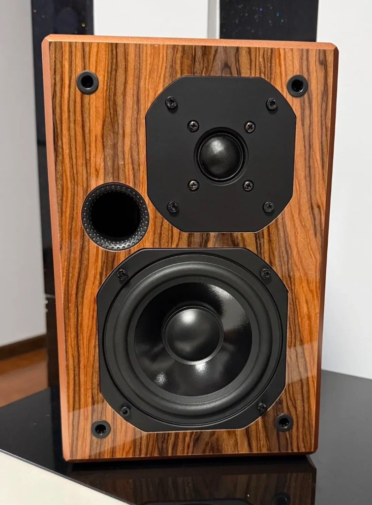
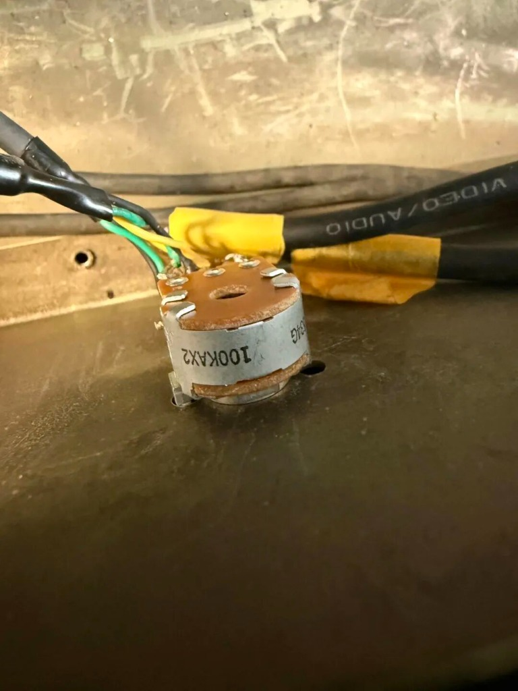
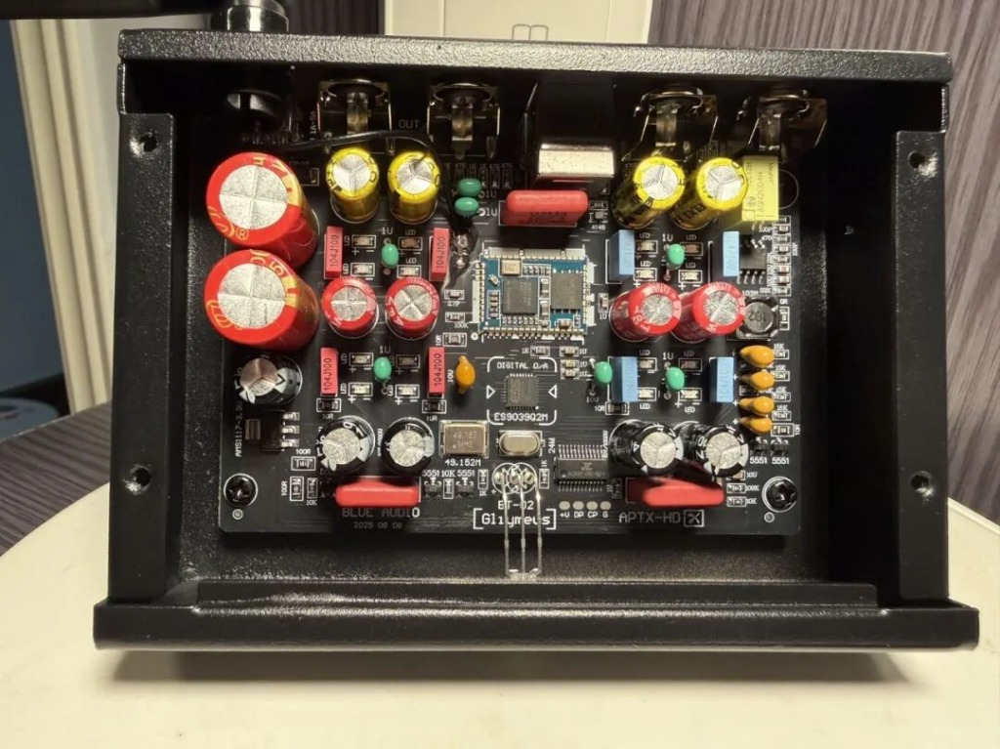
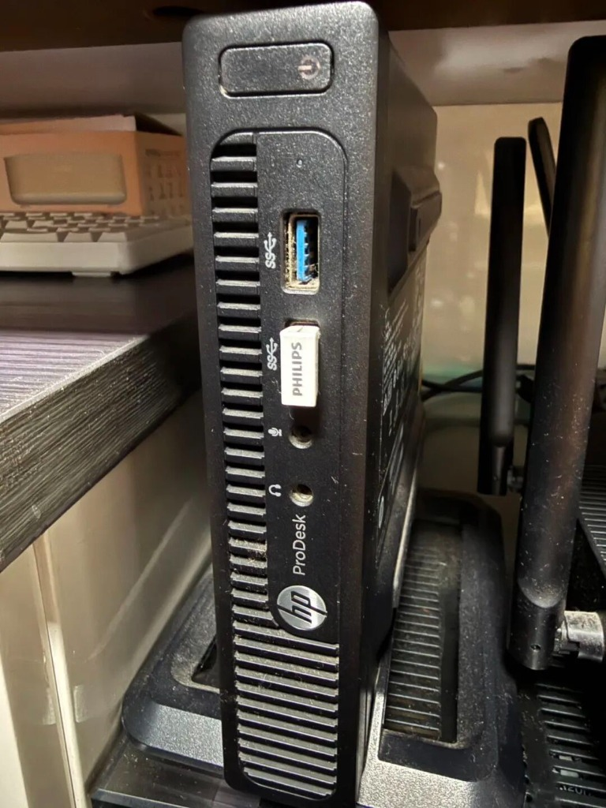
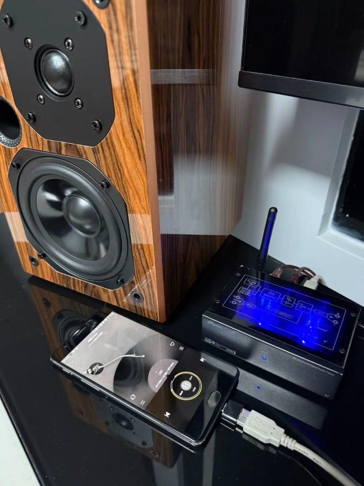

前几天收拾屋子，在角落里翻出了那台积灰多年的国产“湖山”功放。抱着试一试的心态通了电，虽然旋钮有点接触不良，但这大环牛、这沉甸甸的分量，让我确信它“老兵不死”。

既然功放还能打，手边没箱子怎么行？

我一咬牙，信奉“价值投资”的我斥资 800 多大洋，专门为它购入了一对 5 寸二分频书架音箱（丝膜高音+复合纸盆）。

也就是这 800 块的投入，让我彻底掉进了 DIY 的坑。为了让这对新音箱发挥出 120% 的实力，我开启了一场从源头到末端的“魔改”之旅，最终搓出了一套让很多成品机汗颜的“超级链路”。

## 第一步：老机新生，基础要打牢

箱子有了，功放得争气。原机电位器老化严重，底噪大得像蚊子叫。为了配得上这对新买的音箱，我先给湖山做了个“基础手术”：

- **直通化改造**：扔掉自带的廉价前级板，减少音染，让信号直通后级。
- **换装 ALPS 电位器**：换上日本原产 ALPS 100KA 指数型电位器。这一换，阻尼感顺滑如丝，小音量下的控制力瞬间提升了几个档次。
- **全屏蔽布线**：重新接地处理后，背景黑得像深海，完全听不到底噪。

这一步做完，声音干净了，底子有了。

## 第二步：源头革命——从惊魂到安稳

系统搭好后，我入手了一台“小平影音”的 hifiv 发烧级 LDAC/APTX 无损蓝牙播放器 9039 高通 DAC 解码器。这台机器配置极高（ESS 旗舰架构），声音温润，正好中和晶体管功放的硬朗。

> **【一段惊心动魄的小插曲】**
>
> 为了追求极致，我曾试图把解码器输出端的耦合电容短接，实现“直通”。但在动手前，我敏锐地发现静音电路阻值异常，并咨询了原厂。
>
> 老板小平一盆冷水浇醒了我：“静音电路动作时会接地，直通必烧芯片！”
>
> 这次经历让我明白：DIY 不是盲目冒进，懂得“止损”和尊重原厂安全设计，也是一种修养。这台解码器，最终保留了原厂状态，稳稳地当好了“守门员”。

## 第三步：零成本神来之笔——废旧手机变身纯净数播

解码器到位了，转盘呢？

我没有买昂贵的数播，而是翻出了抽屉里的当年神机——一加 3T，配合家里的飞牛 NAS，打造了一套“真·无损数字转盘”。

*   **软件核心**：海贝音乐 (HiBy Music) 开启“USB 独占模式”，完美避开安卓 SRC 劣化。
*   **物理外挂**：开启“飞行模式”，拔掉充电器，利用手机电池纯净供电。
*   **连接方式**：一加 3T (OTG) -> ES9039 解码器。

此时，这台“断网砖头”输出的数字信号，背景黑度极高，零电网纹波干扰，直接秒杀很多入门级台式数播。

## 第四步：注入灵魂——红威马的“点睛之笔”

虽然系统已经很不错了，但作为完美主义者，我总觉得高音虽然亮，但有点“燥”，不够润。

问题锁定在功放输入端那两颗廉价的绿皮涤纶电容上。

**终极魔改方案：**

1.  **拆除路障**：毫不犹豫，焊下那两颗老化的绿皮电容。
2.  **注入灵魂**：换上发烧界经典的 WIMA（威马）MKS2 0.1µF 红色薄膜电容。
3.  **关键细节**：剪短引脚！紧贴电路板背面，并联在 47µF 大电解电容上。

这一步是真正的“点睛之笔”。WIMA 电容极快的高频响应，打通了信号的“高速公路”。

## 最终章：听见“松香”的味道

现在的系统链路是：

**NAS无损库 -> 一加3T (电池纯净电) -> ES9039 (旗舰硬解) -> 湖山+红威马 (魔改后级) -> 800元书架箱**

一开声，我直接起鸡皮疙瘩了！

*   **解析力爆棚**：之前蒙着纱的感觉彻底消失。小提琴弓弦摩擦的瞬间，那种特有的细腻和泛音（俗称“松香味”）清晰可闻。
*   **声场全开**：声音不再缩在箱子里，而是脱箱而出，乐器定位精准。
*   **低频质变**：得益于红威马对高频相位的修正，低频的轮廓感反而更深沉、更结实。那对 800 块买来的 5 寸音箱，此刻发出了超越体积的能量。

## 结语：花小钱，办大事

算笔账：

*   **音箱**：800 多元（这是核心资产）。
*   **解码器**：200 多元。
*   **电容/电位器**：几十块钱。
*   **功放/手机/NAS**：废旧利用，0 元。

总共 1000 出头，却搞出了一套“高解析音源 + 独立解码 + 大推力功放 + 发烧音箱”的正经 HiFi 数播系统。这就是 DIY 的魅力——小孩才做选择，成年人用双手创造奇迹！
