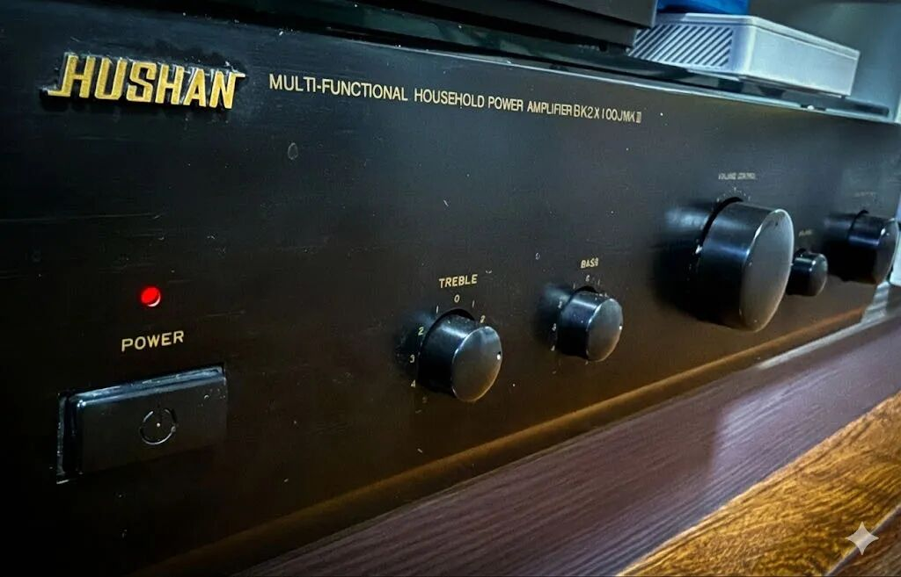
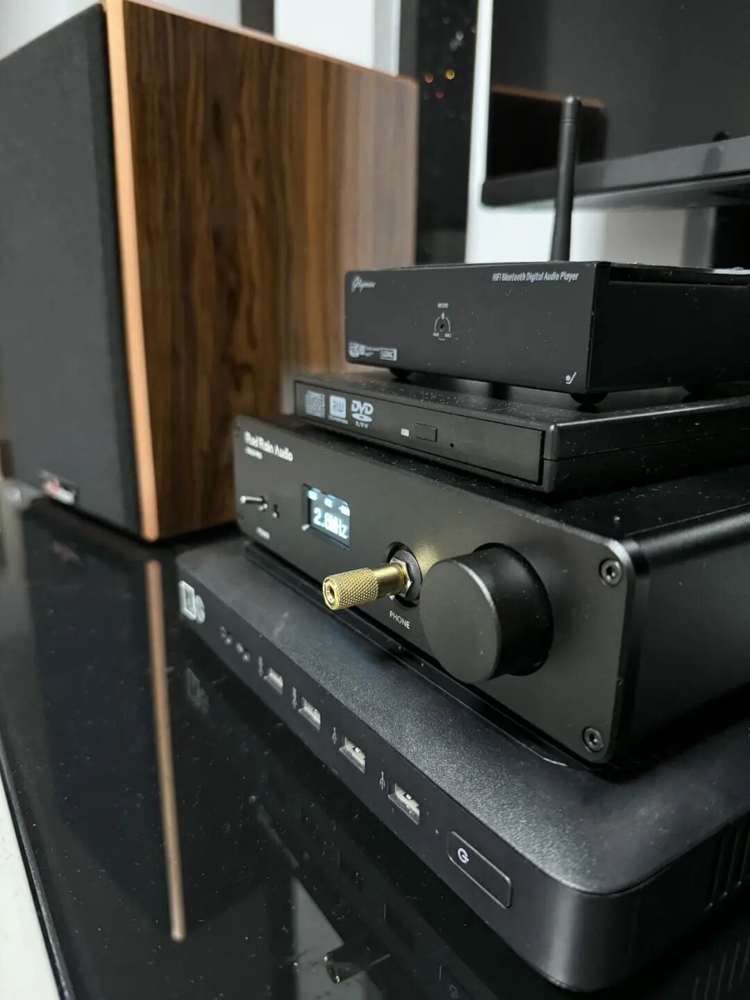
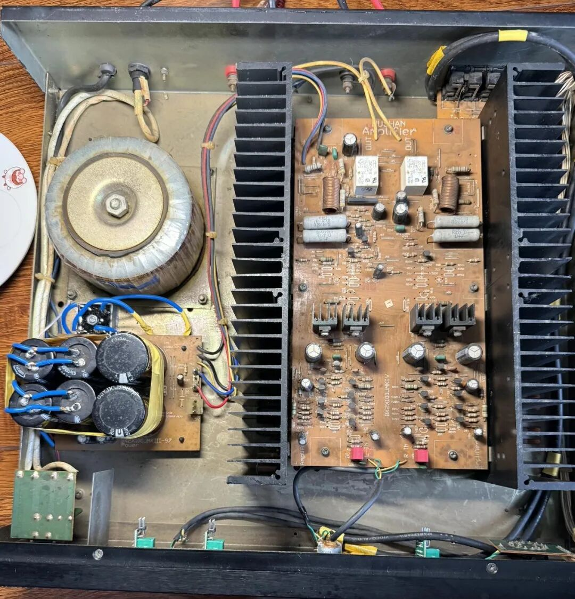
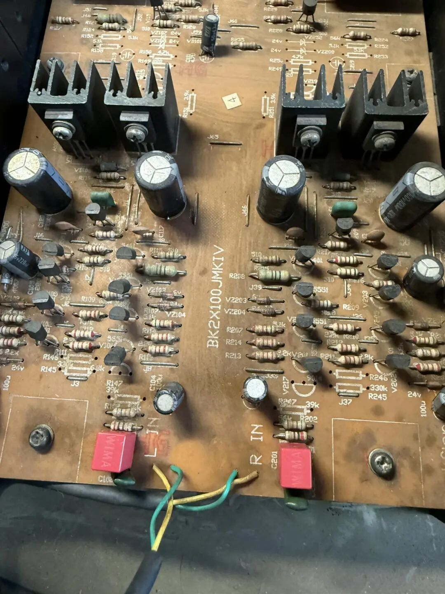
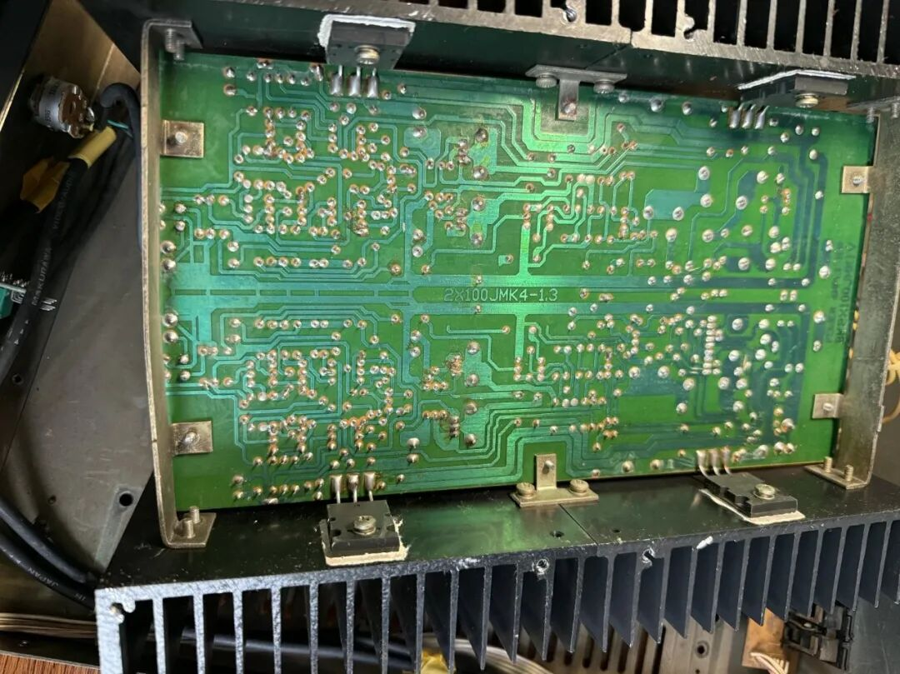
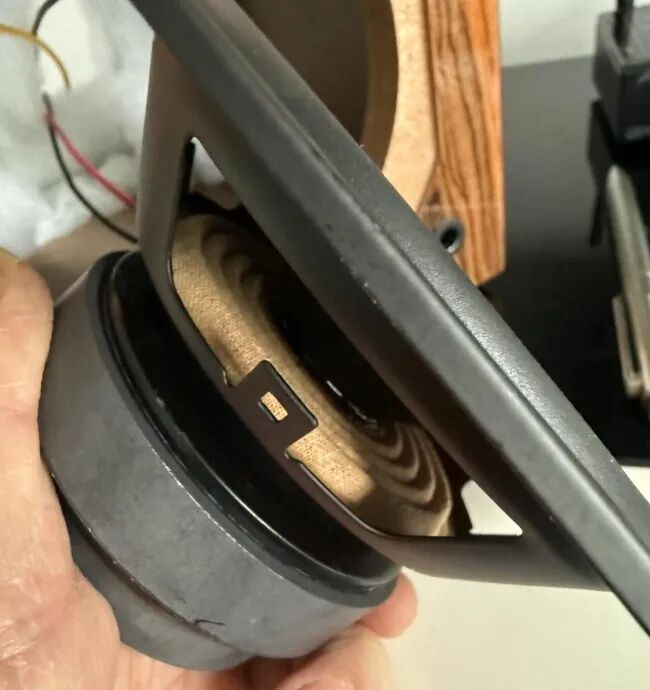
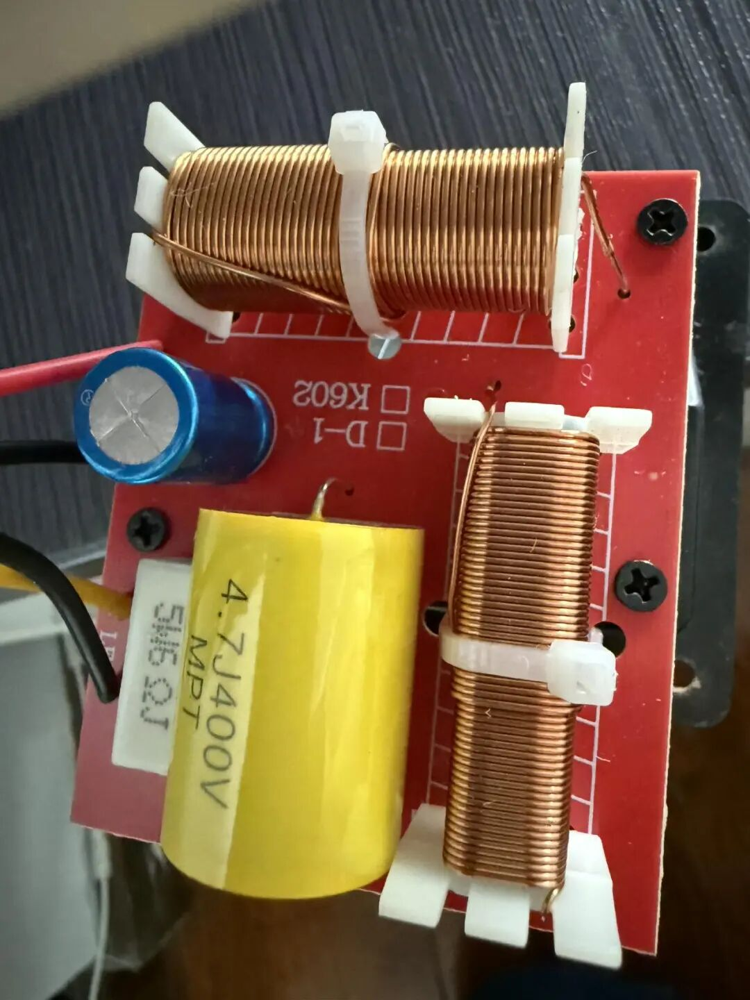
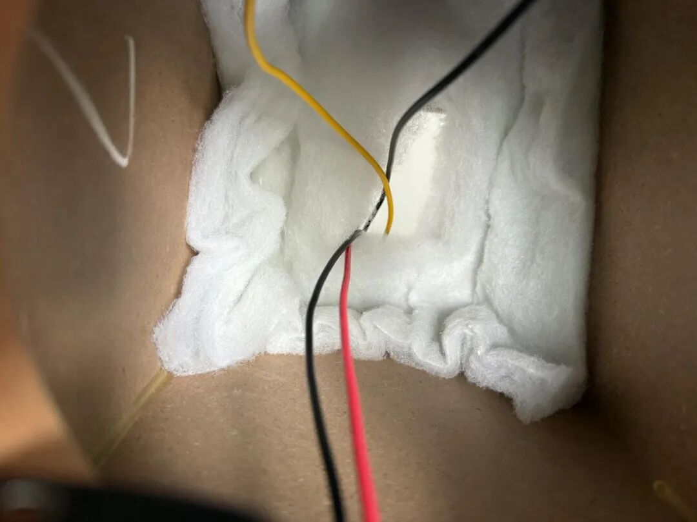

金色的 HUSHAN Logo 在灯光下依然熠熠生辉。它见证了模拟时代的辉煌，也曾因技术老化而蒙尘。今天，虽然它的外观依然保持着90年代的复古克制，但内部却已经流淌着 2026 年的数字血液。

*图注：湖山 BK2X100JMKII，二十年前的国产荣光。*

在HiFi圈子里，有一种偏见：老机器只能听个“味道”，新数播只有“素质”没感情。

今天，我要用一把电烙铁和一套严谨的数播架构，打破这个偏见。

这次的改造项目很明确：复活一台老款湖山甲乙类功放。但不是简单的维修，而是“夺舍”——彻底阉割掉它陈旧的前级电路，用现代化的 NAS + Daphile + 双 ES9038 解码器接管大脑，只保留老功放最纯粹的后级驱动力。

## 第一章：数字源头的“提纯行动”

HiFi 的尽头或许是电力，但源头绝对是数据。如果源头是浑水，后面用再好的补品电容也是徒劳。

为了喂饱这台即将重生的模拟猛兽，我没有使用普通的 PC 播放器，而是搭建了一套严格的“存播分离”架构：

*图注：桌面上的“扮猪吃老虎”。*

这是一套极具“反差感”的系统：虽然混入了被淘汰的蓝牙接收器和普通的 USB 光驱，但核心却是由 Daphile 数播与双 9038 解码器组成的强悍心脏。当解码器屏幕显示出金色的 DSD 采样率，配合左侧音箱特有的松暖听感，这一刻，技术与音乐在方寸桌面上达成了完美的和解。

*   **后端（仓库）**：一台运行 fnOS 的 NAS，负责吞吐数 TB 的 DSD/SACD ISO 原盘镜像。
*   **前端（转盘）**：独立的 Daphile 主机。它剔除了所有与音频无关的系统进程，通过 NFS 协议只读挂载 NAS 资源。
*   **链路（传输）**：启用 Daphile 的 Ramdisk（内存播放）模式，配合 Rod Rain DA10 Pro 的意大利 Amanero 界面，确保信号是以 Bit-Perfect（位完美）的状态进入双 ES9038 解码芯片。

当解码器屏幕上亮起白色的 DSD 2.8MHz 字样时，我知道，纯净的数字地基已经打稳了。接下来，轮到电烙铁上场了。

## 第二章：手术台上的“心脏搭桥”

搞定了音源，接下来是重头戏——功放改造。

这台老湖山底子不错，但原厂的前级设计在今天看来已经是瓶颈：信噪比低、音染重、解析力不足。我的方案是：直通（Direct）。

### 1. 供电系统：并没有“过度设计”这回事

原机两颗 12000μF 电容略显疲态，我直接并联 4 颗 10000μF 高速电容。

*   **总容量**：飙升至 64000μF。
*   **整流桥**：换装 25A 金属方桥，直接锁底板散热。
*   **实测**：开机瞬时浪涌功率飙升至 240W，待机却稳如老狗仅 9W。

*图注：当现代“补品”遇上经典架构。*

一张图看懂改造全貌：左下角手工并联的高速电容阵列，不仅解决了老机器滤波干涸的问题，更将瞬态响应提升了一个量级。配合右侧经典的对称式放大电路，这台老湖山如今是“穿衣显瘦，脱衣有肉”。

### 2. 信号通道：扔掉拐杖，红威马登场

最纠结的一步在于耦合电容。原计划是“电解+小威马并联”，但在技术合伙人建议下，我果断扔掉了那颗 0.1μF 的“拐杖”。

*   **最终方案**：单颗 WIMA 4.7μF 红威马薄膜电容直通。
*   **理由**：纯薄膜通道，足以保证高频的华丽与低频的深潜。

*图注：点睛之笔，红色的音质灵魂。*

在一片古朴的元器件中，两抹鲜艳的红色格外醒目——这就是被发烧友视为“补品”的德国 WIMA 电容。它们与底部的飞线配合，完成了关键的信号“心脏搭桥”手术。

### 3. 终极一招：法拉第的“防弹衣”

为了追求极致的“零底噪”，我干了一件疯狂的事：

绕开 PCB 板上所有老化走线和波段开关，用一根带屏蔽层的粗壮话筒线，直接从输入端飞线焊接至 ALPS 电位器。这根线，就是在机箱复杂电磁环境中，保护微弱音频信号的“防弹衣”。

*图注：底面走线与关键连接细节。*

照片展示了 PCB 板背面的工艺以及固定在散热器上的大功率输出晶体管。为了最大限度减少干扰，输入信号使用了一根带有屏蔽层的粗壮话筒线，直接从输入端飞线焊接到这个电位器上，实现了最短路径传输。

## 第三章：深海听感——静如处子，动如脱兔

改造完成，接上解码器，开机。

第一耳的震撼是“没有声音”。背景越黑，星星越亮。为了验证这套系统的终端实力，我们拆解了与之搭配的老陈 5 寸书架箱。

*图注：好声音背后的“重料”证据。*

所谓“堆料”，看一眼单元背面就懂了。这颗低音单元背负着一个与其身材不成比例的巨大磁体，仿佛在以此证明它绝非等闲之辈。

*图注：良心用料的细节。*

分频器没有使用廉价电解电容，而是使用了一颗黄色的 4.7μF MPT 薄膜电容。这解释了为什么它的高音能接得住双 9038 的高解析力而不刺耳。

*图注：箱体内部吸音棉的铺设非常克制，只覆盖背板，这是为了保留 5 寸箱宝贵的低频辐射效率。*

### 🎵 试音实录

*   **《The Mass》(Era)**：240W 的瞬态爆发力不再是纸面数据。低频滚滚而来，人声合唱与电子低音分离度极高。
*   **《In My Secret Life》(Leonard Cohen)**：以前听是浑厚，现在听是“颗粒感”。
*   **《鼓王群英会》(DSD)**：鼓皮的震动、鼓槌的击打点，那种结实且富有弹性的质感，证明系统对低频的控制力已臻化境。

## 结语

我们将一台几十年前的模拟怪兽，成功接入了 2026 年的数字洪流。它不再是一台旧机器，它现在拥有了数字的大脑（DSD 硬解）、核动力的心脏（64000μF）和纯净的血管（WIMA 直通）。

这，就是“老机复活”的态度：不盲目追新，不随意怀旧，用技术榨干每一分硬件的潜力。
