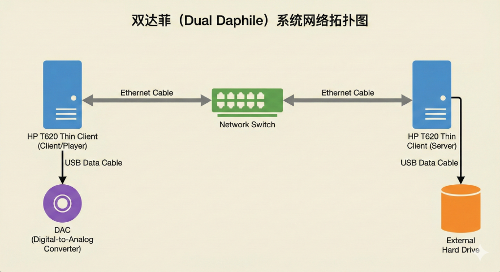
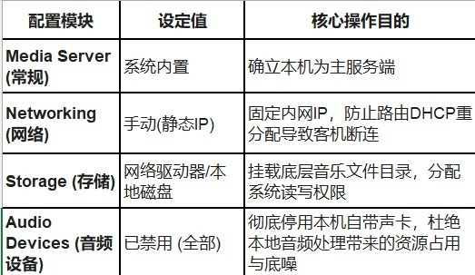
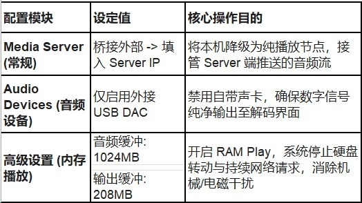
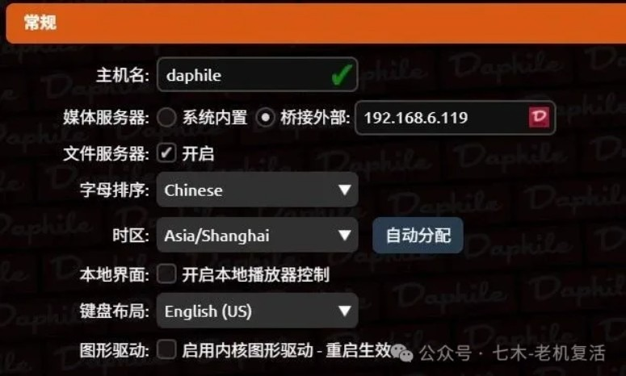
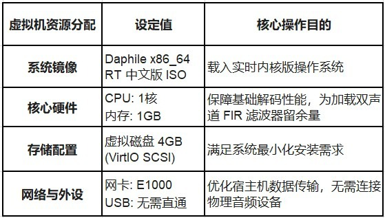

> **站长公告**：原公众号“现代服务”现已正式更名为“**七木-老机复活**”。
>
> 更名原因：原名常被老哥们吐槽像“交水电费的”。为精准匹配内容，故作更改。团队及方向绝对不变，继续死磕低成本 Hi-Fi、Daphile 调优与硬核旧物改造。直接看今日干货👇

---

*图注：双达菲（Dual Daphile）系统架构示意图。通过网络交换机连接 Server 端（算力中心/音乐文件库）与 Client 端（纯净播放节点），实现算力与数字信号输出的物理隔离。*

“双达菲”架构的底层逻辑是：**算力与输出分离**。

单机系统在处理高码率音频解码或卷积滤波时，CPU 的高频运转及硬盘读写会产生电磁噪声。双机架构通过网络隔离，将“文件服务/解码算力”交给 **Server** 端，“纯净数字信号输出”交给 **Client（客机）** 端，从而实现极低底噪的“万元级”听感。

---

## 方案一：双 T620 物理机组网

利用两台几十元捡漏的 HP T620 瘦客户机，一台挂载硬盘作 Server，一台连接 DAC 作 Client。两台主机均安装达菲系统。

### 1. Server 端配置参数

*图注：双达菲 Server 端配置要点。核心在于确立主服务、设置固定 IP 并在 Audio Devices 中彻底禁用所有本地声卡。*

### 2. Client 端配置参数

*图注：双达菲 Client 端配置要点。需在 Media Server 模块中选择桥接外部并填入 Server 的 IP，Audio Devices 仅启用外接 USB 解码器，并配置大缓冲区以开启 RAM Play。*

*图注：Client 端的常规设置界面。媒体服务器勾选“桥接外部”，并在右侧输入框中填入另一台达菲 Server 端的局域网静态 IP 地址。*

外部桥接按上图样式填入你的另一台达菲的 IP 地址。

---

## 方案二：NAS 虚拟机 (Server) + T620 (Client)

若已有群晖、飞牛等 NAS 设备，可利用其强大的 CPU 算力承担 Server 角色。

虚拟机安装达菲教程本站之前已经发布，详情请点击查看：[【全网首发】扔掉小主机！飞牛NAS虚拟机直通硬件跑 Daphile，音质性能双起飞](/blog/fnos-daphile-vm)

### NAS 虚拟机 Server 端配置

*图注：在飞牛或群晖 NAS 虚拟机运行 Daphile Server 时的资源分配建议。分配 1核 CPU + 1GB 内存即可，网卡选择 E1000 驱动，无需配置 USB 硬件直通。*

> [!TIP]
> **注**：Client 端 (T620) 配置同方案一，只需将桥接 IP 指向 NAS 虚拟机的局域网 IP 即可。进阶玩家可在 Client 端加载卷积滤波器（BruteFIR）进行房间声学声学校正。

---

`#Daphile教程` `#双达菲设置` `#T620改造` `#飞牛NAS虚拟机` `#低成本HiFi` `#数字播放器` `#旧电脑复活` `#内存播放` `#Amanero界面` `#桌面音频`
