在数播音频圈里，**“双达菲（Dual Daphile）”**一直是被发烧友们津津乐道的高级玩法。

简单来说，单机版的达菲系统既要负责扫描数万首歌曲、读取元数据（非常消耗 CPU 和内存），又要负责实时的音频解码输出。一旦歌曲库庞大，或者硬件配置较低，很容易在切换歌曲或后台扫描时，因为 CPU 瞬间高载而导致爆音、卡顿。

而**“双达菲”方案**则完美地解决了这个痛点，它将系统一分为二：
1. **Server 机（服务器端）**：专门负责扫描音乐库、管理 SQLite 数据库、安装插件、渲染网页控制端。我们将其部署在**飞牛 NAS（FNOS）虚拟机**中，利用 NAS 强大的处理器和超大内存轻松运行。
2. **Player 机（播放端）**：不承担任何扫描或管理任务，纯粹作为一个极简的硬件解码桥梁。我们使用一台**静音小主机（如百元工控机）**直接连至解码器（USB DAC），以极低的系统负载和干扰专注音频输出。

今天，应广大粉丝的要求，七木为大家带来一期**飞牛 NAS 虚拟机 + 小主机构建“双达菲”的保姆级安装配置教程**。只要按照步骤一步步操作，您一定能搭建出属于自己的发烧数播系统！

---

## 🛠️ 第一步：在飞牛 NAS 上新建虚拟机

飞牛 NAS（FNOS）自带了非常出色的 KVM 虚拟机管理器，性能损耗极低，是作为达菲 Server 端的绝佳选择。

1. **创建虚拟机**：
   登录飞牛 NAS 后台，打开“虚拟机”应用，点击“新建”。
   * **名称**：可随意填写（如 `Daphile-Server`）。
   * **操作系统**：选择 Linux（类型只能选择 `其他 Linux`，没有 `Debian` 可选），具体配置参考下图。

   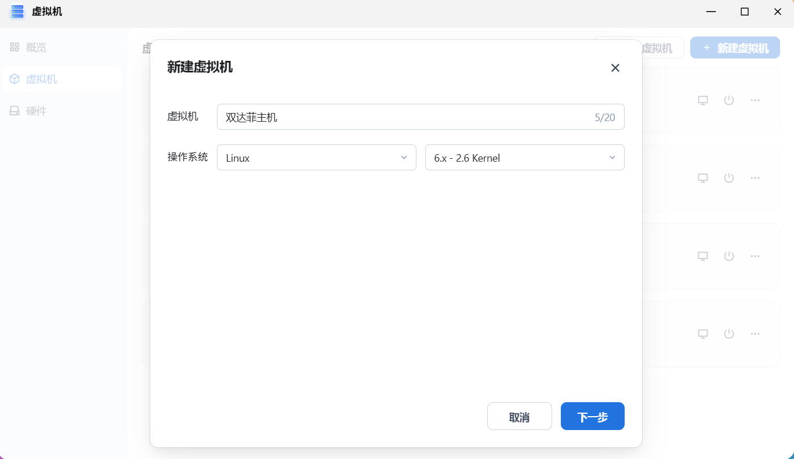
   *图注：新建虚拟机，选择操作系统为通用 Linux 系列。*

2. **配置系统镜像与自启**：
   * **系统镜像**：请先下载好达菲官方或我们的[【Daphile 中文精简优化版】](/blog/daphile-plugins-fix-retrospective/) ISO 镜像到本地电脑，然后上传到飞牛虚拟机的硬盘上并选中。
   * **开机自动开启**：勾选“是”。其余参数保持默认，点击“下一步”。

   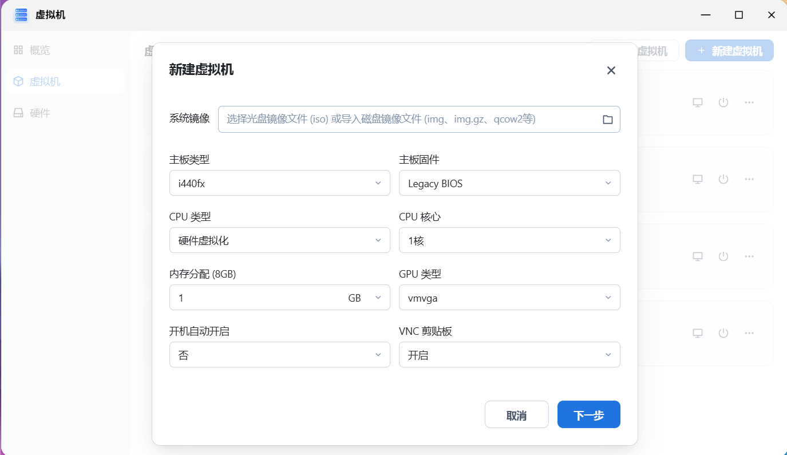
   *图注：选择上传的 Daphile 镜像，并开启开机自动启动。*

3. **添加虚拟硬盘**：
   * **存储空间**：根据您 NAS 的实际情况选择。
   * **磁盘大小**：设置 **4GB** 就已经绰绰有余了（达菲系统本身只有几百兆，不需要占用太多空间）。点击“下一步”。

   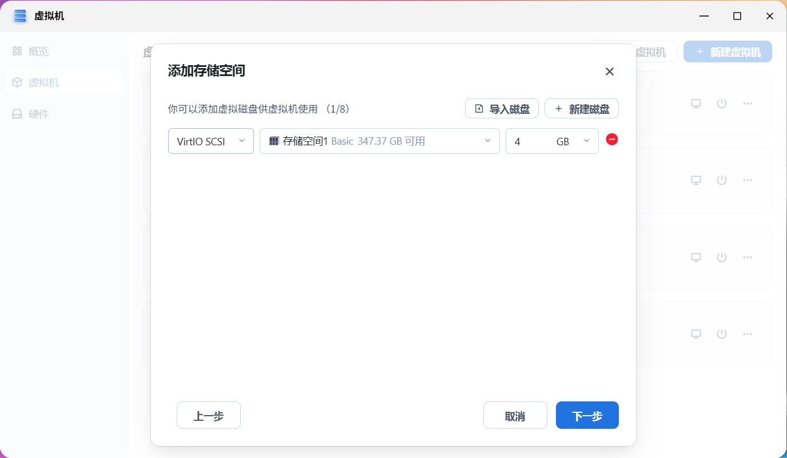
   *图注：分配 4GB 的存储空间作为达菲的系统盘。*

4. **配置网络与添加网卡（关键）**：
   * 来到添加网卡页面，点击右上角的 **“添加网卡”**。

   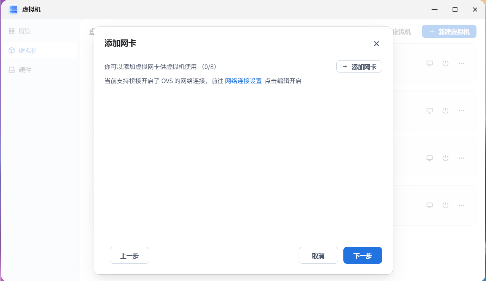
   *图注：点击添加网卡选项进入配置。*

   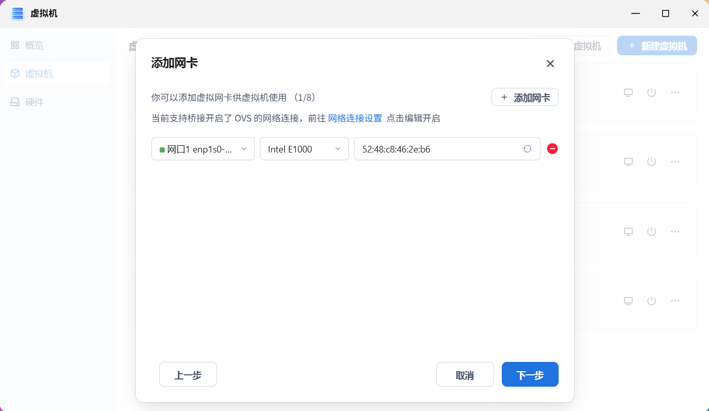
   *图注：弹出新网卡设置页面。*

   * **网卡类型（非常关键）**：在网卡类型下拉菜单中，一定要选择 **`Intel E1000`**。该型号是兼容性和稳定性最好、在 Linux 下最容易免驱的网卡类型。

   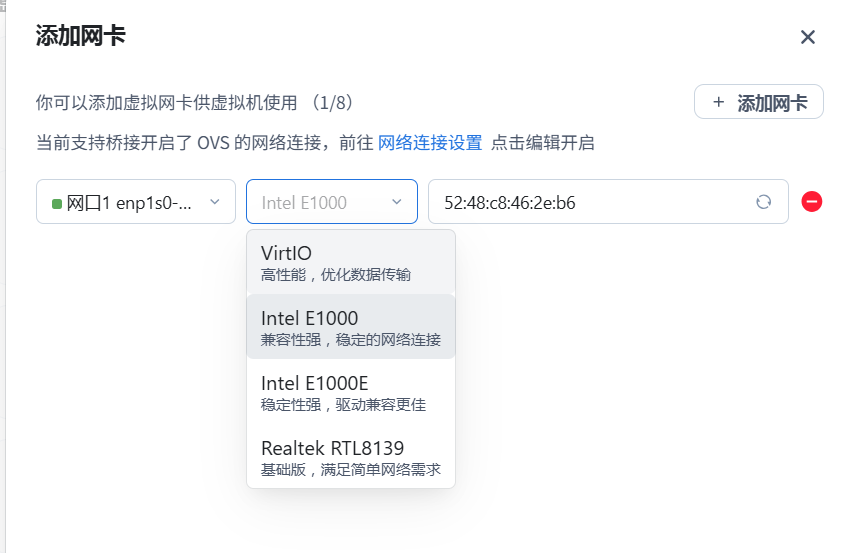
   *图注：选择 Intel E1000 类型的网卡以获得最佳兼容性。*

5. **硬件直通**：
   因为我们采用的是“双机”网络串流方案，Player 端才直连解码器，所以虚拟机的硬件直通（USB、PCI-e 等）**全部不需要管**，直接点击下一步完成创建。

   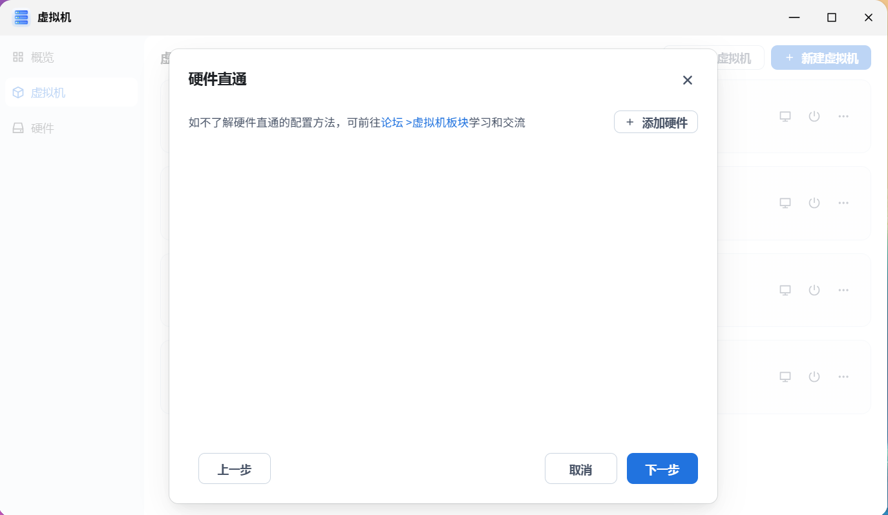
   *图注：无须进行硬件直通，点击下一步完成创建。*

---

## 💿 第二步：在虚拟机中安装达菲系统

1. 回到飞牛虚拟机列表界面，选中刚刚创建好的虚拟机，直接点击 **“开机”** 按钮。
2. 启动后，点击开机按钮旁边的 **“VNC 访问”** 按钮，打开控制台。

   
   *图注：点击 VNC 访问以控制虚拟机的控制台。*

3. 稍等半分钟，VNC 控制台会显示出如下黑底黄字的引导信息：

   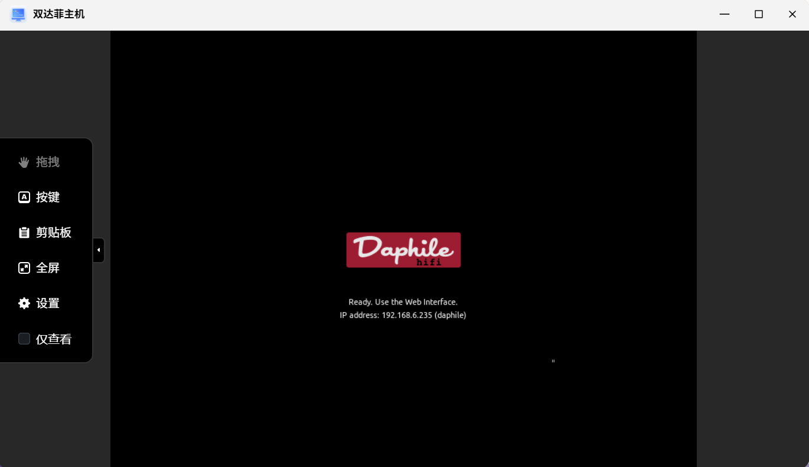
   *图注：系统已成功引导，记下控制台显示的 IP 地址（例如图中的 `192.168.6.119`）。*

4. **正式安装系统**：
   * **特别提醒**：此时系统只是相当于光盘/U盘的 **Live CD 启动状态**，并没有真正写入虚拟硬盘。
   * **操作**：打开浏览器，输入刚才控制台显示的 IP 地址。进入达菲管理界面后，依次点击【设置】--【系统】--【安装达菲】，将系统安装到我们刚才设置的 **4GB 虚拟硬盘**上。
   * *(注：其余的硬盘分区与安装设置与普通的单机达菲完全相同，此处就不再重复赘述。)*

---

## 🎧 第三步：小主机安装达菲并连接 USB 解码器

1. 找出一台您的实体小主机（如普通的二手 x86 工控机或老旧笔记本电脑）。
2. 在该小主机上安装普通的达菲系统，并用硬盘独立引导启动。
3. **连线物理设备**：将您的 **USB DAC / 音频界面 / 歌声音响解码器** 的 USB 数据线，直接插入这台**实体小主机**上。
   *(记住：USB 界面一定要连接到实体小主机上，不需要去管 NAS 的接口。)*

---

## 🔗 第四步：双机连接（Bridge 桥接设置）

两台达菲系统（虚拟机上的 Server 端，和小主机上的 Player 端）都安装并开机好后，我们来打通它们之间的连接：

1. 虚拟机上的 Server 达菲**不需要做任何多余的设置**，只要保证它处于开机状态，并记下它的 IP 地址即可。
2. 打开**实体小主机**达菲的控制后台（在浏览器输入小主机的 IP）。
3. 导航到【设置】--【系统】设置页面，找到【媒体服务器】选项：
   * 将选项设为 **“桥接外部”** (桥接外部媒体服务器)。
   * 在地址栏中输入您**虚拟机 Server 达菲的 IP 地址**（例如我这里是 `192.168.6.119`）。
   * 输入正确并点击保存后，IP 地址后面会自动亮起达菲的彩色小图标。

   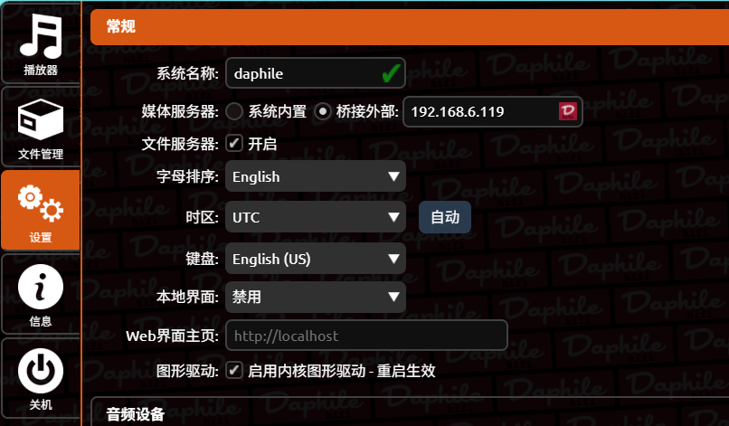
   *图注：在小主机上将媒体服务器选择为“桥接外部”，并填入虚拟机的 IP。*

4. 随后在小主机的【设置】--【音频设备】中，勾选并设置您连接的 USB 解码设备即可。

---

## 📂 第五步：音频文件准备（挂载飞牛 NAS 音乐共享）

双机桥接成功后，我们需要让虚拟机的 Server 达菲读取到飞牛 NAS 里的海量音乐文件。这里我们选择最适合 Linux 系统间传输、延迟极低的 **NFS 协议**。

### 1. 在飞牛 NAS 上设置 NFS 文件共享
* 打开飞牛 NAS 的“系统设置” -> **“文件共享”** 协议页面。
* 找到 **NFS 共享**，点击开启共享开关（如图 1 处所示）。
* 在开启后，点击图 2 处去设置允许访问的文件夹范围，勾选您在 NAS 上存储音乐的文件夹，保存应用。

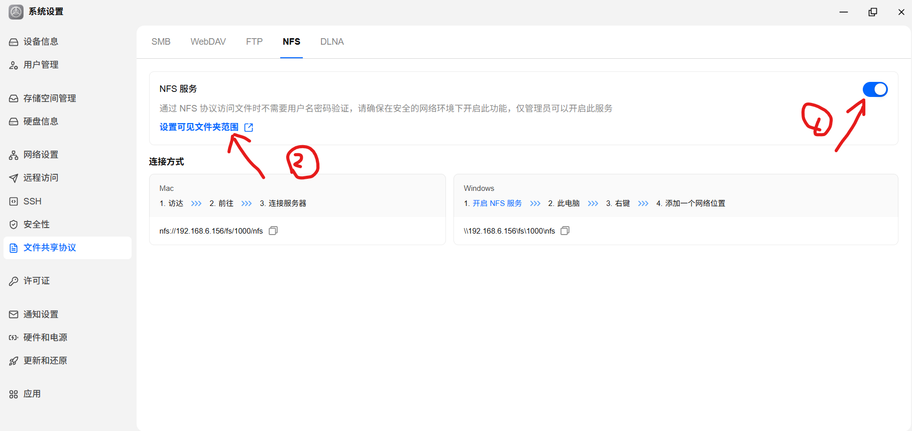
*图注：在飞牛控制面板中开启 NFS 协议，并配置好音乐文件夹。*

### 2. 在 Server 达菲虚拟机中挂载该网络驱动器
* 登录**虚拟机 Server 达菲**的后台。
* 进入【设置】--【存储】--【网络驱动器】部分，点击 **“添加项目”**。
* 按照以下参数设置：
  * **协议**：选择 **NFS**。
  * **远程地址 (Host & Path)**：按照上图的格式精确输入：
    `IP:/fs/1000/nfs` (例如 `192.168.6.156:/fs/1000/nfs`)。
    *🚨 注意：千万不要复制 NAS 控制台或普通文件浏览器里的链接，NFS 协议有特定的格式，必须严格按照上述 `IP:路径` 的形式输入！*
  * **标识**：可随便输入（如 `FN_Music`）。

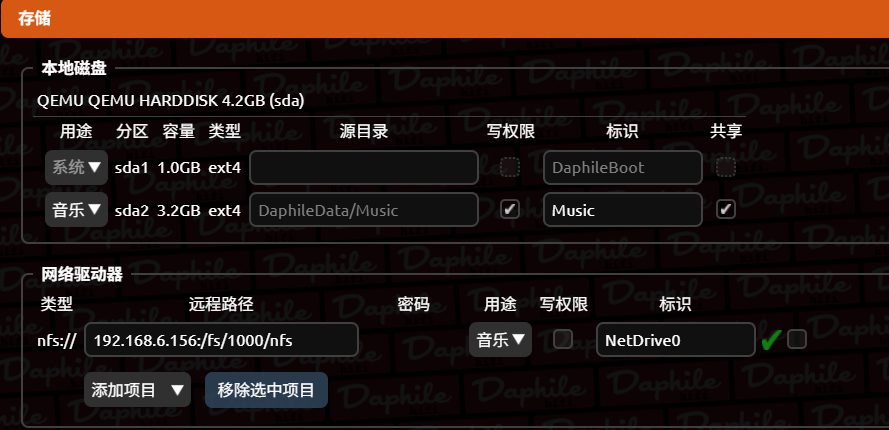
*图注：在达菲虚拟机的存储设置中挂载 NFS 共享。*

* 设置完成后，点击右下角的 **“保存并重启”** 重启虚拟机。

---

## ⚡ 第六步：见证奇迹的时刻

两台达菲在完成配置并重启后，您在浏览器里随便打开哪一台的 IP，进入播放端界面：

* 在控制端的 **“我的音乐”** 里，依次进入 **“浏览音乐文件夹”**。
* 您会看到一个叫作 **“Network Drives”** 的驱动器。

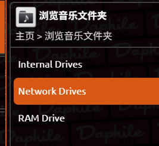
*图注：在音乐目录下成功显示出了我们挂载的网盘。*

* 点击打开，飞牛 NAS 里的海量高解析音频文件已全部呈现在眼前，可以完美流畅地进行播放了！

---

## 📋 总结

至此，我们的**飞牛虚拟机 + 小主机双达菲保姆级教程**就告一段落了。 

通过这种分工合作的方式，您的小主机可以获得完全不受 CPU 扫描干扰的、极度纯净且延迟极低的模拟/数字音频信号，极大地挖掘出解码器硬件的本底实力。

如果您在安装达菲、调校网络时遇到了任何问题，欢迎在下方的评论区留言讨论。我们的下载镜像和补充工具也在持续更新中！
