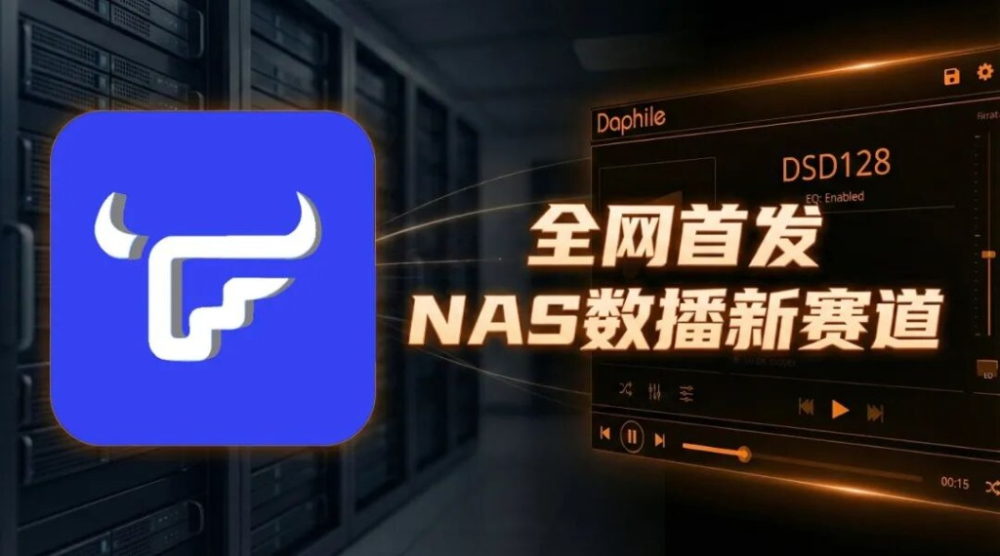
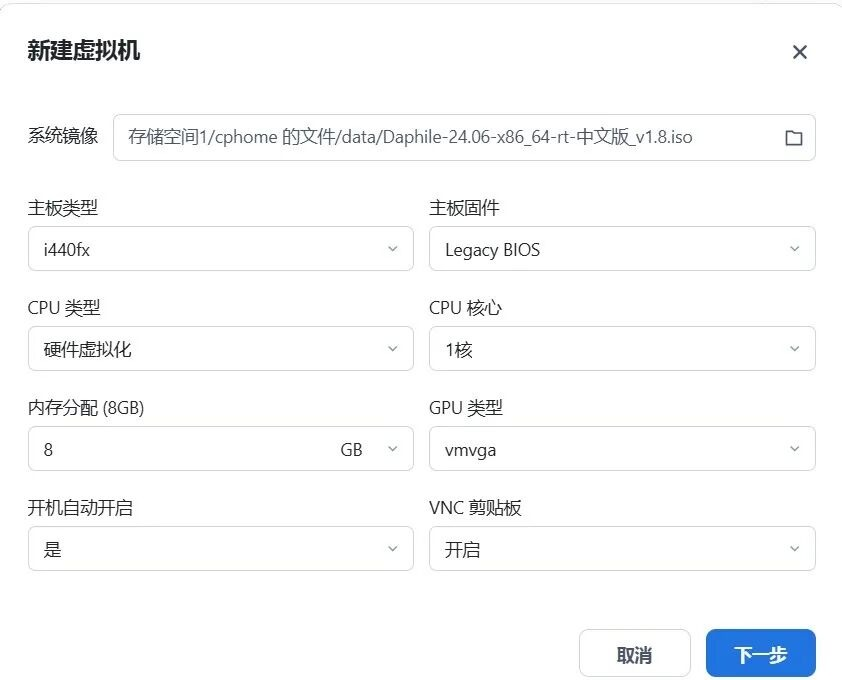
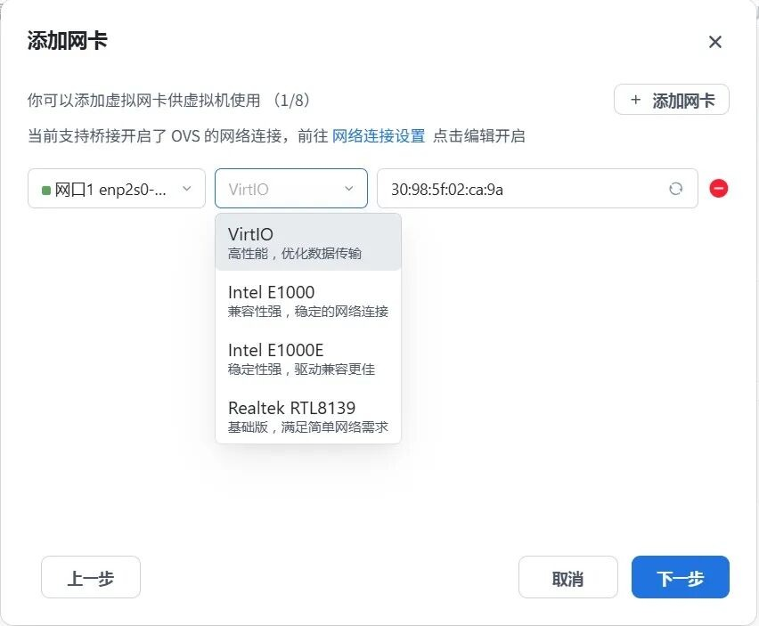
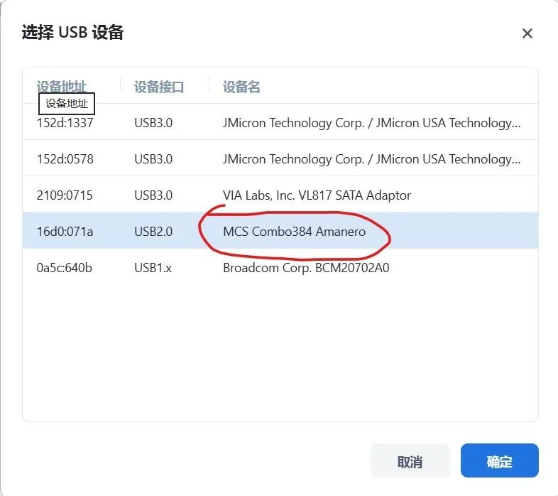
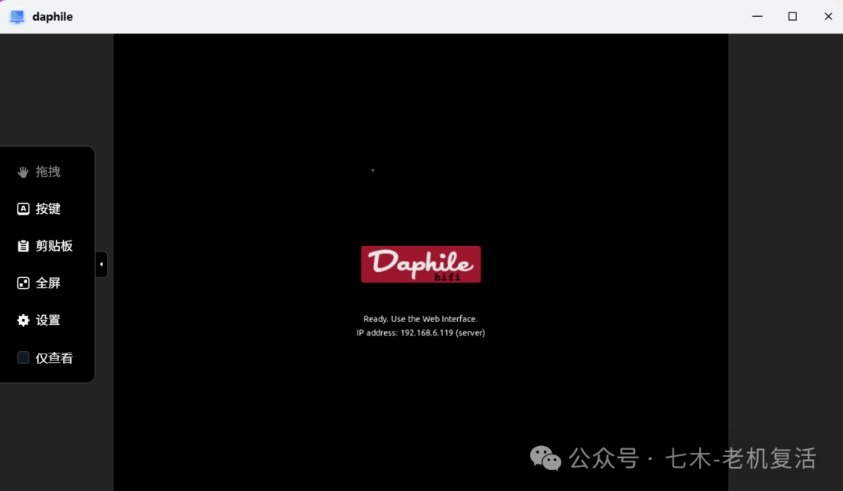

*图注：飞牛 NAS（fnOS）虚拟机直通硬件运行 Daphile，开启 NAS 高性能数播新赛道。*

不少玩家入坑数播的第一反应，就是买个 T620 或者瘦客户机。但由于近期硬件市场波动，性能羸弱 of 旧设备在面对高规格音频处理时，常有力不从心之感。

其实，如果你手里有一台飞牛 NAS（fnOS），完全可以省下这笔钱。

今天分享一个全网首发的硬核玩法：利用飞牛 NAS 虚拟机运行 Daphile，并将 USB 解码硬件直接“通透”给虚拟机。凭借 NAS 现代 CPU 的强大算力，开启数播性能的新赛道。

---

## 一、为什么选择飞牛 NAS 运行 Daphile？

### 1. 性能暴力压制
相比 20 年前或低功耗的瘦客户机，NAS 普遍搭载的 i3 级别处理器性能上限极高。即便同时开启 DSD128 实时转码 + EQ 卷积滤波这种极度吃资源的算法，依然丝滑顺畅。

### 2. 硬件直通（Passthrough）优势
通过飞牛虚拟机的硬件直通功能，让 Daphile 直接接管外部 USB 解码器（DAC）。这种方式绕过了 NAS system 层的音频损耗，确保了 BitPerfect 源码输出的纯净度。

### 3. 零成本复用
只需分配 NAS 极小部分余量性能，无需额外购买和摆放小主机，真正实现“数播一体化”。

---

## 二、飞牛 NAS 虚拟机安装实操

### 1. 新建虚拟机

在飞牛的虚拟机管理界面中：
* **操作系统**：选择 Linux，版本选择 6.x - 2.6 Kernel。
* **系统镜像**：使用 `Daphile-24.06-x86_64-rt-中文版_v1.8.iso`。

*图注：在飞牛 NAS 新建虚拟机向导中，选择好 Daphile 镜像，主板类型选择 i440fx，主板固件选择 Legacy BIOS。*

### 2. 资源分配与网络（根据自己的主机硬件情况设置）

* **CPU 与内存**：得益于 i3 处理器的强劲性能，Daphile 运行时分配 1 核 CPU + 512MB 内存即可轻松起飞。
* **网络模式**：添加网卡时，型号选择 **Intel E1000** 以确保内部数据传输的高效性。
* **固定 IP**：在 Daphile 设置中将 IP 设为“手动（静态）”，确保手机控制端连接稳定。

*图注：添加虚拟网卡时，在型号下拉菜单中选择兼容性更强的 Intel E1000 驱动，以确保稳定的网络连接。*

### 3. 核心步骤：硬件直通（USB 设备直达）

这是让虚拟机内的 Daphile “认出”外部解码器的关键：
1. 在虚拟机配置的“硬件直通”页面，点击“添加硬件”。
2. 勾选你通过 USB 连接到 NAS 上的解码器（DAC）或数字界面（例如下图中的 Amanero 界面）。

*图注：在 USB 设备直通选择列表中，勾选连接在 NAS 上的 USB 音频解码界面（如 MCS Combo384 Amanero）。*

*图注：设置完成后启动虚拟机，系统正常加载并输出与在实体机上相同的 Daphile 终端画面，显示 Web 控制端 IP 地址。*

设置完成后启动虚拟机，后续安装过程与在实体机（如 T620）上完全相同。

---

## 三、进阶调优：DSD 与 EQ 的实测平衡

在 Daphile 的音频设置（Audio Devices）中，我们可以充分榨干 i3 的性能：
* **开启 EQ 卷积滤波**：在“音频处理”中开启 EQ 和 DRC 的 BruteFIR 模式。
* **DSD 策略逻辑**：注意，当你开启 EQ 后，由于复杂的数学运算必须在 PCM 域进行，Daphile 会自动将 DSD 支持策略修改为将 DSD 转码至 PCM。
* **高规格实时回放**：依托现代 CPU，即便将 DSD128 实时转码并叠加卷积运算，系统占用依然极低。这彻底解决了旧款瘦客户机在开启 EQ 后出现的爆音或软件死机问题。

---

## 四、结语

飞牛 NAS 的直通方案不仅省下了买小主机的钱，更通过强大的 CPU 让 DSD128+EQ 等高规格玩法变得轻而易举。

但这只是第一步。

既然飞牛 NAS（i3 核心）已经作为强大的 Server（媒体服务器）稳定运行，那么下一步如何利用“双机方案”，让它配合另一台纯净 Client 进一步压榨音质上限？

**下期预告**：【双机方案】飞牛 NAS 发力，数播进阶的最佳形态！

---

> [!NOTE]
> **想要文中同款飞牛适配版 RT 内核镜像？**
> 可以在 Daphile 官方网站下载，或在我们的社区交流板块中留言获取。

`#飞牛NAS` `#fnOS` `#Daphile` `#数播` `#Hifi发烧友` `#硬件直通` `#NAS玩法`
