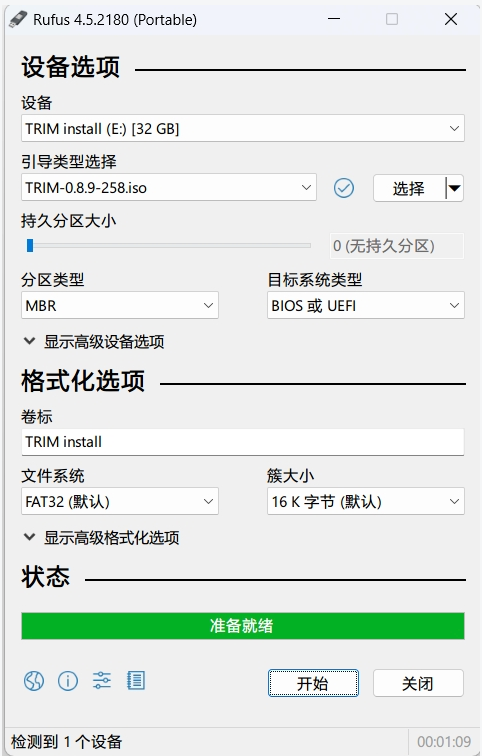
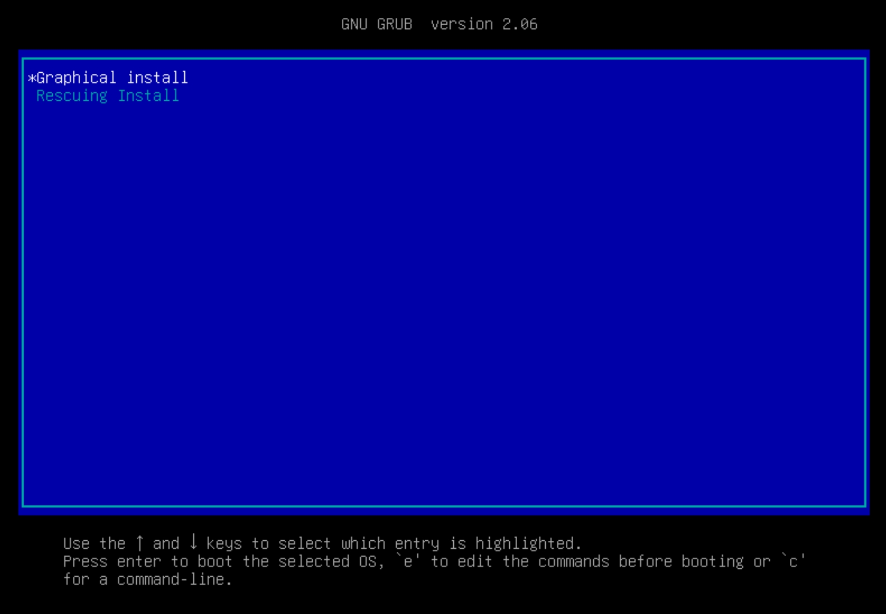
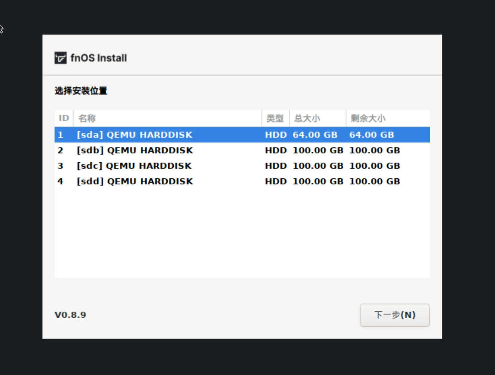
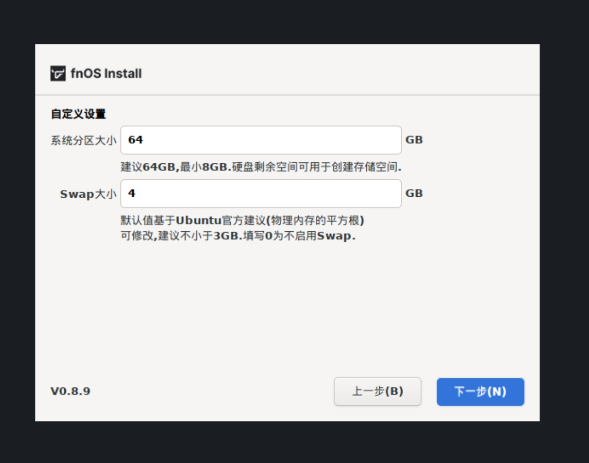
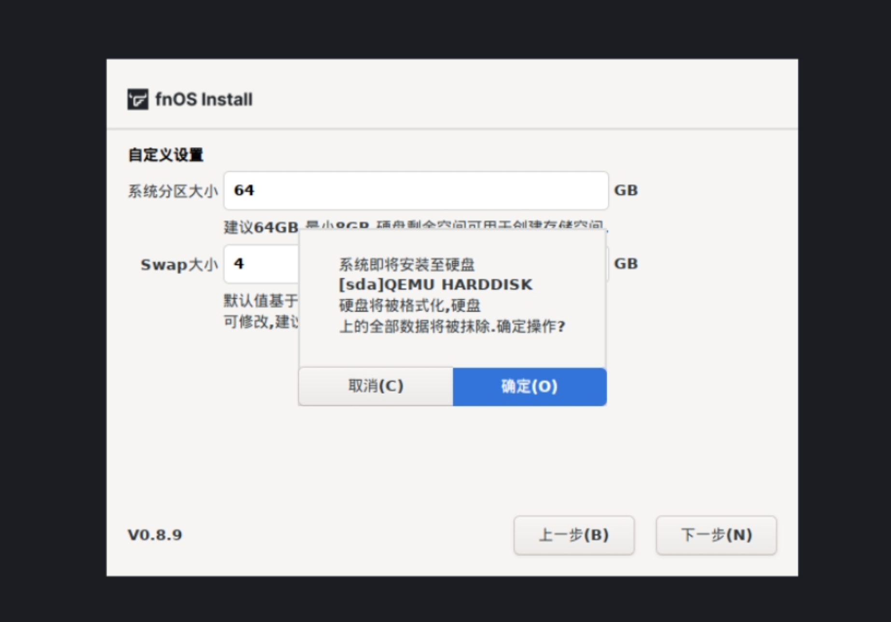
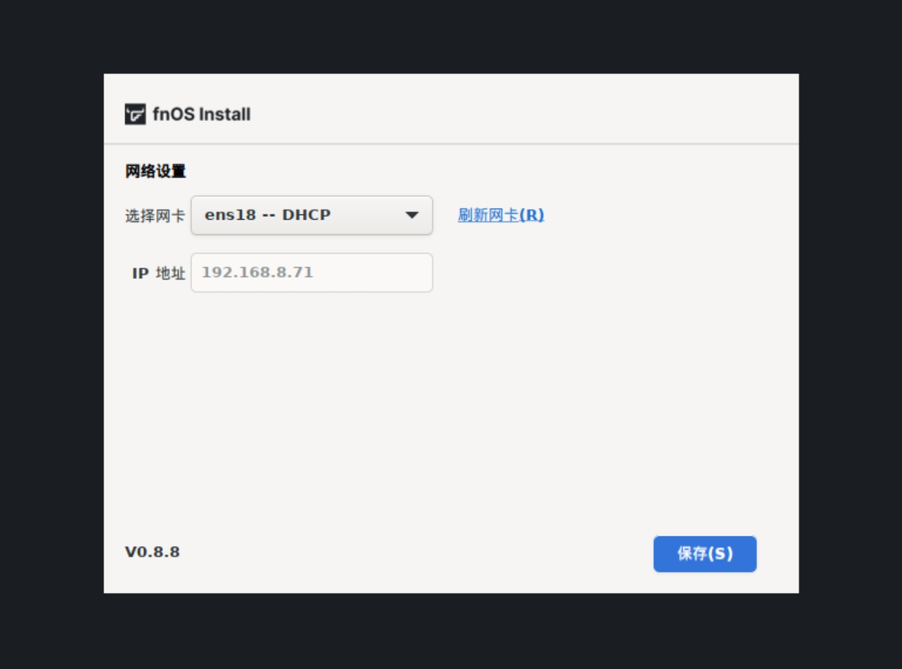
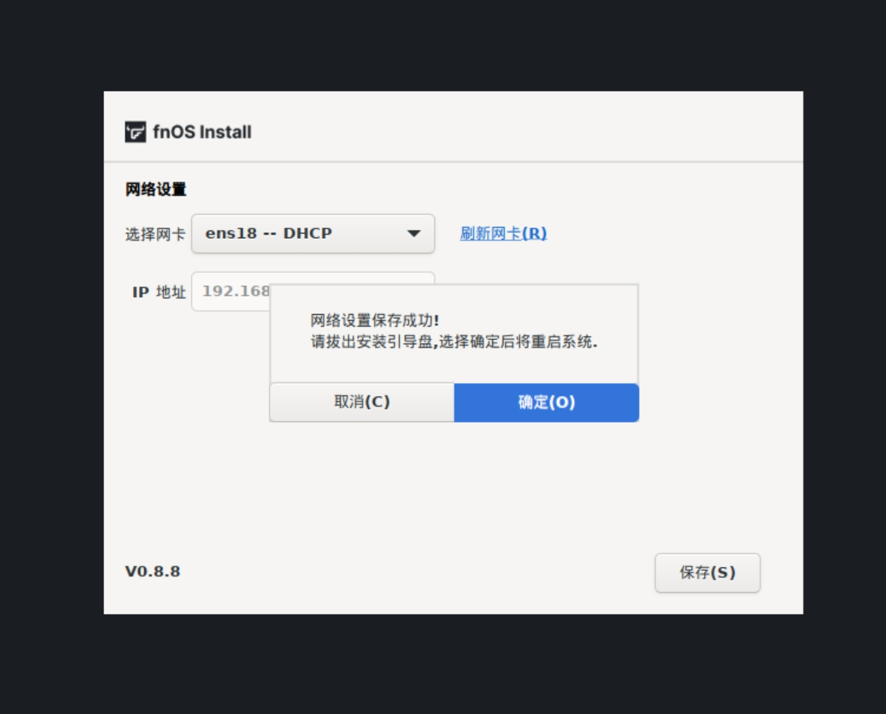
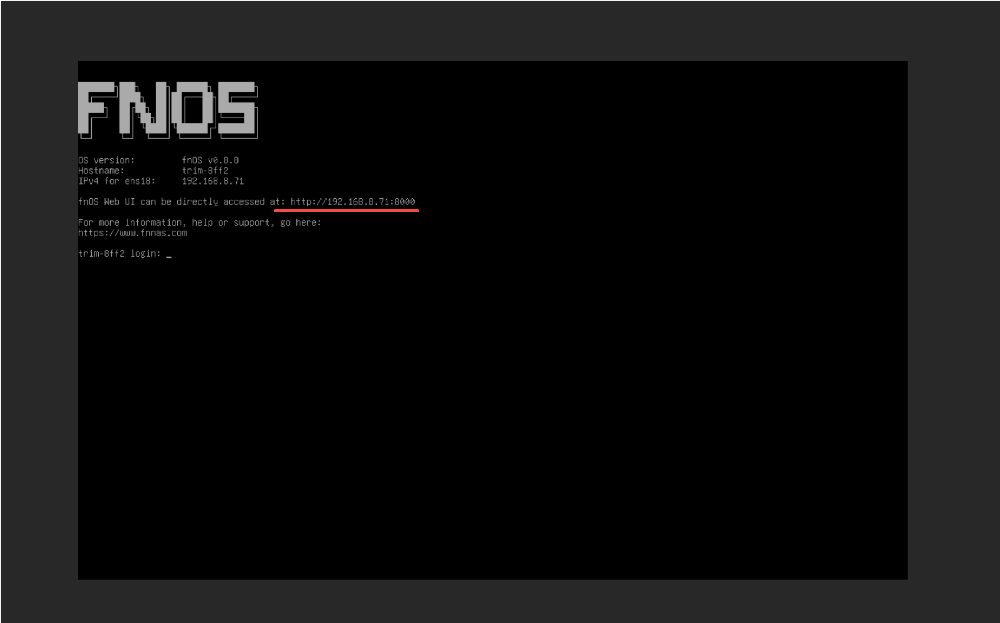
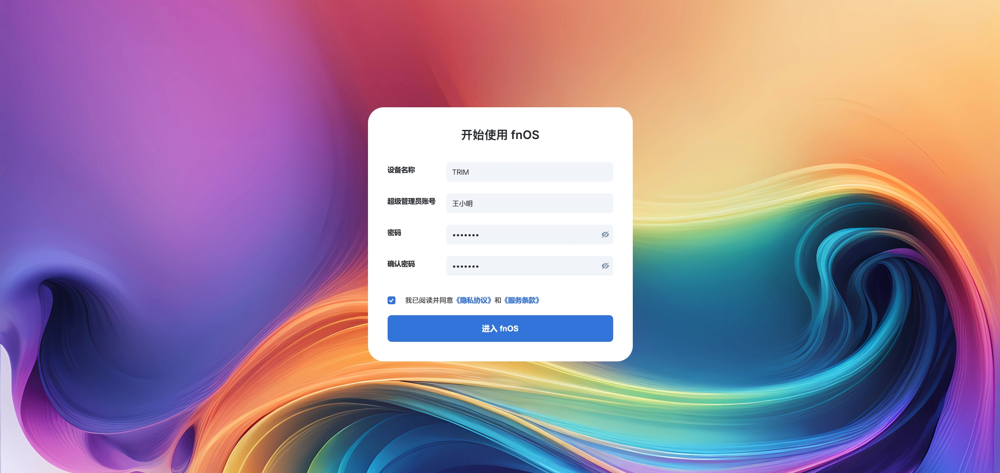

大家好，我是七木。

前段时间，我写了关于 Daphile（达菲）数播的系列教程，很多粉丝在后台留言说，跟着教程用几十块钱的瘦客户机听无损音乐，声音清透、操作方便，特别过瘾。

但随着听的歌越来越多，大家又遇到了一个新的头疼问题：
**“七木啊，我收集的 FLAC、DSD 无损音乐已经有好几个 TB 了，达菲主机的硬盘根本装不下，挂一堆移动硬盘在桌面上乱糟糟的，还容易因为震动伤硬盘，这可怎么办？”**

为了彻底解决“歌多装不下、坏盘歌丢失”的痛点，今天我给大家带来一个一劳永逸的方案：**搭建一台专属于你的“飞牛 NAS”音乐服务器**。

今天这篇，就是我们《飞牛 NAS x 达菲数播》系列教程的第一章：**手把手教你安装飞牛系统**。

---

## 01 什么是飞牛 NAS？为什么选它？

对我们玩音响的人来说，你可以把 NAS（网络附加存储）简单理解为：**一个挂在局域网里的“超级音乐柜”**。

以前，你的音乐存在手机里、电脑里、或者移动硬盘里。现在，我们把所有的无损歌曲、DSD 唱片全部放进这个“音乐柜”里。只要它开着，你家里的达菲数播、手机、平板甚至电视，都可以随时随地通过无线网读取里面的歌曲播放。

市面上的 NAS 系统很多，之所以推荐**飞牛 NAS（fnOS）**，主要是因为它对我们中老年烧友太友好了：
1. **界面漂亮、字大清晰**：不像群晖、威联通那些老系统到处都是密密麻麻的英文和专业术语，飞牛是全中文、极简设计，看着舒心。
2. **硬件要求极低，不挑电脑**：你家里退役的旧台式机、笔记本，或者是闲鱼上一百块钱的工控小主机，都能拿来装，非常省钱。
3. **安全防丢失**：它可以把两块硬盘绑在一起做“镜像备份”（RAID 1），万一一块硬盘坏了，另一块里面珍贵的绝版资源依然完好无损，这对发烧友来说是无价的。

---

## 02 准备工作：你需要准备些什么？

在动手安装前，请像泡茶一样，慢条斯理地准备好以下四样东西：

1. **一台旧电脑**（作为 NAS 音乐服务器）：
   * 必须是 64 位的电脑（近 10-15 年的电脑基本都符合）。
   * 内存建议有 **4GB** 或以上。
   * 必须插着网线，连接到你的路由器上。
2. **一个闲置的 U 盘**：
   * 容量在 **8GB** 或以上即可（用来制作“安装钥匙”，里面的数据会被清空，请提前备份）。
3. **一张系统镜像盘**：
   * 我们去 [飞牛私有云官网下载页面 (https://www.fnnas.com/download)](https://www.fnnas.com/download) 下载最新的系统安装包（格式为 `.iso` 结尾的文件）。
4. **制作工具软件**：
   * 推荐使用免费的 **Rufus** 软件，可以直接点击 [Rufus 官网 (https://rufus.ie/)](https://rufus.ie/) 进行下载，用它把系统安装包“灌录”进 U 盘。

---

## 03 第一步：制作“安装钥匙”（U 盘启动盘）

我们要把下载好的飞牛系统包写进 U 盘里，这样旧电脑才能通过 U 盘启动进行安装。

1. 把你的 U 盘插入你平时用的 Windows 电脑。
2. 双击打开下载好的 **Rufus** 软件。
3. **设备**一栏：确认显示的正是你插入的 U 盘名称。
4. **引导类型选择**：点击右侧的 `【选择】` 按钮，找到你刚刚下载的飞牛系统 `.iso` 文件。
5. 其他设置全部不用动，直接点击最下方的 `【开始】`。
6. 弹出的警告窗口点击 `【确定】`，等待进度条走满，显示“准备就绪”。

这把“安装钥匙”就做好了，可以拔下 U 盘。


*图注：在 Rufus 软件中选择好 U 盘与飞牛系统 ISO 镜像，点击开始制作。*

---

## 04 第二步：旧电脑插钥匙，设置 BIOS 启动

现在，来到那台要改装成 NAS 的旧电脑跟前：

1. 将制作好的 U 盘插在旧电脑的 USB 接口上。确保旧电脑也已经插好了网线。
2. 按下旧电脑的开机键，在屏幕亮起的瞬间，**连续不停地按键盘上的 `【Delete】` 键（有些电脑是 `【F2】` 或 `【F12】`）**，直到进入一个满是英文的蓝色或黑色界面。这个界面叫 **BIOS（基本输入输出系统）**。
3. 在键盘上用方向键移动，找到 **Boot（启动/引导）** 选项卡。
4. 找到 **Boot Priority（启动顺序）** 或 **First Boot Device（第一启动设备）**。
5. 将你的 **U 盘（通常显示为 USB Key 或 U 盘品牌名）** 调整到第一位（最上面）。
6. 按键盘上的 `【F10】` 键保存并退出，电脑会自动重启。


*图注：在旧电脑的 BIOS 设置中，将 USB 闪存盘设置为第一启动项并保存。*

---

## 05 第三步：手把手带你进行系统安装与设置

启动成功后，屏幕上会出现蓝底白字的安装菜单：

1. **选择第一项** `【Install fnOS (Graphical)】`（图形化安装，对电脑盲最友好），直接按下键盘上的回车键。


*图注：选中第一项图形化安装模式，直接按回车确认。*

2. 稍等片刻，屏幕上会出现非常清爽的中文引导界面。点击主页上的 `【开始安装】`，进入硬盘选择页面。

3. **选择系统盘（非常重要，别选错！）**：
   * 屏幕上会列出这台旧电脑上接的所有硬盘。
   * **请认准你的系统盘**（比如你专门准备的那块 64G 或 128G 的固态硬盘 SSD）。
   * *🚨 七木严重警告*：千万别选成你存歌的数据大硬盘，因为这一步会清空该硬盘上的所有文件！
   * 选中硬盘后，点击右下角的 `【下一步】`。


*图注：在硬盘列表中精准选择你要安装系统的硬盘，确认无误后点击下一步。*

4. **设置系统分区与 Swap（虚拟内存）大小**：
   * 这一页会让你选择系统分区分多大，以及 Swap 大小。
   * **Swap 是什么？** 大家可以把它理解为“备用临时本”。当旧电脑的物理内存不够用时，系统会把这里当成临时内存用。
   * 默认参数（通常 Swap 设为 4G 或 8G，系统分区默认最大）就已经非常好，**我们直接点击 `【下一步】` 即可**，不需要乱改。


*图注：保持系统默认的系统分区大小与 Swap 虚拟内存设置，直接点击下一步。*

5. **确认格式化与开始安装**：
   * 此时屏幕上会弹出一个红色的警告窗口，问你是否确认格式化。
   * 再次确认选中的是你的小系统盘后，点击 `【格式化并安装】`。
   * 屏幕上会出现安装进度条，通常 2-3 分钟就能走到 100%。


*图注：仔细核对要清除数据的盘符，确认无误后点击“格式化并安装”。*

6. **网络设置（给 NAS 接上网线）**：
   * 安装进度走完后，系统会让你选择网络卡和设置 IP。
   * 我们默认选择 `【自动获取 IP（DHCP）】`（由你的路由器自动分配），直接点击右下角的 `【确认】`。不需要去手动填那些复杂的网关和掩码，路由器会帮我们处理好。


*图注：默认选择自动获取 IP 地址，点击确认完成网络配置。*

7. **重启设备并拔掉 U 盘**：
   * 屏幕上显示“安装成功！”后，点击 `【立即重启】`。
   * **🚨 关键动作**：点击重启后，当电脑屏幕黑掉的那一瞬间，**请立刻把插在电脑上的 U 盘拔掉！** 如果不拔掉，电脑开机后可能又会重复读取 U 盘，重新进入安装界面。


*图注：显示安装成功后点击重启设备，并在黑屏瞬间拔掉 U 盘。*

---

## 06 第四步：首次开机与电话号码（IP 地址）

电脑重启后，屏幕上会滚动一大堆代码，最后画面会定格，显示如下提示：

```text
飞牛私有云 (fnOS) 已启动成功！
您可以在浏览器中输入以下地址进行管理：
http://192.168.6.156
```

屏幕上显示的这个以 `192.168.x.x` 开头的数字，就是你的 NAS 的 **IP 地址**。你可以把它当成 NAS 在你家里的“电话号码”。

请拿纸笔把这个地址记下来，以后访问都需要它。现在，你可以把这台 NAS 电脑的显示器和键盘拔掉了，让它静静地躺在路由器旁边运行即可。


*图注：飞牛系统启动完毕后，终端屏幕上会给出用于局域网管理的 IP 地址。*

---

## 07 第五步：注册管理员账号

现在，回到你平时用的大电脑或者手机旁，确保和 NAS 在同一个网络下：

1. 打开浏览器（推荐使用 Chrome 浏览器），在最上方的地址栏输入刚才记下的地址：`http://192.168.6.156`（请替换为您自己屏幕上的实际数字）。
2. 按回车，你会看到一个非常精致的飞牛欢迎界面。
3. 首次登录会要求你设置**管理员账号和密码**。
   * *七木温馨提示*：这个密码非常重要，是你的最高管理钥匙，请务必设置一个既安全又好记的密码，并记在纸上防止遗忘。
4. 设置完成后，点击确定登录。

恭喜你！到这里，你的飞牛 NAS 音乐服务器已经成功安家落户了！


*图注：在浏览器中打开飞牛管理页面，注册您的第一个管理员账号。*

---

## ✍️ 第一章总结与下期预告

看着桌面上干净清爽的飞牛 NAS 桌面，我们的第一步尝试已经完美成功了。

不过，现在的“音乐柜”虽然摆好了，但抽屉还是空的，而且我们还没有把它和达菲数播连接起来。

在下一章中，我将手把手教大家最关键的一步：
* **怎么在飞牛里把几块大硬盘安全地组合在一起？**
* **怎么把你的无损音乐拷贝进去？**
* **怎么设置共享，让你的达菲（Daphile）数播一眼就能认出这台 NAS，把音乐源源不断地放出来？**

欢迎关注我们的公众号，收藏我们的独立站。如果您在安装过程中遇到了进不去 BIOS 或者找不到硬盘的麻烦，随时在文章下方的评论区留言，七木会为您解答！

（点击本文左下角【阅读原文】可以直达独立站交流区，与全国的发烧友一起互动探讨！）

`#数播` `#Daphile` `#飞牛NAS` `#HiFi` `#老机复活` `#系统安装` `#家庭服务器`
