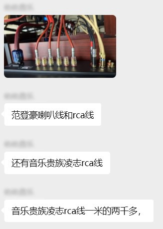

昨天在咱们老哥交流群里，一位玩得很深的骨灰级玩家晒出了他的神仙走线。范登豪的喇叭线，加上音乐贵族凌志的 RCA 线——好家伙，一米就得两千多块钱。

*图注：交流群内骨灰级发烧友晒出的发烧线材，采用了范登豪喇叭线和音乐贵族凌志 RCA 信号线，单米造价均达两千元以上。*

看着屏幕里这根比我小拇指还粗的发烧线材，再低头看了看我桌上那台花几十块钱从闲鱼淘来的 HP T620，以及它屁股后面插着的那根 5 块钱包邮的普通网线，我陷入了深深的沉思。

必须承认，在**模拟信号**的领域（比如老哥晒的 RCA 线、喇叭线），好线材确实有用。因为模拟信号传输的是连续的电波，线材的材质、电阻、电容哪怕有一丁点变化，出来的声音（频响曲线）就不一样，这是实打实的物理学。

但是！现在整个 Hi-Fi 圈最离谱的怪圈出现了：**很多商家和发烧友，把这种模拟时代的“线材玄学”，强行套用到了“数字信号线”（比如 USB 线、网线、同轴线）上。** 一条号称能提升高频通透度、让人声更甜美的“发烧级千兆网线”，敢卖到大几千块。

兄弟们，咱们用底层 IT 逻辑盘一盘，这事儿到底有多荒谬。

---

## 01 数字信号线的本质：0 与 1 的校验

网线和 USB 线里跑的是什么？是数字信号，是纯粹的 0 和 1。而且无论是 TCP/IP 协议还是 USB 异步传输，底层都有极其严密的校验机制。

只要你的线材没有损坏断裂，传输过去的数据包就是 **100% 完美**的。

> [!TIP]
> **一个生动的比喻**
> 这就好比你用手机网银给你老婆转账 1000 块钱，难道你用几千块钱的“发烧级纯银网线”连着路由器，转过去就能变成 1050 块吗？显然是不可能的。网线只要保证链路通畅，传输的数据就不会有任何偏差。

---

## 02 为什么换线后“声音变干净了”？

既然数据 100% 准确，那为什么确实有人换了上千块的 USB 线，觉得“声音变干净、底噪变小了”呢？

其实改变的根本不是 0 和 1 的数据，而是**“物理电磁底噪”**。

昂贵的发烧级线材往往有极其变态的屏蔽层（多层屏蔽网、铁氧体磁环等），它能够挡住电脑主板传过来的高频电磁干扰（EMI/RFI）。

但问题是，为了屏蔽这点电磁干扰，花几千块钱去买根线，这显然是妥妥的“智商税”。

---

## 03 双达菲架构：物理隔离的降维打击

咱们硬核 DIY 玩家是怎么解决这个问题的？我们不需要昂贵的发烧线，而是从**物理架构**上直接进行降维打击。

就像我上一期教程里介绍的[“双达菲”数播搭建方案](/blog/dual-daphile-setup)：

1. **算力与输出物理隔离**：直接用两台几十块钱的瘦客户机组网，把解码和存储分开。
2. **内存播放（RAM Play）**：负责音频输出的 Client（客机）端，在播放时会把音乐文件全部预读到内存里，然后彻底停止网络请求和硬盘读写。

此时此刻，什么电磁干扰、什么网线杂波，在物理层面被直接断绝。

**这才是真正用几十块钱，去彻底解决大几千块钱线材才能勉强压住的底噪问题。**

---

## 04 总结

咱们这群老哥玩 DIY，乐趣就在于用几十块的洋垃圾榨干性能、去探寻硬件的极限，而不是被消费主义裹挟，去交那些莫名其妙的“玄学税”。

把买发烧数字线的几千块钱省下来，多买两块大容量的拆机监控硬盘存无损音乐，它不香吗？

**兄弟们，你们在折腾 Hi-Fi 或者电脑的路上，交过最冤的一笔“智商税”是什么？欢迎在评论区留言，让大家也开开眼！👇**
