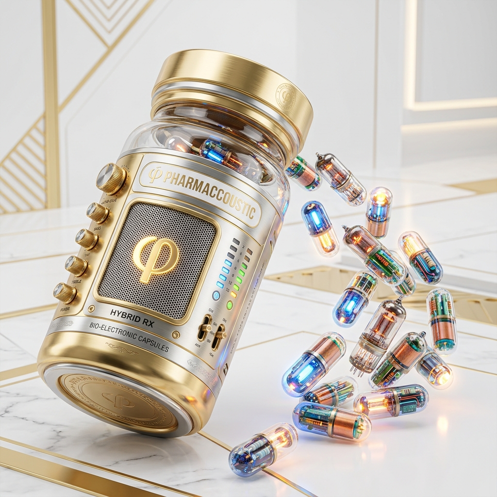

# 音响界的“保健品”：上万元的发烧交换机，到底是神器还是智商税？

在老一辈发烧友的圈子里，最近正流行着一种新的风潮——玩“发烧交换机”。

前两天，有一位 70 岁的老烧友兴冲冲地来问我：“小七，有朋友给我推荐上万元的发烧交换机，说是能让声音背景更干净、细节更多，两个系统之间不走外网直接用它连，这东西有必要玩吗？”

我听完，直接给老爷子泼了一盆冷水：“老先生，就算你再有钱，我也不推荐你玩这个，这妥妥的是智商税。”

放下手机，我不禁感叹：**如今的音响发烧界，其风气和套路，真的跟中老年保健品市场太像了。**

---

## 相似的套路，相同的“韭菜”

如果你仔细对比保健品市场和音响玄学市场，会发现它们的底层逻辑如出一辙：

1.  **兜售“健康/音质”焦虑**  
    保健品商家会告诉你：“血管里有毒素，不排毒就要生病。”  
    发烧网络商家会告诉你：“网线里有抖动，电源有杂讯，不净化声音就没法听。”  
    这种对“不纯净”的恐惧，是收割的开始。
2.  **高大上的“伪科学”名词**  
    保健品喜欢用“纳米技术、量子细胞活化、天然深海提取”。  
    发烧交换机和地盒则充斥着“单晶铜冷冻、恒温飞秒时钟、量子谐振、火山灰吸附”。这些物理学名词听起来高不可攀，实际上在电子工程学里根本无法自圆其说。
3.  **强大的“安慰剂效应”（俗称脑放）**  
    “一万块一盒的药，吃完我感觉腰不酸了。”  
    “一万块一台的交换机，连上我觉得高音更甜了。”  
    其实，这往往只是昂贵的价格带来的心理暗示在起作用。
4.  **精准收割中老年群体**  
    这两个市场都瞄准了同一个群体：**手里有闲钱、有时间、有兴趣爱好，但缺乏系统电子工程或生物医学常识的发烧友和老人家。**

---

## 为什么说发烧交换机是“智商税”？

从数字通信的科学原理来看，上万元的发烧交换机完全是一场概念炒作。

数字音频在网络中传输，采用的是 **TCP/IP 协议**。数据是以“数据包”的形式，在网线中以光速传输的。接收端的播放器里有一个容量很大的数据缓冲区（Buffer）。

这意味着：数据包在网线中走得快一点还是慢一点，哪怕中间有微小的延迟，只要进了播放器的内存缓冲区重新排队，最终送入解码器（DAC）时，**都是由播放端本地的芯片时钟重新打拍子输出的。**

**解码器的时钟，跟上游交换机那所谓的“飞秒时钟”，在物理上是 100% 隔离的。** 交换机时钟再好，也无法对最终的解码过程产生任何正面影响。

如果包装商家硬要说交换机对音质有影响，那唯一的可能就是它开关电源产生的高频电磁杂讯，通过网线的铜线“爬”进了播放器主板。

但要解决这个杂讯，**有极其便宜且完美的科学方案：**
*   **无线网络（Wi-Fi）**：无线传输是物理上的“空气隔离”，连导线都没有，杂讯根本无法跨越空气；
*   **光纤收发器**：用光信号传输，彻底斩断电磁物理连接，百十块钱就能实现完美的“光隔离”。

花上万元买台发烧交换机，无异于买了一盒高价的“蛋白粉”。

---

## 不花冤枉钱，如何用科学提升音质？

发烧讲究的是科学，而不是玄学。如果我们想让声音有本质的提升，应该把钱花在**优化系统架构**上，比如最近在老烧友圈子里极受好评的**「双达菲分体模式」**。

传统的做法是用一台机器包揽所有工作：既要读取硬盘里的音乐文件、管理歌曲数据库，又要实时进行数字解码。这会让主机的 CPU 负载很高，产生大量的计算杂讯。

而**「双达菲分体模式」**则是将工作彻底分离：
*   **主脑端（Core）**：负责干脏活累活。插硬盘、管理数据库、做网络传输。它产生的计算杂讯再大，也因为不直接连接解码器，而被物理隔离了。
*   **网桥端（Bridge）**：只负责安静地播放。它只运行一个极轻量级的播放进程，CPU 负载极低，主板供电稳如磐石，电磁底噪压到了极限。

老先生听从了我的建议，没有买交换机，而是配了一套分体系统。今天下午他兴奋地发微信告诉我：**“小七，声音比以前好多了！密度变大了，线条感变强了！”**

**这，就是科学架构带来的真实物理提升，根本不是换根天价线材或发烧交换机能比拟的。**

---

发烧的乐趣，在于探索声音的本源，而不是陷入无底线的消费主义陷阱。

老先生开开心心地在家里喝茶听歌，还把他的朋友带到家里来体验双达菲的魅力。临走前，他的朋友也当场决定：“一定要搞一套双系统！”

用科学的眼光发烧，用诚实的技术服务。这，才是玩音响的真正乐趣所在。
