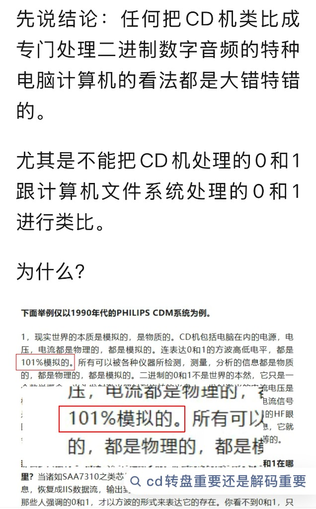
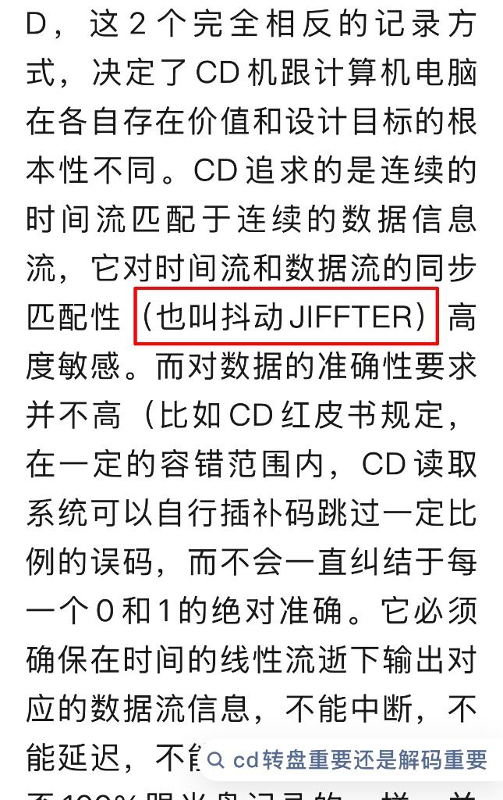
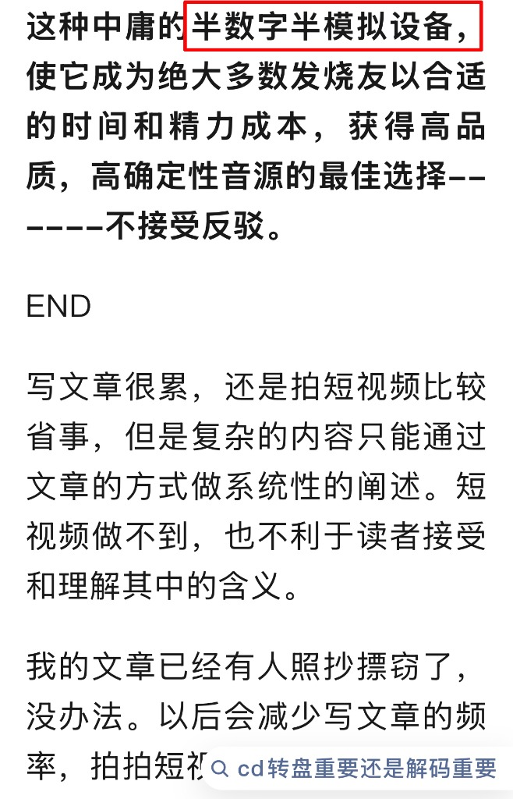

今天在网上闲逛，看到一篇堪称“发烧圈科幻巨制”的神文，把我这个理工男看得叹为观止。为了防止大家说我瞎编，先上两张奇文共赏的截图，大家品鉴一下这个理论高度。

这位前辈先是抛出了一个惊人的爆论：“CD机处理的0和1是101%模拟的”。理由竟然是底层的电压电流是物理的、模拟的。

紧接着，前辈可能嫌现有的物理名词不够用，还发明了一个极其高深的英文词汇：“JIFFTER”。

那一刻我愣住了，我玩了这么多年数字音频，只认识“Jitter（时钟抖动）”，这个多出来的两个字母“FF”，大概是前辈独创的某种高级模拟味吧。

*图注：某发烧科普文宣称底层物理电信号是模拟的，所以CD机处理的0和1是101%模拟的。*

*图注：作者将时钟抖动（Jitter）拼写为独创词汇“JIFFTER”，令人大开眼界。*

看完这篇大作，我突然明白，为什么发烧圈会有那么多交了智商税的年轻人。今天，咱们不谈玄学，就用初中信息技术课的常识，来聊聊底层的科学逻辑。

---

## 01 关于那个“101%模拟论”

按照前辈的逻辑：只要底层物理载体是电压 and 电流，那就是模拟的，就会受电源噪声干扰而改变音色。

这个逻辑看似无懈可击，其实荒谬至极。数字电路的伟大之处就在于**“阈值”**。规定 3V 到 5V 都是 1，0V 到 1V 都是 0。哪怕你电源再差，把 5V 抖成了 3.5V，只要没跌破阈值，解码芯片读出来的，永远是那个绝对完美的 1。它不带感情，没有温度，更没有所谓的“胆味”。

> [!TIP]
> **一个最简单的例子**
> 如果电压波动真的能改变数字信号的“本质”，那我用一台老旧电脑、插在劣质插座上给你微信转账 10000 块。因为电压波动，这串 0 和 1 发到你手机上时，是不是就会变成 9980 块？而且这笔钱还会带着一丝“老旧电源的沧桑感”？

---

## 02 关于拼错的“JIFFTER”和所谓的“随便插补”

兄弟们，CD 的红皮书标准里，有一套极其强大的 CIRC（交叉交错里德-所罗门码）纠错机制。只要你的光盘没有划得像溜冰场，光头没有老化到快瞎了，它抓取出来的数据就是 100% 完美的比特流（Bit-perfect）。

如果真的错到纠不回来，CD机会直接爆音或者卡顿，绝不会出现老法师幻想的那种“因为读错了一个0，所以高音变暗了、中频变厚了”这种荒谬的模拟式衰减。

除了上面这些常识错误，这篇文章里还有一段话，堪称给发烧友洗脑的“终极万恶之源”。请看下图：

*图注：宣称CD是“半数字半模拟设备”，并“不接受反驳”的言论截图。*

看完我直接气笑了。今天咱们就把这最后一层底裤也给扒了。

---

## 03 咱们先寻个根：你听的 CD，难道是从树上长出来的？

这都什么年代了，现在全世界 99.9% 的音乐，都是录音师在苹果 Mac 或者 Windows 电脑上，用数字软件搞出来的母带。

也就是说，你奉为神明的 CD 光盘，里面刻的每一个 0 和 1，最初在娘胎里就是个纯纯的“电脑文件（WAV）”！

按这位前辈的说法，电脑处理的 0 和 1 “品质非常粗糙低劣”。那你买的几百块原版 CD，基因在出生的那一刻就已经被电脑“污染”了，你还搁这儿听什么高贵灵魂呢？这不是扯犊子吗？

---

## 04 退一万步说，电脑里的 0 和 1，还真就比纯 CD 转盘更“严谨”！

传统的纯 CD 转盘在现代电脑架构面前，纯属“弟弟”。

CD 机读盘，那叫“跑步机上读报纸”。盘在飞速转，光头得死死盯着，稍微有点震动就容易看错。看错了没法停下来重看，只能靠纠错芯片去“猜”（插补），这才是真正容易产生时钟抖动的地方。

而现代电脑（比如咱们玩的达菲系统）是怎么干活的？那叫“把书买回家躺被窝里慢慢看”！

电脑根本不跟你搞提心吊胆的实时同步。它是把音乐文件“嗖”地一下，100% 完整无误地吸进内存（Buffer）里存着。然后解码器（DAC）再用自己的高精度飞秒时钟，不慌不忙地排队把数据送出去。没有任何机械震动干扰，这叫绝对的“Bit-perfect”。CD 拿头跟它比准确度？

至于那个生造出来的“半数字半模拟设备”，更是个笑话。

如果因为 CD 机光头读取的是物理射频信号，就叫它“半数字半模拟”，那咱们家里的 5G 路由器用的还是纯纯的模拟电磁波呢！

请问，我用 Wi-Fi 下载的一首无损音乐，因为经过了“模拟无线电波”的洗礼，听起来是不是就会比我插着网线下载的音乐更温暖、更有人情味？数字就是数字，没有任何“半数字”的灰色地带。

---

## 05 既然电脑的文件系统这么严谨强大，为什么他们非要把电脑踩在脚底下？

答案很简单：**利益**。

兄弟们，算一笔账就明白了。

一台能跑完美达菲系统的二手小主机，才一百来块！可一台打着“Hi-End”旗号、标榜“专为发烧而生”的 CD 转盘，要卖五万块！

如果他们承认，这 100 块破电脑读出来的 0 和 1，跟他们 5 万块机器读出来的 0 和 1 一毛一样甚至误差更小……那他们的天价转盘卖给谁？商家的“纯银同轴线”、“发烧级线性电源”、“天价水晶避震钉”要卖给谁？利益帝国不就瞬间崩塌了吗？

所以，他们必须硬生生造出一个概念：把坚如磐石的数字信号，描绘成脆弱的、需要被“呵护”的，忽悠你 CD 的 0 和 1 带贵族血统，电脑的 0 和 1 是打工仔。只有让你觉得它像模拟设备一样“娇贵、怕震动、怕供电不稳”，商家才能顺理成章地让你掏空钱包。这不是在探讨声学，这叫“技术恐吓式营销”。

---

## 06 总结

在数学和底层代码面前，所有的“数字玄学”都是纸老虎。有那几万块钱交智商税，不如给家里升级对好音箱，或者好好学学怎么跑段 FIR 代码给房间做个声学校准。

最后，留给各位懂物理和懂玄学的前辈们一个思考题：

**如果物理电流能改变数字信号的特征，那此时此刻，如果我敲击键盘的力气足够大，这篇推文在你手机上显示的字号，是不是应该比别人的大一圈？🤔**

**老哥们，你们怎么看待这种“JIFFTER”和“101%模拟”的玄学论调？欢迎在评论区开火，咱们评论区见！👇**
