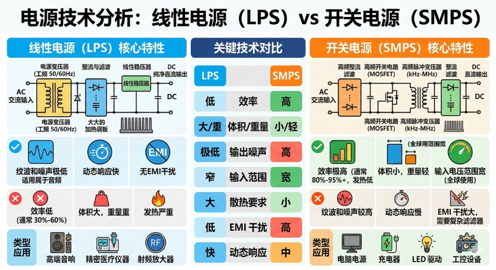
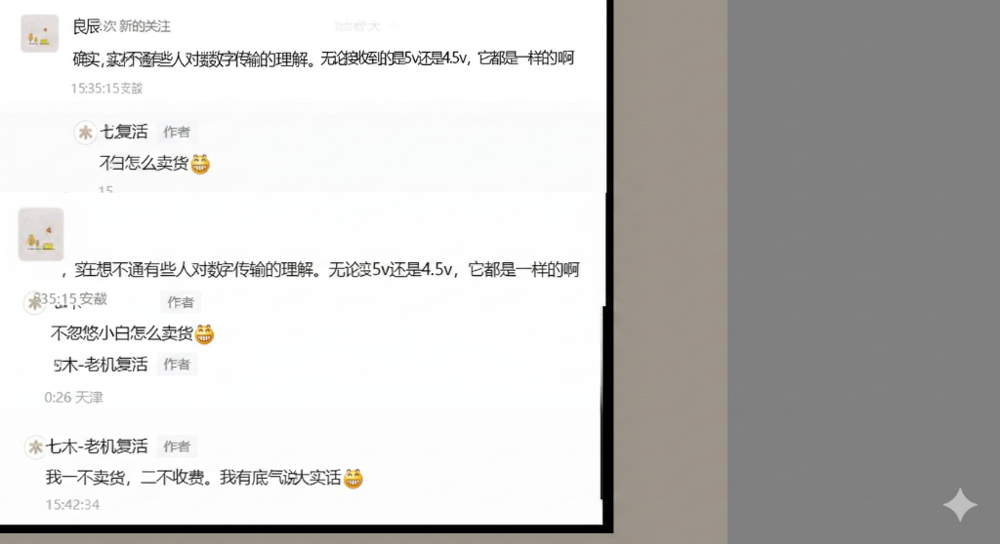
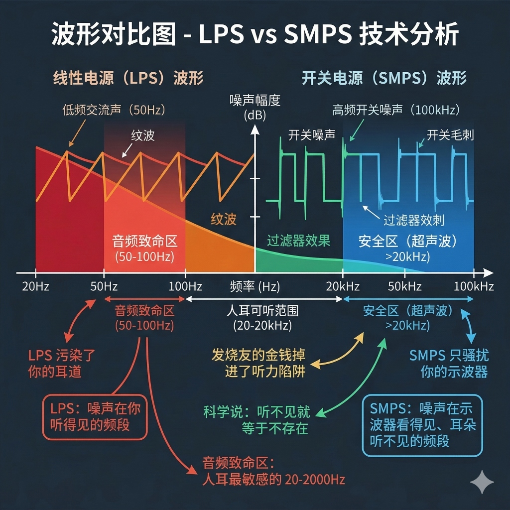
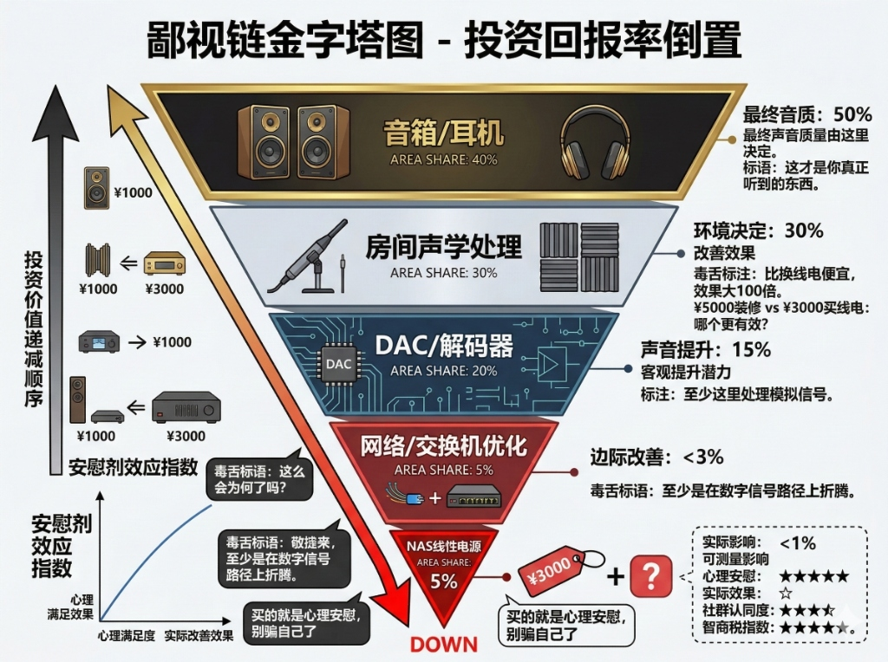

> [!CAUTION]
> **前置警告**
> 
> 本文会打碎很多 Hi-Fi 圈和数码圈玄学人士的饭碗，也会让很多交了智商税的发烧友破防。如果你刚刚花上万元给你的音响、NAS 或路由器配了“发烧级线性电源”，建议在读之前先摸一下自己的钱包，现在退货还来得及。

---

## 01 扒开底裤：线性电源到底是个什么玩意儿？

不管是卖两万的音响神电，还是卖两千的路由器线电，它们的底层物理结构都简单到离谱，总共就四个部分：

`[工频变压器] → [整流桥] → [滤波电容] → [线性稳压芯片]`

*图注：线性电源与开关电源的底层物理结构原理对比。线性电源结构简单、纹波小但效率极低，而开关电源效率高、体积小但纹波与高频噪声稍高。*

1. **降压（变压器）**：把 220V 交流高压降到低压交流电。
2. **整流（整流桥）**：把交流电变成脉动的直流电。
3. **滤波（大电容）**：把波浪脉动的波形“撸平”。
4. **稳压（稳压芯片/LDO）**：用最原始的物理消耗（发热）来稳住电压。

原理简单到什么程度？国内高校电子专业大一新生的课程设计题目《直流稳压电源》，做不出来都拿不到毕业证。

它确实有纹波极低、无高频电磁干扰（EMI）、瞬态响应快的优点。但代价极其惨痛：效率极低（通常只有 40%-60%，近一半的电全变成热量烤掉了）、体积巨大、死沉死沉。

---

## 02 底层认知：模拟电路 vs 数字电路，差了一个银河系

奸商最喜欢偷换概念，把模拟电路的电源需求硬套到数字电路头上。我们先把这俩的底层需求扒得明明白白：

*图注：社交平台上关于数字信号电压与传输的真实互动。数字信号本质是逻辑阈值判定，电压轻微波动根本不会影响 0 和 1 的数据结果。*

| 维度 | 模拟电路（功放、DAC模拟部分、射频前端） | 数字电路（CPU、内存、NAS主控、路由器交换机） |
| :--- | :--- | :--- |
| **核心需求** | 极低的纹波噪声（µV级）、完美的线性度、无高频杂散 | 足够的电流、稳定的电压裕量（±5%以内）、低阻抗 |
| **噪声敏感度** | 全频段敏感，低频纹波会直接放大叠加到音频/射频信号上 | 只看电平阈值（如TTL的0.8V/2V），不破阈值，你纹波100mV照样稳如老狗 |
| **电源调节** | 靠外部电源稳压，自身抗干扰弱 | 片上集成极其复杂的多阶DC-DC、PMU，外部电源进来先被“扒一层皮”再分配 |
| **极端情况** | 纹波大一点直接音质劣化、信号失真 | 只要不断电，数字传输有CRC校验和重传机制，错一个比特都给你拉回来 |

> [!TIP]
> **一个直白的通俗比喻**
> - **模拟电路的电源是“食材”**：食材不好做出来的菜肯定难吃。
> - **数字电路的电源是“装手机的快递纸箱”**：只要纸箱没破到把手机摔碎，你用顺丰纸箱还是拼多多纸箱，开箱后拿出来的手机功能和体验是完全一样的。

---

## 03 HiFi模拟圈实测对线：万元线电 vs 20块钱开关电源

我们找了某售价 **¥12,999 元**的“旗舰级音响线电”，和淘宝 **¥19.9 包邮**的 12V 5A 普通开关电源，拉到实验室跑了全套测试。

*图注：LPS 与 SMPS 的输出波形对比。线性电源的纹波处于人耳敏感的音频频段，而开关电源的高频开关噪声则完全处于人耳听不见的超声波安全区。*

### 核心参数打脸对比（输出 12V 3A）

| 参数 | 万元线性电源 | 20元开关电源 | 人体/设备感知与捕捉阈值 |
| :--- | :--- | :--- | :--- |
| **输出纹波(峰峰值)** | 1.2mV | 28mV | **>100mV**（才可能对模拟电路产生可闻影响） |
| **输出噪声** | 32μVrms | 156μVrms | **>500μVrms**（才可能被音频电路捕捉） |
| **负载瞬态响应** | 12μs | 86μs | **>1ms**（才可能产生可闻失真） |
| **效率 / 重量 / 价格** | 52% / 3.2kg / ¥12,999 | 89% / 0.1kg / ¥19.9 | - |

**关键结论**：线性电源的参数确实更好，但远没有价格差的 **650 倍**那么夸张。

最核心的是：两者的参数都**远低于**人耳和普通音频设备的感知阈值，你根本听不出区别。

我们做过多次双盲测试，把电源隐藏在黑箱子中让所谓的“金耳朵”试听，听完他们信誓旦旦地指着其中一路说“这路声音明显更通透、高频更亮、背景更漆黑”，结果打开箱子一看，他们指的那一路正是 **¥19.9 包邮的普通开关电源**，当场脸都绿了。

---

## 04 数字设备圈实测对线：给劳斯莱斯加98号油？

刚才扒完了模拟圈，现在来看重灾区：**数字设备**。给数字设备换线电，纯粹是钱包太鼓，钱多烧的。

*图注：发烧系统投资回报率倒置金字塔。最末端的数字线电和网线优化实际提升占比不到 1%，通常仅提供极高的心理安慰，是妥妥的智商税重灾区。*

### 1. 计算机场景：“线电能让系统更稳、游戏帧率更高？”
- **测试设备**：i7-13700K + RTX 4090
- **测试结果**：¥2,000 线电改装电源 vs 普通 ATX 开关电源，Prime95 烤机稳定性均为 100%，Time Spy 跑分误差 0.06%，4K 视频导出时间误差 0.16%。
- **打脸真相**：ATX 电源输出的 12V 输送到主板后，还要经过主板上的 **VRM 进行多相降压与二次稳压**才会供给 CPU 和显卡。你换的线电改的只是最前端，对后端供电没有丝毫影响。系统觉得卡顿，请去清理机箱灰尘，别折腾电源。

### 2. NAS场景：“线电能让NAS读写更快、数据更安全？”
- **测试设备**：群晖 DS923+，4 块硬盘组 RAID5
- **测试结果**：¥1,500 线性电源 vs 原装开关电源，连续读取速度、随机 IOPS 以及文件传输错误率的差异全部在 **0.3% 以内**（属于正常的测试误差）。
- **打脸真相**：SATA 和 NVMe 协议自带强大的 CRC 校验。只要电源不断电、不烧毁，传输的数据格式是不可能发生改变的，更不存在“换电源提升读写速度”的物理可能。如果电源真的能影响数据，那说明这个电源已经劣质到在疯狂烧毁硬盘了。

### 3. 路由器/交换机场景：“线电能降低游戏延迟、减少丢包？”
- **测试设备**：华硕 RT-AX88U 路由器，思科工业交换机
- **测试结果**：网络吞吐量、Ping 延迟、丢包率数据完全一致（**0% 差异**）。
- **打脸真相**：网线传输的是物理电平，以太网 PHY 芯片自带高精度的信号整形与再生。哪怕你把电源线和微波炉缠在一起，只要电压没有崩溃，网络性能和转发效率就不会有任何变化。玩游戏卡？请去升级你的物理宽带或者更换运营商，而不是给路由器换个高贵的线电。

---

## 05 骗局大放送：奸商常用玄学话术逐条击破

- ❌ **谎言1：“用了我们进口发烧级元器件，声音更暖，背景更漆黑。”**
  - **真相**：纯粹是消费主义诱导。电容只要容量足够、ESR（等效串联电阻）低、寿命合规即可。电子元器件只看参数，不分国籍。“声音变暖”纯粹是因为你为之付出了昂贵的金钱代价，你的大脑自动触发了“安慰剂效应”。
- ❌ **谎言2：“数播等数码设备必须用线电，不然开关电源的高频干扰会混入音频劣化音质。”**
  - **真相**：数字音频传输的是 0 和 1 的数据流，只要数据格式无错，后端 DAC 还原的声音就绝对一致。另外，就算真有高频噪声，CPU 本身每秒几十亿次开关产生的高达 GHz 级别的电磁噪声，早就将电源那点 100kHz 的微弱噪声盖得严严实实了。
- ❌ **谎言3：“线性电源越重越好，用料足才好声。”**
  - **真相**：重的主要是那个大铁芯工频变压器（一坨硅钢片加铜线）。很多商家故意把机箱做大做重，甚至在内部填充铅块，就是为了给发烧友提供一种“沉甸甸、很值钱”的心理暗示。

---

## 06 终极结论：什么时候值得买？什么时候是傻子？

### ✅ 什么时候值得买线电？（不到 1% 的场景）
1. **高精度微弱模拟信号设备**：如高档黑胶唱头放大器、纯甲类功放的前级、高精度示波器、脑电图仪等医疗测量设备。
2. **手搓的简易裸板设备**：自己 DIY 的、主板上完全没有做任何二次 LDO 稳压与 EMI 电磁屏蔽的测试板。
3. **钱实在太多**：就是喜欢在桌上摆一整排金属外壳、通电后散发温暖热量的大体积“砖头”来满足视觉和心理成就感。

### 🧠 什么时候买线电绝对是“智商税”？（99% 的日常数字场景）
- **所有带完整数字电路、内部自带稳压的成品设备**：普通成品音响、数播、电脑主机、NAS、路由器、交换机、游戏机。
- 给这些设备换高价线电，和买“防核辐射孕妇装”、“量子降糖鞋垫”没有任何本质区别。

**兄弟们，别再交学费了。把买线电的几千块钱省下来去升级音箱的单元或者给房间做做声学隔音板改造，那带来的提升才是实打实的物理可见！**
