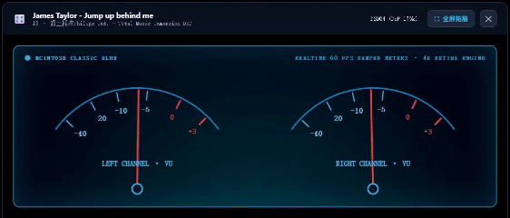

# 七木数播操作系统 (QMS Audio OS) v4.1.1 官方完整安装与激活教程

> **适用版本**：七木数播系统 ISO 4.1.1 纯净发烧正式版  
> **适用硬件**：主流 64 位 x86 设备（惠普 T620 / T610 / T730 等瘦客户机、工控机、Intel NUC、小主机、闲置笔记本及老台式机）  
> **预计耗时**：约 5~10 分钟即可完成全部部署与发烧开声！


---

## 快速导航
1. [一、前期准备与硬件清单](#一前期准备与硬件清单)
2. [二、制作 U 盘安装介质（Rufus 写盘）](#二制作-u-盘安装介质rufus-写盘)
3. [三、主机接线与 BIOS 引导启动](#三主机接线与-bios-引导启动)
4. [四、进入 Live 临时试听模式（免写盘初体验）](#四进入-live-临时试听模式免写盘初体验)
5. [五、一键安装到机身固态硬盘（正式落盘）](#五一键安装到机身固态硬盘正式落盘)
6. [六、联网开通 3 天无限制深度试听](#六联网开通-3-天无限制深度试听)
7. [七、输入券码激活永久终身版（VIP 授权）](#七输入券码激活永久终身版vip-授权)
8. [八、发烧常见问题与贴士 (FAQ)](#八发烧常见问题与贴士-faq)

---

## 一、前期准备与硬件清单

### 1. 硬件清单
*   **数播主机**：一台 64 位 x86 架构主机（建议配备至少 2GB 内存及一个 8GB 以上内置硬盘/固态盘）；
*   **安装 U 盘**：1 个容量 **4GB 及以上** 的空白 U 盘（注意：写盘会格式化 U 盘，请提前备份重要文件）；
*   **网线**：一根网线将数播主机连入家庭路由器/交换机（确保数播与您的手机/电脑处于**同一局域网**）；
*   **音频解码设备**：一台 USB DAC 解码器或数字界面，通过 USB 线连接数播主机的 USB 接口；
*   **临时显示器与键盘**（可选）：仅首次开机确认 IP 和按引导项使用，安装落盘后完全无需显示器与键鼠（脱机开机秒入系统）。

### 2. 软件与镜像下载
*   **系统官方镜像**：`QMS-Audio-OS-v4.1.1-PRO.iso`
    👉 **[点击前往百度网盘下载官方系统镜像](https://pan.baidu.com/s/1K6iMTY7ONZ6wlqKVrv8KOg?pwd=qmsb)**（提取码：`qmsb`）
*   **官方写盘工具**：推荐使用 **Rufus**（Windows 平台，绿色免安装）。

---

## 二、制作 U 盘安装介质（Rufus 写盘）

使用 Windows 电脑与 **Rufus** 工具制作启动 U 盘：

1. 将准备好的 U 盘插入电脑，打开 **Rufus**；
2. **设备**：下拉菜单确认选中刚才插入的 U 盘；
3. **引导类型选择**：点击右侧【选择】按钮，找到并选中下载好的 `QMS-Audio-OS-v4.1.1-PRO.iso` 镜像；
4. **分区类型与目标系统**：
   *   **分区类型**：选择 **`MBR`**（通用兼容性最佳）；
   *   **目标系统类型**：选择 **`BIOS 或 UEFI`**（七木数播自带自适应双模引导，新老机型通吃）；
5. 点击最下方的【开始】按钮；
6. ⚠️ **关键步骤（特别注意）**：  
   如果弹窗提示“检测到 ISOHybrid 镜像”或询问写入模式：  
   > **请保持默认勾选：【以 ISO 镜像模式写入（推荐）】**，直接点击【确定】！  
   > ❌ **无需切换为 DD 模式**，使用标准 ISO 模式写入即可获得最稳定的自适应双引导体验。
7. 再次确认格式化警告，等待进度条走完显示“准备就绪”，即可安全弹出拔下 U 盘。

---

## 三、主机接线与 BIOS 引导启动

### 1. 设备接线
*   将制作好的安装 U 盘插入数播主机的 USB 接口；
*   插入网线，确保接通路由器局域网；
*   用发烧 USB 数据线将 USB DAC 解码器连接至主机背板 USB 接口；
*   临时连上显示器（HDMI / DP / VGA）与键盘。

### 2. 开机并呼出启动菜单
按下数播主机电源键开机，立刻**连续轻按**对应品牌的启动快捷键：

| 主机品牌 / 机型 | 快速启动项快捷键 | 备注说明 |
| :--- | :---: | :--- |
| **惠普 (HP T620 / T610 / T730 等瘦客户机)** | **`F9`** | 常用发烧数播神机 |
| **联想 (Lenovo / ThinkCentre 小主机)** | **`F12`** | 开机迅速连按 |
| **戴尔 (Dell OptiPlex 微型主机)** | **`F12`** | 开机迅速连按 |
| **Intel NUC 迷你主机** | **`F10`** | 或开机按 F2 进 BIOS 设为 U 盘优先 |
| **华硕 / 技嘉 / 微星台式机主板** | **`F8` / `F11` / `F12`** | 视主板型号而定 |
| **工控机 / 软路由 / 杂牌小主机** | **`F11` / `F7` / `Esc`** | 屏幕通常有小字提示 Boot Menu |

3. 在弹出的启动项列表中，使用键盘方向键选中带有 **`UEFI: [你的U盘品牌]`** 或 **`USB Storage Device`** 的选项，回车启动。

---

## 四、进入 Live 临时试听模式（免写盘初体验）

数播主机开机极速载入，临时显示器屏幕上会出现如下标准字符状态看板：

```text
================================================================================
          QMS Audio OS v4.1.1 PRO - Audiophile Master Edition
================================================================================
   Web Control : http://192.168.1.125/  or  http://qms.local/
   Audio DAC   : USB Audio DAC / XMOS / Amanero (Bit-Perfect Ready)
   Engine Core : Bit-Perfect Low-Latency RAM Architecture
   System Mode : Live USB Mode (Read-Only / Ready to Install)
   Status      : Ready (Standing by for Bit-Perfect Playback)
================================================================================
   Open Web Control in your browser to manage music & installation.
================================================================================
```

### 1. 打开黑金控制台
拿起处于同一 Wi-Fi 局域网下的 **手机、iPad 平板或电脑**，打开任意浏览器：
*   在地址栏直接输入看板上显示的设备 IP（例如：`http://192.168.1.125`）；
*   或者直接访问免记 IP 域名：👉 **`http://qms.local`** 即可秒级开启七木黑金发烧控制台！

### 2. 免盘快速试听
此时整套七木音频操作系统运行在主机的高速内存（RAM-Disk）中，**完全没有改动您的机身内置硬盘**：
*   可立即试听内置的高规格示范曲目，确认您的 DAC 解码器已正常出声；
*   感受深邃漆黑的声音背景，欣赏 4K 动感双表头的优雅起舞！


---

## 五、一键安装到机身固态硬盘（正式落盘）

声音与设备一切测试就绪后，建议将系统直接安装到机身内置固态硬盘（SSD），从此彻底拔掉 U 盘独立开机：

1. 在浏览器 Web 控制台界面中，点击页面弹出的 **【一键安装到机身固态硬盘】**（或点击右上角设置 ⚙️ ->【安装管理】）；
2. 系统会自动扫描并列出主机检测到的内置存储（例如：`sda (120GB SSD)` 或 `nvme0n1`）；
3. 勾选确认目标内置固态硬盘，点击 **【立即开始格式化并安装】**；
4. 七木底层部署引擎将在 **15 ~ 30 秒内** 自动完成全盘独立分区、自适应双引导配置与核心高保真音频内核解压；
5. 界面弹出提示：“🎉 安装成功！请拔下安装 U 盘并重启主机”；
6. **拔掉机身插入的安装 U 盘**，在页面点击【立即重启】（或轻按主机电源键关机重启）。

> 🚀 **体验飞跃**：从此主机彻底告别 U 盘拖尾！每次开机直接从固态极速秒启，系统瞬间解压至内存常驻，脱离硬盘磨损与噪音。

---

## 六、联网开通 3 天无限制深度试听

硬盘启动后，系统自动由临时 Live 模式转入正式发烧运行态：

1. 手机/电脑重新打开控制台网址（`http://qms.local` 或主机新 IP）；
2. 页面会自动提示：**【请先申请 3 天无限制深度试听】**；
3. 点击下方的 **【一键联网申请 3 天免费试听】** 按钮；
4. 系统将在 1 秒内与云端鉴权中心完成快速握手，并自动签发 **72 小时无限制官方全功能深度试听权限**；
5. 试听期间所有功能全面开放：
   *   极速自动挂载家庭 NAS / SMB 本地百万级曲库；
   *   直读直放上千张 SACD ISO 镜像与 DSD512 母带；
   *   畅享经典湖水蓝、复古暖金等多风格 4K 麦景图动态双表头；
   *   全曲库顺序播放与 gapless 零间隙无缝连播。



---

## 七、输入券码激活永久终身版（VIP 授权）

当 3 天深度试用期结束（或在试用期间任何时候），您都可以随时输入购买的券码激活终身版：

### 方式 A：在线一键极速激活（最推荐）

1. 点击弹窗上的 **【👑 输入 6 位兑换券码激活终身版】**（或点击右上角【设置】⚙️ -> 【VIP 授权与激活】）；
2. 窗口中会清晰显示您主机的专属 **【机器码】**（例如：`QMS-A1B2C3D4`）；
3. 在下方输入框中，输入向官方客服购买时获得的 **【6 位兑换券码】**；
4. 点击 **【在线激活】**；
5. 系统瞬间连接官方云端平台核销并下发固化永久证书：
   > 弹窗提示：**🎉 恭喜！云端授权核销成功！系统已永久升级为【七木终身尊享 VIP】！**
6. 激活成功！永久移除时间限制，终身免费享受后续固件 OTA 在线升级！

---

### 方式 B：离线 U 盘导入激活（专为无外网的独立独立听音室打造）

如果您的发烧听音室处于不连外网的纯封闭内网环境：

1. 在数播 Web 界面【VIP 授权与激活】窗口中，记下屏幕上的专属 **【机器码】**；
2. 用手机或另一台联网电脑，在浏览器中打开七木官方授权中心：  
   👉 **`https://wx.284868.xyz/qms-auth/`**
3. 填入您的 **【机器码】** 与购买的 **【兑换券码】**，点击【立即兑换证书】；
4. 兑换成功后，下载官方加密授权文件 **`license.lic`**；
5. 将 `license.lic` 拷贝到普通 U 盘的**根目录**，插进数播主机；
6. 数播后台自动侦测热插拔并在 2 秒内完成验签激活，屏幕提示激活成功后即可拔出 U 盘！

---

## 八、发烧常见问题与贴士 (FAQ)

### Q1：安装完成后，主机脱离显示器，怎么知道数播的 IP？
*   **方法一（最简单）**：手机连接同一 Wi-Fi，在浏览器直接输入 `http://qms.local` 或 `http://qms-audio.local`，系统自带 mDNS 广播协议，免记数字 IP 秒开；
*   **方法二**：登录家庭路由器后台，在“已连接设备”列表中查看名为 `qms` 或 `alpine` 的设备 IP。

### Q2：插上 USB DAC 后没有声音怎么办？
1. 检查 DAC 解码器的输入通道（Input Source）是否切换至 **USB** 档位；
2. 在七木数播 Web 控制台右上角【设置】⚙️ -> 【音频输出设备】中，确认已选中您的 USB DAC 名称（系统默认会优先自动热插拔直通）。

### Q3：老主机在固态落盘时检测不到内置硬盘？
*   开机按快捷键进入电脑主板 BIOS 设置，将硬盘控制器模式由 `RAID / Intel RST` 切换为标准的 **`AHCI`** 模式，保存重启即可精准识别。

### Q4：未来系统有新版本（如新表头样式、新调音算法），需要重新做 U 盘刷机吗？
*   **完全不需要！** 终身 VIP 用户尊享 **免写盘 OTA 热升级** 权益。
*   后续只需在 Web 控制台右上角点击【系统升级】，直接上传官方提供的升级包（`.qpkg`），数秒内自动原子替换升级，您的全部曲库设置、播放列表、NAS 挂载配置无损完整保留！

---

## 🎁 官方限时早鸟特惠进行中

*   **官方正式定价**：<del>¥ 299 元</del>
*   **首发限时特惠价**：**¥ 99 元**（直降 200 元，仅限 10 月 8 日 24:00 前）
*   **一份投入，终身进化**：包含完整系统激活、一对一专属指导与终身 OTA 极速升级权益。

<div style="text-align: center; margin: 32px 0;">
  
  <p style="margin-top: 12px; font-size: 14px; color: #888;">👉 微信扫码添加官方客服，发送【七木数播411】获取专属指导与 99 元早鸟特惠 👈</p>
</div>

*祝您在七木数播带来的纯粹声音世界里，重拾音乐最真挚的感动！*
