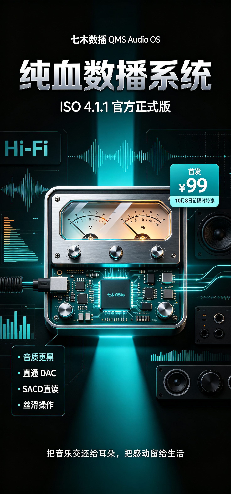
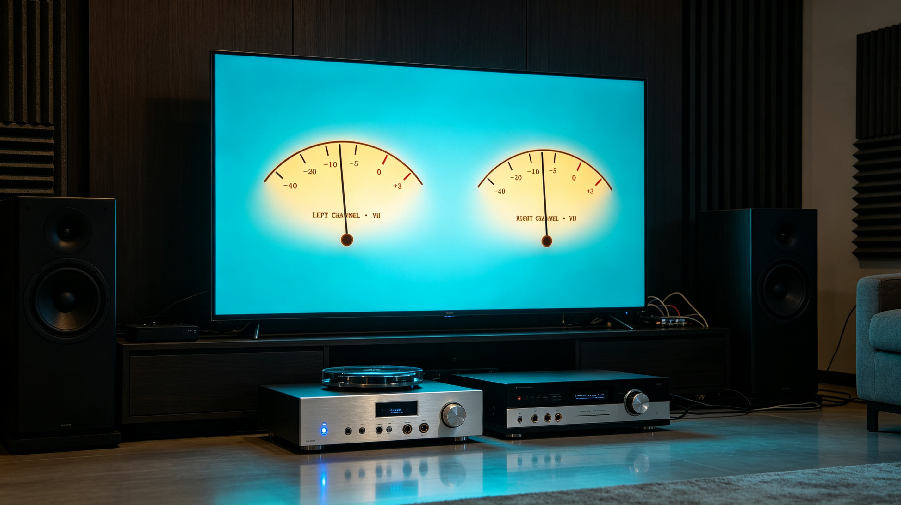

# 两年磨一剑｜七木数播 QMS Audio OS ISO 4.1.1 正式版全球发布！

> **把音乐交还给耳朵，把感动留给生活。**  
> 历经近两年的底层重构与数百位发烧友的实机调音检验，**七木数播 QMS Audio OS【ISO 4.1.1 官方正式版】今日正式面向全球发烧友公开发布！**

你有没有过这种体验——  
花大价钱买了解码器、音箱、电源线，结果声音总像隔了一层毛玻璃，**背景不够黑、微动态出不来、结像发散**？

**问题可能不在你的器材，而在你那台“顺便负责放歌”的电脑。**  
后台几百个进程在抢资源，系统底层偷偷给你做了强制重采样（SRC），风扇一转，高频底噪与 Jitter 就跟着上来了。

我们受够了。  
所以用近两年时间，写了一套**只做一件事、但把这件事做到极致**的系统——  
**七木数播 QMS Audio OS，今天，正式发布！**

---

## 🎯 那些年，数播发烧友踩过的痛

如果你是一位追求极致音质的音乐爱好者，你一定经历过这些痛点：

*   **上万元的商业数播硬件**：系统封闭卡顿、曲库扫描慢如蜗牛，交互界面简陋得像上个世纪；
*   **普通 PC / Windows 听歌**：后台数百个进程争抢资源、系统强制重采样（SRC）、风扇噪音与电磁干扰让声音背景永远不够“黑”；
*   **各种开源折腾方案**：命令行配置反人类、网络共享天天掉线、高规格 SACD ISO 镜像根本解不开或频繁卡死……

> **“为什么市面上就没有一款：音质极致纯净、界面优雅发烧、操作像手机一样丝滑、还能让闲置电脑一秒变万元数字转盘的系统？”**

带着这个近乎偏执的念头，七木数播（QMS Audio OS）走过了近两年的研发长跑。从最底层的 Linux 音频调度内核写起，一行行代码攻坚、一次次打磨底层 ALSA 直通驱动，历经无数个通宵调试与上百套 Hi-Fi 系统的实测校音。

此前，**v3.1.1 内部测试版** 在数播发烧友核心群内开展了深度内测。大家提的每一个建议、反馈的每一处细节体验——无论是**“断电记忆”**、**“SACD 快速解析”**，还是**“目录顺序连播”**、**“双表头动态渲染”**，我们全部在底层重构解决！

今天，经过无数次脱胎换骨的迭代，七木数播系统【ISO 4.1.1 官方正式版】正式上线！

✨ **无门槛体验**：镜像免费下载！把镜像刷入你的主机，装机后可自行申请 **3 天全功能免费试听**，全部功能开放体验，试听满意后再决定是否购买授权！

---

## 🔥 为什么选择七木数播？七大殿堂级核心突破

### 1. ⚡ 全内存驻留架构：音质“黑得彻底”，告别底噪与 Jitter
七木数播采用高规格的 **全 RAM-Disk 内存运行架构**。  
开机后，整套系统瞬间解压并完全驻留于高速内存中运行，彻底脱离传统硬盘的磨损与寻道物理延迟。极度精简的后台服务与毫秒级实时任务调度，消灭了任何不必要的时钟抖动（Jitter）与系统开销，声音背景深邃漆黑，声场立体开阔，微动态纤毫毕现。

### 2. 🎛️ 硬件独占 Direct Bit-Perfect 直通：原汁原味，直达 DAC 灵魂
彻底绕过所有操作系统层面的杂波重采样（SRC），原生构建独占级纯净音频传输管道：
*   原生支持 **PCM 44.1kHz ~ 768kHz** 顶级母带规格；
*   原生硬件硬解支持 **DSD64 ~ DSD512**（Native DSD / DoP 直通）；
*   支持市面上 **99% 的主流 USB DAC 解码器与同轴/光纤数字界面**，即插即用，毫秒级热插拔识别。

### 3. 📻 发烧友灵魂图腾：多风格 4K 超清全屏动态双 VU 表
音乐不仅用来听，更是视觉的沉浸与享受！  
七木数播独家内建多款发烧级 VU 表盘：经典湖水蓝、香槟暖金、复古羊皮米黄、极光紫电、冰魄纯白。

*   **双表头左右声道独立响应**：毫秒级精准电平捕捉；
*   **一键 4K 视网膜全屏沉浸拓展**：客厅电视、副屏、显示器秒变高级发烧器材面板；
*   **精密物理阻尼算法**：指针摆幅经精密动力学建模，音乐响起，经典指针起舞，仪式感瞬间拉满。

### 4. 💿 格式大满贯：SACD ISO 原生秒级分轨与无缝解析
无需在电脑上预先解压、分轨转换！七木数播内置自研的 SACD/DSD 硬件级解析中枢：
*   **SACD ISO 镜像直读直点**：毫秒级提取歌曲元数据与单曲封面封套；
*   **主流高清格式全覆盖**：完美支持 **DSF、DFF、WAV、FLAC、APE、M4A、MP3** 等全主流音乐格式；
*   **整张专辑无缝播放（Gapless Playback）**：交响乐、现场演唱会连续演奏零间隙、零卡顿。

### 5. 📱 跨平台发烧 Web 控制台：零安装 App，全家设备自由掌控
无需在手机上安装臃肿、频繁失效的第三方 App：
*   拿出**手机、iPad、平板、甚至电视浏览器**，输入 IP 即可秒开奢华黑金发烧控制台；
*   支持**文件夹层级浏览、发烧专辑墙、顺序播放 / 随机播放**一键直达；
*   支持全曲库智能检索、断电无感记忆、网络自动续播。

### 6. 🌐 强大的网络与存储交互中枢：家庭音乐图书馆秒变私人电台
*   **局域网 NAS / SMB 极速自动挂载**：百万级本地曲库极速载入，断电重启不丢配置；
*   **U 盘 / 移动硬盘免驱热插拔**：插上自动识别，即插即播；
*   **网络邻居本地共享**：支持通过电脑直接拖拽无损曲目拷进数播；
*   **零配置 mDNS 发现**：打开浏览器输入 `http://qms.local` 无需死记硬背 IP，设备自动发现。

### 7. 💻 闲置设备“起死回生”：老小主机一秒蜕变高端数字转盘
支持广泛的 x86_64 硬件架构：  
家里闲置的迷你工控机、惠普瘦客户机（如 HP T620、T610、T730 等）、Intel NUC、闲置旧笔记本、老台式机；只要通过 U 盘一键刷入七木数播 ISO，无需高昂硬件成本，立刻升级为一台媲美万元级发烧水准的高端专业无盘数字转盘！

---

## 🎁 官方正式版首发：限时早鸟特惠！

七木数播能有今天的成熟与稳健，离不开近两年来最早一批参与内测、无私提出反馈的发烧友们的支持与包容。  
为了让更多热爱音乐的朋友毫无门槛地体验到这套真正纯粹的声音系统，我们决定在正式公开发售之际，开启首发特惠活动：

| 版本规格 | 官方正式定价 | 首发推广特惠价 | 优惠幅度 |
| :--- | :---: | :---: | :---: |
| **七木数播系统 ISO 4.1.1 纯净发烧正式版** | <del>¥ 299 元</del> | **¥ 99 元** | **直降 200 元（仅限首发期）** |

> ⏰ **限时推广截止时间：即日起至 10 月 8 日 24:00**  
> **10 月 8 日零点起准时恢复官方原价 299 元！**

*   💡 **一份投入，终身进化**：购买授权后包含**完整系统激活、一对一专属固件激活与交流指导**，并终身享受七木数播系统 **OTA 极速在线无缝升级**权益（后续所有新特性与发烧调音优化一键直达）！
*   💡 **试听说明**：镜像免费下载，自行写盘装机，系统内自助申请 **3 天全功能免费试听**，所有功能完整开放，试听满意后再购买授权！

---

## 📂 官方系统镜像免费下载通道

七木数播 QMS Audio OS 官方 ISO 安装镜像现已全面开放免费下载：

👉 **[点击前往百度网盘下载：七木数播 QMS Audio OS ISO 4.1.1 官方正式版镜像](https://pan.baidu.com/s/1K6iMTY7ONZ6wlqKVrv8KOg?pwd=qmsb)**
*   **百度网盘提取码**：`qmsb`
*   **装机说明**：下载 ISO 镜像后，使用 Rufus 或通用写盘工具一键写入 U 盘（UEFI / Legacy 双引导），插入闲置主机/工控机即可快速启动安装。装机后在系统中可自助开启 **3 天全功能免费试听**！
*   📖 **新手安装指南**：详见官方保姆级图文教程 👉 [《七木数播 QMS Audio OS v4.1.1 完整安装与激活保姆级教程》](/blog/qms-audio-os-install-guide)

---

## 📥 如何获取与开启发烧之旅？

只需要简单三步，立即让好声音流淌进你的听音室：

1.  **第一步：免费下载镜像与开启试听**  
    点击上方百度网盘链接（提取码：`qmsb`）下载镜像，或扫码下方官方微信发送暗号：**【七木数播411】**。自行写盘装机后，系统内自助开启 **3 天全功能免费试听**；试听满意，可直接锁定 **99 元首发限时早鸟特惠授权**（10 月 8 日后恢复 299 元）。
2.  **第二步：专属极速发货**  
    联系客服付款购买授权后即刻获取激活兑换码，一键联网授权永久激活。
3.  **第三步：进入 VIP 发烧友社群**  
    正式版用户可进入七木数播官方 **VIP 发烧友交流群**，技术人员随时在线答疑解惑，与全国发烧同好分享调音与器材搭配心得，终身享受 OTA 在线升级。

  
  
👉 微信扫码添加官方客服，发送【七木数播411】获取专属指导与 99 元早鸟特惠 👈

---

## ✍️ 写在最后：好声音，只需一个 U 盘的距离

两年前，这只是我们自己为了“听一首干干净净的歌”而写下的第一行脚本；  
两年后，它已成长为一套凝聚了数百位发烧友智慧、经历严苛考验的完整数字音频操作系统。

七木数播不做浮夸的概念，我们只专注于两件事：**极致好听的纯粹声音，和极致省心的使用体验。**

好声音不该等待。而好的数字心脏，只需要一个 U 盘的距离。

如果这篇文章说中了你的痛点，欢迎转发给身边那位还在用普通电脑听歌的朋友！
